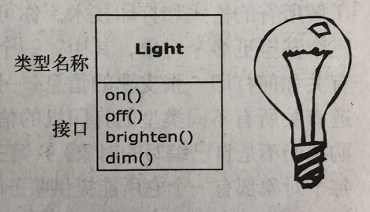

# 1.2 每个对象都有一个接口

所有的对象都是唯一的，但同时也是具有相同特性和行为的对象所归属的类的一部分。这种思想被直接应用于第一个面向对象语言Simula-67，它在程序中使用基本关键字class来引入新的类型。

在程序执行期间具有不同的状态而其他方面都相似的对象会被分组到对象的类中，这就是关键字class的由来。创建抽象数据类型（类）是面向对象程序设计的基本概念之一。
抽象数据类型的运行方式与内置（built-in）类型几乎完全一致：你可以创建某一类型的变量（按照面向对象的说法，称其为*对象* 或*实例* ），
然后操作这些变量（称其为*发送消息* 或*请求* ；发送消息，对象就知道要做什么）。

所以，尽管我们在面向对象程序设计中实际上进行的是创建新的数据类型，但事实上所有的面向对象程序设计语言都使用class这个关键词来表示数据类型。当看到类型一词时，
可将其作为类来考虑，反之亦然。

因为类描述了具有相同特性（数据元素）和行为（功能）的对象集合，所以一个类实际上就是一个数据类型，例如所有浮点型数字具有相同的特性和行为集合。
二者的差异在于，程序员通过定义类来适应问题，而不再被迫只能使用现有的用来表示机器中的存储单元的数据类型。可以根据需求，通过添加新的数据类型来扩展编程语言。
编程系统欣然接受新的类，并且像对待内置类型一样地照管它们和进行类型检查。

面向对象方法并不是仅局限于构建仿真程序。无论你是否赞成这样的观点，即任何程序都是你所设计的系统的一种仿真，面向对象技术的应用确实可以将大量的问题很容易地降解为一个简单的解决方案。

一旦类被建立，就可以随心所欲地创建类的任意个对象，然后去操作它们，就像它们是存在于你的待求解问题中的元素一样。事实上，面向对象程序设计的挑战之一，就是在问题空间元素和解空间的对象之间创建一对一的映射。

但是，怎样才能获得有用的对象呢？必须有某种方式产生对对象的请求，使对象完成各种任务。每个对象都只能满足某些请求，这些请求由对象的*接口（interface）* 所定义，
决定接口的便是类型。以电灯泡为例来做一个简单的比喻（如下图所示）：
```java
Light lt = new Light();
lt.on();
```

接口确定了对某一特定对象所能发出的*请求*。但是，在程序中必须有满足这些请求的代码。在类型中，每一个可能的请求都有一个方法与之相关联，当向对象发送请求时，
与之相关联的方法就会被调用。此过程通常被概括为：向某个对象“发送消息”（产生请求），这个对象便知道此消息的目的，然后执行对应的程序代码。

上例中，类型/类的名称是Light，特定的Light对象的名称是lt，可以向Light对象发出的请求有：打开它、关闭它、将它调亮、将它调暗。你以下列方式创建了一个Light对象：
定义这个对象的“引用”(lt)，然后调用new方法来创建该类型的新对象。为了向对象发送消息，需要声明对象的名称，并以圆点符号连接一个消息请求。

---

### [上一节：抽象过程](1.1_The_progress_of_abstraction.md)　　　　　　　　[下一节：每个对象都提供服务](1.3_An_object_provides_services.md)