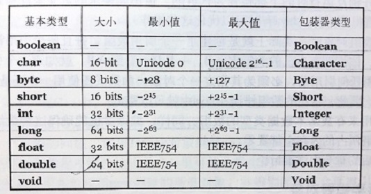

# 2.2 必须由你创建所有对象

一旦创建了一个引用，就希望它能与一个新的对象相关联。通常用new操作符来实现这一目的。new关键字的意思是“给我一个新对象”。所以前面的例子可以写成：
```java
String s = new Srtring("asdf");
```
它不仅表示“给我一个新的字符串”，而且通过提供一个初始字符串，给出了怎样产生这个String的信息。

当然，除了String类型，Java提供了大量过剩的现成类型。重要的是，你可以自行创建类型。事实上，这是Java程序设计中一项基本行为，你会在本书以后的章节慢慢学到。

## （一）存储到什么地方
程序运行时，对象是怎么进行放置安排的呢？特别是内存是怎样分配的呢？对这些方面的了解会对你有很大的帮助。有五个不同的地方可以存储数据：
1. **寄存器。**  
这是最快的存储区，因为它位于不同于其他存储区的地方——处理器内部。但是寄存器的数量极其有限，所以寄存器根据需要进行分配。你不能直接控制，
也无法在程序中感觉到寄存器的存在（另一方面，C和C++允许您向编译器建议寄存器的分配方式）。

2. **堆栈。**  
位于通用RAM(随机访问存储器)中，但通过*堆栈指针* 可以从处理器那里获得直接支持。堆栈指针若向下移动，则分配新的内存；若向上移动，则释放那些内存。
这是一种快速有效的分配存储方法，仅次于寄存器。

3. **堆。**  
一种通用的内存池（也位于RAM区），用于存放所有的Java对象。堆不同于堆栈的好处是：编译器不需要知道存储的数据在堆里存活多长时间。因此，在堆里分配存储有很大的灵活性。
当然，为这种灵活性必须要付出相应的代价：用堆进行存储分配和清理可能比用堆栈进行存储分配需要更多的时间。

4. **常量存储。**  
常量值通常直接存放在程序代码内部，这样做是安全的，因为它们永远不会被改变。有时，在嵌入式系统中，常量本身会和其他部分隔离开，所以在这种情况下，可以选择将其存放在ROM（只读存储器）中。

5. **非RAM存储。**  
如果数据完全存活于程序之外，那么它可以不受程序的任何控制，在程序没有运行时也可以存在。其中两个基本的例子是*流对象* 和 *持久化对象*。
在流对象中，对象转化成字节流，通常被发送给另一台机器。在“持久化对象”中，对象被存放于磁盘上，因此即使程序终止，它们仍可以保持自己的状态。

## （二）特例：基本类型
在程序设计中经常用到一系列类型，它们需要特殊对待。可以把它们想象成“基本”类型。之所以特殊对待，是因为new将对象存储在“堆”里，故用new创建一个对象——特别是小的、
简单的变量，往往不是很有效。因此，对于这些类型，Java采用与C和C++相同的方法。也就是说，不用new来创建变量，而是创建一个*并非是引用* 的“自动”变量。
这个变量直接存储“值”，并置于堆栈中，因此更加高效。

Java要确定每种基本类型所占存储空间的大小。它们的大小并不像其他大多数语言那样随机器硬件架构的变化而变化。这种所占存储空间大小的不变性是Java程序比用其他大多数语言编写的程序更具有可移植性的原因之一。  


所有数值类型都有正负号，所以不要去寻找无符号的数值类型。

boolean类型所占存储空间的大小没有明确指定，仅定义为能够取字面值true或false。

基本类型具有包装器类，使得可以在堆中创建一个非基本对象，用来表示对应的基本类型。例如：
```java
char c = 'x';
Character ch = new Character(c);
```
也可以这样用：
```java
Character ch = new Character('x');
```
Java SE5的自动包装功能将自动地将基本类型转换为包装器类型：
```java
Character ch = 'x';
```
并可以反向转换：
```java
char c = ch;
```
包装基本类型的原因将在以后的章节中说明。

### 高精度数字
Java提供了两个用于高精度计算的类：BigInteger和BigDecimal。虽然它们大体上属于“包装器类”的范畴，但二者都没有对应的基本类型。

不过，这两个类包含的方法，提供的操作与对基本类型所能执行的操作相似。也就是说，能作用于int或float的操作，也能作用于BigInteger或BigDecimal。
只不过必须以方法调用方式取代运算符方式来实现。由于这么做复杂了许多，所以运算速度会比较慢。在这里，我们以速度换取了精度。

BigInteger支持任意精度的整数。也就是说，在运算中，可以精确地表示任何大小的整数值，而不会丢失任何信息。

BigDecimal支持任何精度的定点数，例如，可以用它进行精确的货币计算。

关于调用这两个类的构造器和方法的详细信息，请查阅JDK文档。

### Java中的数组
几乎所有的程序设计语言都支持数组。在C和C++中使用数组是很危险的，因为C和C++中的数组就是内存块。如果一个程序要访问其自身内存块之外的数组，
或在数组初始化之前使用内存（程序中常见的错误），都会产生难以预料的后果。

Java的主要目标之一是安全性，所以许多在C和C++里困扰程序员的问题在Java里不会再出现。Java确保数组会被初始化，而且不能在它的范围之外被访问。
这种范围检查，是以每个数组上少量的内存开销及运行时的下标检查为代价的。但由此换来的是安全性和效率的提高，因此付出的代价是值得的（并且Java有时可以优化这些操作）。

当创建一个数组对象时，实际上就是创建了一个引用数组，并且每个引用都会自动被初始化为一个特定值，该值拥有自己的关键字null。一旦Java看到null，
就知道这个引用还没有指向某个对象。在使用任何引用前，必须为其指定一个对象；如果试图使用一个还是null的引用，在运行时将会报错。
因此，常犯的数组错误在Java中就可以避免。

还可以创建用来存放基本数据类型的数组。同样，编译器也能确保这种数组的初始化，因为它会将这种数组所占的内存全部置零。

数组将在以后的章节中详细讨论。

---

### [上一节：用引用操纵对象](2.1_You_manipulate_objects_with_references.md)　　　　　　　　[下一节：永远不需要销毁对象](2.3_You_never_need_to_destroy_an_object.md)