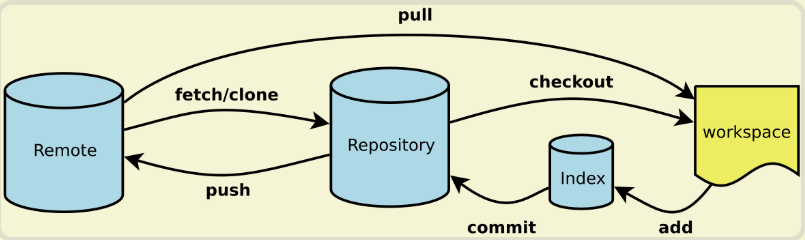

# 常用 Git 命令清单

## 目录
- [新建代码库](README.md#新建代码库)
- [配置](README.md#配置)
- [增加/删除文件](README.md#增加/删除文件)
- [代码提交](README.md#代码提交)
- [分支](README.md#分支)
- [标签](README.md#标签)
- [查看信息](README.md#查看信息)
- [远程同步](README.md#远程同步)
- [撤销](README.md#撤销)
- [其他](README.md#其他)

一般来说，日常使用只要记住下图6个命令，就可以了。但是熟练使用，恐怕要记住60～100个命令。

下面是常用 Git 命令清单。几个专用名词的译名如下。
- Workspace：工作区
- Index / Stage：暂存区
- Repository：仓库区（或本地仓库）
- Remote：远程仓库

## 新建代码库

#在当前目录新建一个Git代码库  
**$ git init**

#新建一个目录，将其初始化为Git代码库  
**$ git init [project-name]**

#下载一个项目和它的整个代码历史  
**$ git clone [url]**

## 配置
Git的设置文件为.gitconfig，它可以在用户主目录下（全局配置），也可以在项目目录下（项目配置）。

#显示当前的Git配置  
**$ git config --list**

#编辑Git配置文件  
**$ git config -e [--global]**

#设置提交代码时的用户信息  
**$ git config [--global] user.name "[name]"**  
**$ git config [--global] user.email "[email address]"**

## 增加/删除文件

#添加指定文件到暂存区  
**$ git add [file1] [file2] ...**

#添加指定目录到暂存区，包括子目录  
**$ git add [dir]**

#添加当前目录的所有文件到暂存区  
**$ git add .**

#添加每个变化前，都会要求确认  
#对于同一个文件的多处变化，可以实现分次提交  
**$ git add -p**

#删除工作区文件，并且将这次删除放入暂存区  
**$ git rm [file1] [file2] ...**

#停止追踪指定文件，但该文件会保留在工作区  
**$ git rm --cached [file]**

#改名文件，并且将这个改名放入暂存区  
**$ git mv [file-original] [file-renamed]**

## 代码提交

#提交暂存区到仓库区  
**$ git commit -m [message]**

#提交暂存区的指定文件到仓库区  
**$ git commit [file1] [file2] ... -m [message]**

#提交工作区自上次commit之后的变化，直接到仓库区  
**$ git commit -a**

#提交时显示所有diff信息  
**$ git commit -v**

#使用一次新的commit，替代上一次提交  
  - 如果代码没有任何新变化，则用来改写上一次commit的提交信息  
    **$ git commit --amend -m [message]**

  - 重做上一次commit，并包括指定文件的新变化  
    **$ git commit --amend [file1] [file2] ...**

## 分支

#列出所有本地分支  
**$ git branch**

#列出所有远程分支  
**$ git branch -r**

#列出所有本地分支及其所处的提交位置  
**$ git branch -v**

#列出所有本地分支和远程分支  
**$ git branch -a**

#新建一个分支，但依然停留在当前分支  
**$ git branch [branch-name]**

#新建一个分支，并切换到该分支  
**$ git checkout -b [branch]**

#修改分支名称  
#如果出现重名等情况，会出现提示  
**$ git branch -m old_name new_name**  
#无论是否有重名都强制修改  
**$ git branch -M old_name new_name**

#新建一个分支，指向指定commit  
**$ git branch [branch] [commit]**

#新建一个分支，与指定的远程分支建立追踪关系  
**$ git branch --track [branch] [remote-branch]**

#切换到指定分支，并更新工作区  
**$ git checkout [branch-name]**

#切换到上一个分支  
**$ git checkout -**

#建立追踪关系，在现有分支与指定的远程分支之间  
**$ git branch --set-upstream [branch] [remote-branch]**

#合并指定分支到当前分支  
**$ git merge [branch]**

#选择一个commit，合并进当前分支  
**$ git cherry-pick [commit]**

#删除分支  
  - 如果要删除的分支没有合并，删除之前会提示信息  
    **$ git branch -d [branch-name]**  
  - 无论是否已经合并都强制删除  
    **$ git branch -D [branch-name]**

#删除远程分支  
**$ git push origin --delete [branch-name]**  
**$ git push origin :[remote branch]**
**$ git branch -dr [remote/branch]**

#将当前分支上的修改保存在一个临时区域，然后就可以进行分支切换操作  
**$ git stash**  

#将保存的内容弹出，以便进行提交  
**$ git stash pop**

#查看stash列表  
**git stash list**  

#删除stash列表  
**git stash clear**  

## 标签

#列出所有tag  
**$ git tag**

#新建一个tag在当前commit  
**$ git tag [tag]**

#新建一个tag在指定commit  
**$ git tag [tag] [commit]**

#删除本地tag  
**$ git tag -d [tag]**

#删除远程tag  
**$ git push origin :refs/tags/[tagName]**

#查看tag信息  
**$ git show [tag]**

#提交指定tag  
**$ git push [remote] [tag]**

#提交所有tag  
**$ git push [remote] --tags**

#新建一个分支，指向某个tag  
**$ git checkout -b [branch] [tag]**

## 查看信息

#显示有变更的文件  
**$ git status**

#显示当前分支的版本历史  
**$ git log**

#显示commit历史，以及每次commit发生变更的文件  
**$ git log --stat**

#搜索提交历史，根据关键词  
**$ git log -S [keyword]**

#显示某个commit之后的所有变动，每个commit占据一行  
**$ git log [tag] HEAD --pretty=format:%s**

#显示某个commit之后的所有变动，其"提交说明"必须符合搜索条件  
**$ git log [tag] HEAD --grep feature**

#显示某个文件的版本历史，包括文件改名  
**$ git log --follow [file]**  
**$ git whatchanged [file]**

#显示指定文件相关的每一次diff  
**$ git log -p [file]**

#显示过去5次提交  
**$ git log -5 --pretty --oneline**

#显示所有提交过的用户，按提交次数排序  
**$ git shortlog -sn**

#显示指定文件是什么人在什么时间修改过  
**$ git blame [file]**

#显示暂存区和工作区的差异  
**$ git diff**

#显示暂存区和上一个commit的差异  
**$ git diff --cached [file]**

#显示工作区与当前分支最新commit之间的差异  
**$ git diff HEAD**

#显示两次提交之间的差异  
**$ git diff [first-branch]...[second-branch]**

#显示今天你写了多少行代码  
**$ git diff --shortstat "@{0 day ago}"**

#显示某次提交的元数据和内容变化  
**$ git show [commit]**

#显示某次提交发生变化的文件  
**$ git show --name-only [commit]**

#显示某次提交时，某个文件的内容  
**$ git show [commit]:[filename]**

#显示当前分支的最近几次提交  
**$ git reflog**

## 远程同步

#下载远程仓库的所有变动  
**$ git fetch [remote]**

#显示所有远程仓库  
**$ git remote -v**

#显示某个远程仓库的信息  
**$ git remote show [remote]**

#增加一个新的远程仓库，并命名  
**$ git remote add [shortname] [url]**

#取回远程仓库的变化，并与本地分支合并  
**$ git pull [remote] [branch]**

#上传本地指定分支到远程仓库  
**$ git push [remote] [branch]**

#强行推送当前分支到远程仓库，即使有冲突  
**$ git push [remote] --force**

#推送所有分支到远程仓库  
**$ git push [remote] --all**

## 撤销

#恢复暂存区的指定文件到工作区  
**$ git checkout [file]**

#恢复某个commit的指定文件到暂存区和工作区  
**$ git checkout [commit] [file]**

#恢复暂存区的所有文件到工作区  
**$ git checkout .**

#重置暂存区的指定文件，与上一次commit保持一致，但工作区不变  
**$ git reset [file]**

#回撤暂存区内容到工作目录
**$ git reset HEAD**

#回撤提交到暂存区
**$ git reset HEAD --soft**

#回撤提交，放弃变更
**$ git reset HEAD --hard**

#重置暂存区与工作区，与上一次commit保持一致  
**$ git reset --hard**

#重置当前分支的指针为指定commit，同时重置暂存区，但工作区不变  
**$ git reset [commit]**

#重置当前分支的HEAD为指定commit，同时重置暂存区和工作区，与指定commit一致  
**$ git reset --hard [commit]**

#重置当前HEAD为指定commit，但保持暂存区和工作区不变  
**$ git reset --keep [commit]**

#新建一个commit，用来撤销指定commit  
#后者的所有变化都将被前者抵消，并且应用到当前分支  
**$ git revert [commit]**

#暂时将未提交的变化移除，稍后再移入  
**$ git stash**
**$ git stash pop**

#变基操作，改写历史提交
**$ git rebase -i [commit]**

#回撤上一次提交
**$ git commit --amend -m "message"**

#回撤远程仓库，-f即--force
**$ git push -f**

## 其他

#生成一个可供发布的压缩包  
**$ git archive**