# 第二季 Markdown
在Github开源平台上无非两种语言：计算机语言和自然语言，写程序我们会用到各种编程语言，而写文档是我们就要用到自然语言————Markdown。

## 目录
- ### [了解Markdown](README.md#了解Markdown)
- ### [安装HBuilder工具](README.md#安装HBuilder工具)
- ### [Markdown语法](README.md#Markdown语法)
	- [标题](README.md#标题)  
	- [段落](README.md#段落)  
	- [强调](README.md#强调)  
	- [链接](README.md#链接)  
	- [图片](README.md#图片)  
	- [列表](README.md#列表)  
	- [引用](README.md#引用)  
	- [代码块](README.md#代码块)  
	- [水平分隔线](README.md#水平分隔线)  
	- [HTML代码](README.md#HTML代码)  
	- [表格](README.md#表格)  
	- [GFM语法](README.md#GFM语法)

## 了解Markdown
> **维基百科**：Markdown是一种轻量级标记语言，创始人为約翰·格魯伯。它允许人们使用易读易写的纯文本格式编写文档，然后转换成有效的XHTML（或者HTML）文档。这种语言吸收了很多在电子邮件中已有的纯文本标记的特性。  
> 由於Markdown的輕量化、易讀易寫特性，並且對於圖片，圖表、數學式都有支援，目前許多網站都廣泛使用Markdown來撰寫說明文件或是用於論壇上發表訊息。如GitHub、Reddit、Diaspora、Stack Exchange、OpenStreetMap 、SourceForge、简书等，甚至还能被使用來撰寫電子書。

> **百度百科**：Markdown是一种可以使用普通文本编辑器编写的标记语言，通过简单的标记语法，它可以使普通文本内容具有一定的格式。

## 安装HBuilder工具
要求：
- 百度搜索HBuilder ；
- 从DCloud官网下载HBuilder安装包 ；
- 安装HBuilder ；
- 注册HBuilder账户 ；
- 安装GFM Viever插件（可选）；
- 安装 HBuilder 主题（可选）；
- 导入 HBuilder 配置文件（可选）；

## Markdown语法  

### 标题
标题能显示出文章的结构。行首插入1-6个 # ，每增加一个 # 表示更深入层次的内容，对应到标题的深度由 1-6 阶。
- H1 :# 标题 1
- H2 :## 标题 2
- H3 :### 标题 3
- H4 :#### 标题 4
- H5 :##### 标题 5
- H6 :###### 标题 6  

标题1 和 标题2 还有另一种写法：  
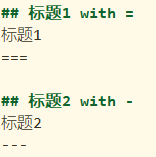

---

### 段落
使用Markdown编写文档是有两种方式换行，一种是**自然换行**：就是按照文档的自然行间距换行，我们只要在上下两行之间多加一个空行就可以实现。
如果嫌这种方式的行间距太大，可以使用第二种方式**换行符换行**，我们只要在上一行行尾加两个空格，即可插入一个换行符。这种方式出来的效果，是上下两行紧挨在一起，
适合在书写正文时段落内部的换行，而第一种方式适合段落与段落的换行或段落与标题之间的换行。

---

### 强调
- 粗体：在要加粗的文字的前后加“**”或者加两个下划线"_"
- 斜体：在斜体文字两边加一个“*”，或者下划线“_”
- 斜体加粗：在斜体加粗文字两边加三个“*”或三个下划线
- 删除：在删除文字两边加两个“~”

---

### 链接
Markdown中的链接：
- **外部链接**  
    -   
- **内部链接**（又称内嵌式链接）
	- 如果文档在同一个文件夹内则不用写绝对路径，直接写相对路径，即直接写文件名称。
	- 链接本文档的其他部分：可以写成“#要跳转位置”，可以在GitHub中测试
- **引用式链接**  
如果一个链接要在文档中多次出现，为了避免重复书写，我们可以使用“引用式链接”，即只定义一次，然后只需要引用它的名称即可。
另外，我们在定义引用时可以给它取一个别名，例如：[百度][baidu]，这里[baidu]就是别名。

****例如：***  
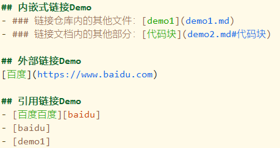  
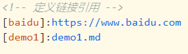

---

### 图片
- **直接定义**，语法：直接定义，语法：  
	alt：表示如果图片不能正常显示的时候，显示的文字  
	url：表示图片所在的位置  
	text：表示当鼠标移到图片上面是显示的提示文字
- **使用引用**， 语法：![alt][引用]
	- 引用的语法：[引用名称]:图片地址  

***例如:***  
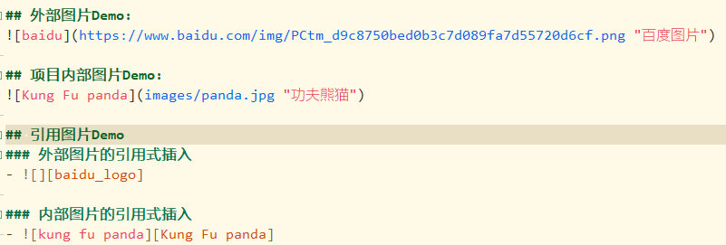  
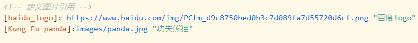

---

### 列表
- **无序列表**：使用符号“-”或“*”，再加一个空格开始。子列表要使用一个tab或四个空格缩进。  

***例如:***  
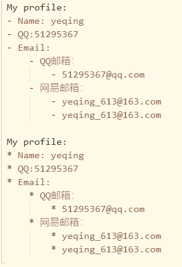  
***效果：***  
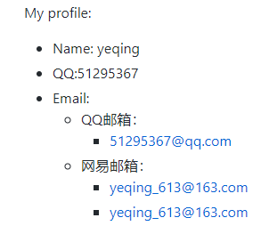

- **有序列表**  
在每个列表成员前面加上数字序号加点号即可。
注意：如果没有按数字没有按顺序，则Markdown会自动进行排序。同样，如果是多级列表，则子列表比父列表在开始位置多加四个空格。

***例如：***  
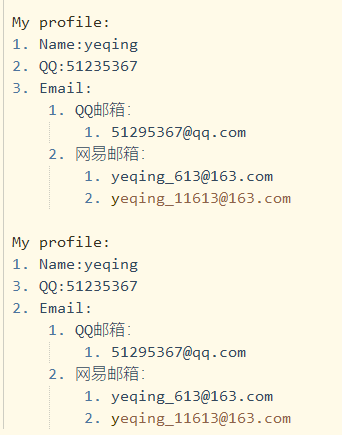  

***效果：***  
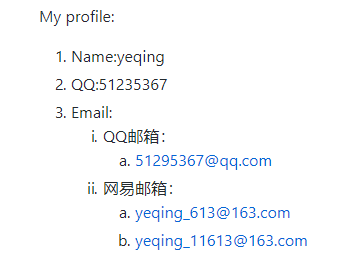

---

### 引用
引用比较简单，就是在要引用的内容前加一个“>”，如果是多重引用就连续加多个“>”。这样就会引用的内容就会变成灰色，并且前面有一条竖杠，表示该内容引用自别处。

***例如：***  
  

***效果：***  

---

### 代码块
- **行内代码**：行内代码就是在代码左右两边各加上一个英文半角的反引号“·”，例如：  
    
	
- **块式代码**：在代码的上下各加上三个英文半角反引号，还可以在上面的反引号后面写上代码的语言名称，可以实现语法高亮。块式代码还可以不用反引号，而直接在每行代码前加四个前导空格，但是这种方法无法实现语法高亮。
 
    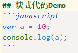  
	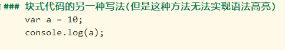
	
---

### 水平分隔线
等价于HTML中的（hr）标签，有三种书写方式：
1. 三个连续的英文横杠：---  
	*注意*：三个英文的横杠，注意：如果在横杠上面加上文字，就变成了“##标题2”了，所有不要在上面加文字。
2. 三个连续的型号：***
3. 三个连续的下划线：___

---

### HTML代码
如果你想对文档做更多的格式化，而这些格式超出了 MarkDown的能力范围，你可以使用 HTML 标记，MarkDown 对 HTML 能够很好地兼容。这个功能非常有用，但是需要小心。
HTML 内部的 MarkDown语法会无效！

---

### 表格
Markdown的表格语法简单直观，就是使用“|”直接分割表格单元，第一行是表头，注意第二行一定要在“|”之间至少写三个“-”，它的作用可以标记单元格的对齐方式，
例如：左对齐是“| :--- |”，右对齐是：“| ---: |”，居中对齐是：“| :---: |”。可以看出在哪边对齐就是在哪边加一个英文冒号，如果不加冒号默认是居左对齐。每个单元格至少需要三个横线来间隔，冒号算作一个横线。外侧的竖线（|）可以没有。
单元格里可以使用 MarkDown 语法。我们还可以在单元格中加入链接和图片。

***表格Demo***  
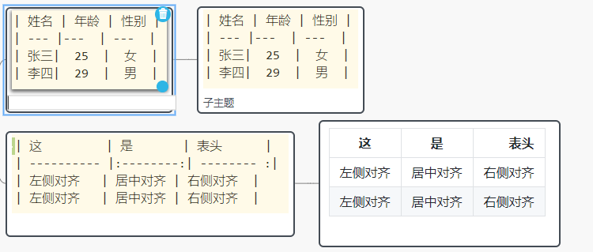

---

### GFM语法
GFM是Github Flvored Markdown的英文缩写，它是Github定义的markdown的语法扩展。  
1. task list(任务列表)：语法： [一个空格] task，它相当于HTML中的checkbox 。
创建任务列表的前提是你需要创建一个有序或无序列表。然后使用方括号来表示一个复选框。
方括号中用字母x标识任务已经完成，或者空格标识任务没有完成。

	***任务列表Demo***  
	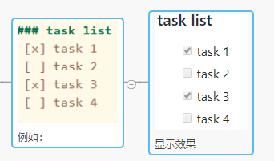
2. emoji表情符号:查看 GFM 支持的完整表情符号列表，请访问 [Emoji CheatSheet](http://www.emoji-cheat-sheet.com/)

---

## 附件：[Markdown语法思维导图](https://processon.com/view/5ed9e66bf346fb1712e21d92#map)
