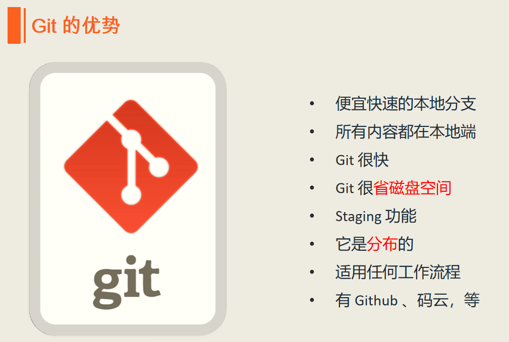

# 第三季 Git进阶
通过前面的学习我们已经了解Git Bash基本命令的使用，并且学习如何使用Markdown来编写文档。
这一节，我们将进一步学习Git，并对Git Bash命令进行深入的学习。学完本节后，我们应该能够把 Git Bash 命令使用的游刃有余，可以在项目仓库的提交历史中随意穿梭，可以玩转分支，以及变基这些高级操作，
可以使用别名，定制属于自己的 Git Bash 命令，提高自己的操作效率，等等。

## 目录
- [了解Git](README.md#了解Git)
- [Git GUI](README.md#GitGUI)
- [Git配置](README.md#Git配置)
- [Git协议](README.md#Git协议)
- [Git基本操作](README.md#Git基本操作)
- [标签操作](README.md#标签操作)
- [分支操作](README.md#分支操作)

## 了解Git
> **维基百科**：git（/ɡɪt/，吉特）是一个分散式版本控制软件，最初由林纳斯·托瓦兹創作，於2005年以GPL釋出。最初目的是为更好地管理Linux核心开发而设计。应注意的是，这与GNU Interactive Tools（一个类似Norton Commander界面的文件管理器）不同。

> **百度百科**：Git（读音为/gɪt/）是一个开源的分布式版本控制系统，可以有效、高速地处理从很小到非常大的项目版本管理。 [1] 
> Git 是 Linus Torvalds 为了帮助管理 Linux 内核开发而开发的一个开放源码的版本控制软件。
> Torvalds 开始着手开发 Git 是为了作为一种过渡方案来替代 BitKeeper [1]  。

Git 是分布式版本控制系统，那么它可以没有中央服务器的，每个人的电脑
就是一个完整的版本库，这样，工作的时候就不需要联网了，因为版本都是在自己的电脑上。既然每个人的电脑都有一个完整的版本库，那多个人如何协作呢？
比如说自己在电脑上改了文件 A，其他人也在电脑上改了文件 A，这时，你们两
之间只需把各自的修改推送给对方，就可以互相看到对方的修改了。

### git 工作流程
一般工作流程如下：  
1. 从远程仓库中克隆 Git 资源作为本地仓库。
2. 从本地仓库中 checkout 代码然后进行代码修改
3. 在提交前先将代码提交到暂存区。
4. 提交修改。提交到本地仓库。本地仓库中保存修改的各个历史版本。
5. 在修改完成后，需要和团队成员共享代码时，可以将代码 push 到远程仓库。

下图展示了 Git 的工作流程：  

关于Git的详细介绍，可以查阅Git官网文档：[Git book](https://git-scm.com/book/zh/v2)，这里就不再赘述！

## Git GUI
如果熟练使用Git命令，可以完成版本控制的左右操作，但是Git GUI工具相对而言更为直观，由其是在进行分支操作时，我们可以很直观的看见项目各个分支的变化情况。  
流行的Git GUI工具有很多，自己常用的Git自带的Git GUI、SrouceTree、TortoiseGit三个工具。  
第一个是安装Git时自带的，后面两个只要在百度搜索它们的名字，找到官网就可以点击下载。关于它们的安装和基本使用方法，每个都可以专门做一个主题讲解，
网上相关的知识也很多，这里就不再赘述了。  
在使用SrouceTree和TortoiseGit向GitHub推送是如果提示需要配置秘钥。所谓秘钥就是我们使用git bash 执行命令,生成的公钥和私钥
命令: ssh-keygen -t rsa

执行命令完成后,在window本地用户.ssh目录C:\Users\用户名\.ssh下面生成如下
名称的公钥和私钥:  

公钥是配置在自己的Github账户里的，私钥是自己保存的。有时需要在GUI工具里配置一个.ppk格式的私钥，我们可以找到已经安装好的PuTTY Key Generator打开  
  

然后点击Conversions-->Import Key    
  

然后选择我们的私钥，导入私钥后如下所示：  
  

最后点击Save private key，将生成的.ppk文件保存到.ssh文件夹里。  

接着打开Papeant Key List程序  
  

将刚刚生成的.ppk文件加入  

## Git配置

### .gitignore
我们可以设置.gitignore文件，目的是告诉Git某些文件是被忽略的。  

我们把要忽略的文件写到该文件中，一行一条信息，例如：在.gitignore文件中写入*.obj和*.ext，就是告诉git所有.obj格式和.exe格式的文件都将被忽略，
这样这些文件就不再被跟踪和提交。

### 换行符
在不同的操作系统中换行符是不同的：  

如上所示如果我们在windows上编写项目，自然换行符是“\r\n”，而git用的是linux的“\n”换行，
因此在添加到git时就会出现警告提示：warning: LF will be replaced by CRLF in file.
意思是说原来的CRLF换行符被替换成了LF。  

我们可以通过配置如下两条信息消除该警告：  

第一条命令是git自动配置好的，我们无需再手动配置，只需执行第二条命令即可。

### 别名
当我们熟悉了git命令后，每次输入命令全称，有些命令会特别长，比如：  
***git log -pretty=format:'%h %ad | %s%d' -graph -date=short***  
这条命名是表示：***以图形方式打印Git提交日志***。如果每次有输入这么长的命令会很麻烦，于是我们可以设置别名来简化Git命令。

我们可以执行这个命令：  

***git config --global alias.hi log -pretty=format:'%h %ad | %s%d' -graph -date=short***

此时我们就将上面的那条特别冗长的命名简化为了“hi”，之后我们只需敲“***git hi***”就能同样以图形方式打印Git提交日志。
“hi”就是我们自定义的别名，是单词**history**的头两个字母。

我们还可以执行“***git config --global alias.ci commit***”给commit设置别名ci，
执行“***git config --global alias.st status***”给status设置别名st，等等  
所有的这些别名都配置在Git主目录下一个叫**.gitconfig**的隐藏配置文件中。
我们可以执行***“cd ~”***命令来到主目录，然后执行“***vim .gitconfig***”命令就可以查看刚刚配置的所有别名了。

### 凭证
如果我们使用的是HTTP协议，则每次向GitHub执行推送时，都要输入用户名和密码。为了提高效率我们执行命令：  
  
该命令执行后当我们执行推送时，只需在输入一次用户名和密码，就会被记住。今后执行“***git push***”时就再不用输用户名和密码了。

## Git协议

Git协议有四种：
1. 本地协议
2. Git协议
3. HTTP协议
4. SSH协议（重点）

### 本地协议
在本次协议中我们通常克隆的是本地仓库，因此可以使用：***git clone 仓库的磁盘路径***，例如；***git clone /F/myRepository/demo.git***，就是要克隆F盘中myRepository文件夹下的叫demo的仓库。
通常不建议在路径前使用“file://”，如：“file:///F/myRepository/demo.git”，这样无论是克隆、拉取、推送等，都要使用file协议栈来完成，显然没有直接使用文件系统效率高。
当然我们一般不会直接克隆一个本次磁盘上的仓库，而是一个局域网（如公司局域网）的服务器上的某个共享文件夹的名字。  
无论是在本地的磁盘上，还是共享文件夹上，我们都可以进行克隆（clone）、拉取（pull）、推送（push）、我们还可以添加远程仓库链接：  
***git remote add origin /f/myRepository/demo.git***  

如果像上面使用文件系统的共享，一般要设置文件系统的shell权限，否则在多人协作时，如果有人修改了仓库的git内部文件，从而造成仓库的损坏。

### Git协议
接下来是 Git 协议。 这是包含在 Git 里的一个特殊的守护进程；它监听在一个特定的端口（9418），类似于 SSH 服务，但是访问无需任何授权。 要让版本库支持 Git 协议，需要先创建一个 git-daemon-export-ok 文件 —— 它是 Git 协议守护进程为这个版本库提供服务的必要条件 —— 但是除此之外没有任何安全措施。 要么谁都可以克隆这个版本库，要么谁也不能。 这意味着，通常不能通过 Git 协议推送。 由于没有授权机制，一旦你开放推送操作，意味着网络上知道这个项目 URL 的人都可以向项目推送数据。 不用说，极少会有人这么做。

### HTTP协议
Git 通过 HTTP 通信有两种模式。 在 Git 1.6.6 版本之前只有一个方式可用，十分简单并且通常是只读模式的。 Git 1.6.6 版本引入了一种新的、更智能的协议，让 Git 可以像通过 SSH 那样智能的协商和传输数据。 之后几年，这个新的 HTTP 协议因为其简单、智能变的十分流行。 新版本的 HTTP 协议一般被称为 智能 HTTP 协议，旧版本的一般被称为 哑 HTTP 协议。

### SSH协议
使用SSH协议前先要获取一个RSA密钥对：  

然后把产生的公钥配置到GitHub账户上，添加完成后会出现一个钥匙的图案，注意：刚添加时钥匙图案是黑色的，表示一次都没有用过。当我们使用SSH协议完成了一次“推送”或“拉取”后，钥匙图案就会变成绿色。

架设 Git 服务器时常用 SSH 协议作为传输协议。 因为大多数环境下服务器已经支持通过 SSH 访问 —— 即使没有也很容易架设。 SSH 协议也是一个验证授权的网络协议；并且，因为其普遍性，架设和使用都很容易。

通过 SSH 协议克隆版本库，你可以指定一个 ssh:// 的 URL：

$ git clone ssh://[user@]server/project.git

或者使用一个简短的 scp 式的写法：

$ git clone [user@]server:project.git

在上面两种情况中，如果你不指定可选的用户名，那么 Git 会使用当前登录的用的名字。

***以上只是简单对四种协议进行了介绍，详细信息和各自的优缺点，并查阅Git官方文档：[服务器上的 Git - 协议](https://git-scm.com/book/zh/v2/%E6%9C%8D%E5%8A%A1%E5%99%A8%E4%B8%8A%E7%9A%84-Git-%E5%8D%8F%E8%AE%AE)***