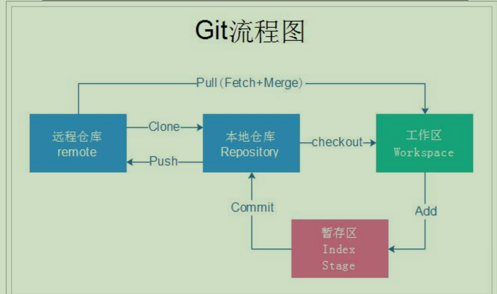
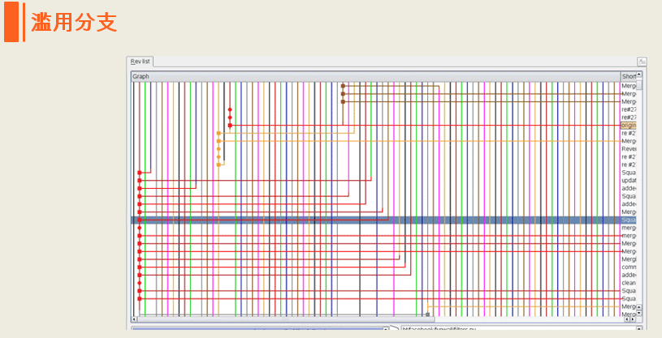
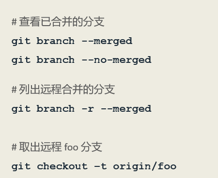

# 第三季 Git进阶
通过前面的学习我们已经了解Git Bash基本命令的使用，并且学习如何使用Markdown来编写文档。
这一节，我们将进一步学习Git，并对Git Bash命令进行深入的学习。学完本节后，我们应该能够把 Git Bash 命令使用的游刃有余，可以在项目仓库的提交历史中随意穿梭，可以玩转分支，以及变基这些高级操作，
可以使用别名，定制属于自己的 Git Bash 命令，提高自己的操作效率，等等。

## 目录
- [了解Git](README.md#了解Git)
- [Git GUI](README.md#GitGUI)
- [Git配置](README.md#Git配置)
- [Git协议](README.md#Git协议)
- [Git基本操作](README.md#Git基本操作)
- [标签操作](README.md#标签操作)
- [分支操作](README.md#分支操作)

---

## 了解Git
> **维基百科**：git（/ɡɪt/，吉特）是一个分散式版本控制软件，最初由林纳斯·托瓦兹創作，於2005年以GPL釋出。最初目的是为更好地管理Linux核心开发而设计。应注意的是，这与GNU Interactive Tools（一个类似Norton Commander界面的文件管理器）不同。

> **百度百科**：Git（读音为/gɪt/）是一个开源的分布式版本控制系统，可以有效、高速地处理从很小到非常大的项目版本管理。 [1] 
> Git 是 Linus Torvalds 为了帮助管理 Linux 内核开发而开发的一个开放源码的版本控制软件。
> Torvalds 开始着手开发 Git 是为了作为一种过渡方案来替代 BitKeeper [1]  。

Git 是分布式版本控制系统，那么它可以没有中央服务器的，每个人的电脑
就是一个完整的版本库，这样，工作的时候就不需要联网了，因为版本都是在自己的电脑上。既然每个人的电脑都有一个完整的版本库，那多个人如何协作呢？
比如说自己在电脑上改了文件 A，其他人也在电脑上改了文件 A，这时，你们两
之间只需把各自的修改推送给对方，就可以互相看到对方的修改了。

### git 工作流程
一般工作流程如下：  
1. 从远程仓库中克隆 Git 资源作为本地仓库。
2. 从本地仓库中 checkout 代码然后进行代码修改
3. 在提交前先将代码提交到暂存区。
4. 提交修改。提交到本地仓库。本地仓库中保存修改的各个历史版本。
5. 在修改完成后，需要和团队成员共享代码时，可以将代码 push 到远程仓库。

下图展示了 Git 的工作流程：  

关于Git的详细介绍，可以查阅Git官网文档：[Git book](https://git-scm.com/book/zh/v2)，这里就不再赘述！

---

## Git GUI
如果熟练使用Git命令，可以完成版本控制的所有操作，但是如果你想更为直观，尤其是在进行分支操作时，我们可以使用Git GUI工具。  
流行的Git GUI工具有很多，自己常用的有Git自带的Git GUI、SrouceTree、TortoiseGit三个工具。  
第一个是安装Git时自带的，后面两个只要在百度搜索它们的名字，找到官网就可以点击下载。
需要强调的是，如果你的本地仓库需要与远程仓库进行同步，并且你使用的是SSH协议，那么你需要先配置密钥。所谓密钥就是我们使用git bash 执行 **ssh-keygen -t rsa** 命令,生成的由公钥和私钥组成的一个密钥对。

默认情况下，用户的 SSH 密钥存储在其 ~/.ssh 目录下：  

公钥是配置在自己的Github账户里的，私钥是自己保存的。有时需要在GUI工具里需要配置一个.ppk格式的文件，该文件是由私钥生成的，具体方法是：  
1. 打开PuTTY Key Generator程序  
  

2. 点击Conversions-->Import Key    
  

3. 导入自己的私钥  
  

4. 点击Save private key，生成.ppk格式文件，然后命名、保存（通常名称命名为sy.ppk，并保存在.ssh文件夹）。  

5. 打开Papeant Key List程序  
  

6. 把刚刚生成的sy.ppk文件加入  

关于Git GUI的安装和基本使用方法，每个都可以专门做一个主题讲解，网上相关的知识也很多，这里就不再赘述了。  

---

## Git配置
### （一）.gitignore
我们可以设置.gitignore文件，目的是告诉Git某些文件是被忽略的。  

我们把要忽略的文件写到该文件中，一行一条信息，例如：在.gitignore文件中写入:  
  
就是告诉git所有Markdown文件和.project文件都将被忽略，这样这些文件就不再被跟踪和提交。其中#后面的文字是注释，不作为忽略信息。

### （二）换行符
在不同的操作系统中换行符是不同的：  

如上所示如果我们在windows上编写项目，换行符就是“\r\n”，但是git用的是linux的“\n”换行，
因此当我们在windows中修改了某个文件，然后添加到git时就会出现警告提示：*warning: LF will be replaced by CRLF in fileName.*
意思是说：*在某某文件中原来的CRLF换行符被替换成了LF*。  

我们可以通过配置如下两条信息消除该警告：  

第一条命令是git自动配置好的，我们无需再手动配置，只需执行第二条命令即可。这样以后就不会在出现上述警告了。：-）

### （三）别名
当我们熟悉了git命令后，每次输入命令全称，有些命令会特别长，比如：  
***git log -pretty=format:'%h %ad | %s%d' -graph -date=short***  
这条命名是表示：***以图形方式打印Git提交日志***。如果每次都输入这么长的命令会很麻烦，于是我们可以设置别名来简化Git命令。

我们可以执行这个命令：  

***git config --global alias.hi log -pretty=format:'%h %ad | %s%d' -graph -date=short***

将上面那条特别冗长的命名简化为了两个字符“hi”，之后我们只需敲“***git hi***”就能同样以**图形方式打印Git提交日志**。
“hi”就是我们自定义的别名，是单词**history**的头两个字母。

我们还可以执行“***git config --global alias.ci commit***”给commit设置别名ci，
执行“***git config --global alias.st status***”给status设置别名st，等等  
所有的这些别名都保存在Git主目录下一个叫**.gitconfig**的隐藏的配置文件中。
我们可以执行***“cd ~”***命令来到主目录，然后执行“***vim .gitconfig***”命令就可以查看和编辑刚刚配置的所有别名了。

### （四）凭证
如果我们使用的是HTTP协议，则每次向GitHub执行推送或拉取时，都要输入GitHub的用户名和密码。为了提高效率我们执行命令：  
  
此后在执行push或pull时只需再输入一次用户名和密码，就会被记住，以后就再不用输入了。

---

## Git协议

Git协议有四种：
1. 本地协议
2. Git协议
3. HTTP协议
4. SSH协议（重点）

### 本地协议
在本次协议中我们通常克隆的是本地仓库，因此可以使用：***“git clone 仓库的磁盘路径”***，例如；***git clone /F/myRepository/demo.git***，就是要克隆F盘中myRepository文件夹下的叫demo的仓库。
通常不建议在路径前使用“file://”，如：“file:///F/myRepository/demo.git”，这样无论是克隆、拉取、推送等，都要使用***file协议栈***来完成，没有直接使用文件系统效率高。
当然我们一般不会直接克隆一个本次磁盘上的仓库，而是克隆某个局域网（如公司局域网）的服务器上的某个共享文件夹。  
无论是在本地的磁盘上，还是局域网上的共享文件夹，我们都可以进行克隆（clone）、拉取（pull）、推送（push），这些操作与远程仓库的操作是一样的。

我们甚至还可以将本地仓库添加为远程仓库链接：  
***git remote add origin /f/myRepository/demo.git***  

使用这个协议时，一般还要设置文件系统的shell权限，否则在多人协作时，如果有人修改了仓库的git内部文件，会造成仓库的损坏。

### Git协议
接下来是 Git 协议。 这是包含在 Git 里的一个特殊的守护进程；它监听在一个特定的端口（9418），类似于 SSH 服务，但是访问无需任何授权。 要让版本库支持 Git 协议，需要先创建一个 git-daemon-export-ok 文件 —— 它是 Git 协议守护进程为这个版本库提供服务的必要条件 —— 但是除此之外没有任何安全措施。 要么谁都可以克隆这个版本库，要么谁也不能。 这意味着，通常不能通过 Git 协议推送。 由于没有授权机制，一旦你开放推送操作，意味着网络上知道这个项目 URL 的人都可以向项目推送数据。 不用说，极少会有人这么做。  
该协议最大的优点是速度快，但缺点是不安全。  
常用命令：  

### HTTP协议
Git 通过 HTTP 通信有两种模式。 在 Git 1.6.6 版本之前只有一个方式可用，十分简单并且通常是只读模式的。 Git 1.6.6 版本引入了一种新的、更智能的协议，让 Git 可以像通过 SSH 那样智能的协商和传输数据。 之后几年，这个新的 HTTP 协议因为其简单、智能变的十分流行。 新版本的 HTTP 协议一般被称为 “*智能 HTTP 协议*”，旧版本的一般被称为 “*哑 HTTP 协议*”。  
该协议的优点是使用简单，我们只需要写出远程仓库的URL地址就可以执行push、clone或pull，也不需要设置密钥。同样，它的传输速度也很高效，另一个好处是 HTTPS 协议被广泛使用，一般的企业防火墙都会允许这些端口的数据通过。

缺点：在一些服务器上，架设 HTTPS 协议的服务端会比 SSH 协议的棘手一些。 除了这一点，用其他协议提供 Git 服务与智能 HTTP 协议相比就几乎没有优势了。

### SSH协议
架设 Git 服务器时常用 SSH 协议作为传输协议。 因为大多数环境下服务器已经支持通过 SSH 访问 —— 即使没有也很容易架设。 SSH 协议也是一个验证授权的网络协议；并且，因为其普遍性，架设和使用都很容易。

*优势*

用 SSH 协议的优势有很多。 首先，SSH 架设相对简单 —— SSH 守护进程很常见，多数管理员都有使用经验，并且多数操作系统都包含了它及相关的管理工具。 其次，通过 SSH 访问是安全的 —— 所有传输数据都要经过授权和加密。 最后，与 HTTPS 协议、Git 协议及本地协议一样，SSH 协议很高效，在传输前也会尽量压缩数据。

*缺点*

SSH 协议的缺点在于它不支持匿名访问 Git 仓库。 如果你使用 SSH，那么即便只是读取数据，使用者也 必须 通过 SSH 访问你的主机， 这使得 SSH 协议不利于开源的项目，毕竟人们可能只想把你的仓库克隆下来查看。 如果你只在公司网络使用，SSH 协议可能是你唯一要用到的协议。 如果你要同时提供匿名只读访问和 SSH 协议，那么你除了为自己推送架设 SSH 服务以外， 还得架设一个可以让其他人访问的服务。

使用SSH协议前先要获取一个RSA密钥对：  
  
前面已经讲过：默认情况下，用户的 SSH 密钥存储在其 ~/.ssh 目录下：  

在GitHub账户上添加完公钥后会出现一个钥匙的图案，刚添加时图案是黑色的，表示一次都没有用过。当我们使用SSH协议完成了一次“推送”或“拉取”后，钥匙图案就会变成绿色。

通过 SSH 协议克隆版本库，例如：

**$ git clone ssh://git@github.com/yeqing123/demo.git**

或者使用一个简短的 scp 式的写法：

**$ git clone git@github.com:yeqing123/demo.git** 
 
在上面两种情况中，如果你不指定可选的用户名，那么 Git 会使用当前登录的用的名字。

***有关四种协议的详细介绍，请查阅Git官方文档：[服务器上的 Git - 协议](https://git-scm.com/book/zh/v2/%E6%9C%8D%E5%8A%A1%E5%99%A8%E4%B8%8A%E7%9A%84-Git-%E5%8D%8F%E8%AE%AE)***

---

## Git基本操作
  
  

当我们想要删除没有添加到git暂存区中的文件时，可以使用下面的命令：  
  
  
***注意：“git add -p”***  可以将一次修改分块后多次提交，但是分块是按原来的内容进行的，例如：文件a中原有一行内容“1111”，我们在1111的前面加入了一行2222，在1111的后面加入了一行3333，就可以按原来的内容1111将修改分为2222和3333两块进行两次提交。
但是如果三行都是一次新加上去的，则无法分块，只能进行一次提交。

  
  

- Git diff  
  

用于比较两次修改的差异，常用的git diff命令如下：

#显示暂存区和工作区的差异  
**$ git diff**

#显示暂存区和上一个commit的差异  
**$ git diff --cached [file]**

#显示工作区与当前分支最新commit之间的差异  
**$ git diff HEAD**

#显示两次提交之间的差异  
**$ git diff [first-branch]...[second-branch]**

#显示今天你写了多少行代码  
**$ git diff --shortstat "@{0 day ago}"**

#显示某次提交的元数据和内容变化  
**$ git show [commit]**

#显示某次提交发生变化的文件  
**$ git show --name-only [commit]**

#显示某次提交时，某个文件的内容  
**$ git show [commit]:[filename]**

***关于 git diff 命令的详细介绍，请查阅Git官方文档：[git-diff](https://git-scm.com/docs/git-diff)***

- 回撤操作  
回撤操作是git的重要功能，我们之所以使用版本控制，不单单是我们可以看见过去的提交历史，更重要的是我们可以回撤和修改提交历史，常用的操作有：  
  
git reset 操作的示例图：  
  
  
变基操作的功能非常的强大，它可以改写历史提交，并对分支进行操作！

- ***关于“Git提交信息规范及Commitizen工具使用指南”，请移步[这里](ch0301/README.md)***

---

## 标签操作
为什么要使用标签？一般在一个软件开发中会有几百甚至是上千个提交，其中有些重要的提交，它在该软件整个发展历史中具有里程碑式的意义。
如果我们需要回退到这些重要的节点，就只能找到它的哈希值然后才能回退，这是非常不方便的。因此，就有了标签，我们会为这些重要的节点（提交）打上具有一定含义的标签，
以后在回退时就可以引用标签名进行操作，而不必再使用哈希值。

  
  
#删除远程仓库上指定的标签  
**$ git push origin :refs/tags/tagName**

---

## Git分支
git分支是非常重要的，如果我们不能掌握它，那么我们使用Git的水平基本上算是停留在幼儿园水平！！  
- **使用分支最大的作用是有利于实现软件的并行开发**。例如：  
  
又如：  

分支到好处是软件开发的灵活高效，但凡是都有两面性，这也容易造成分支的滥用:  
  
因此，一定要对分支进行规范化的使用，防治滥用分支。

- **常用的分支操作**  
分支的操作其实不难，每一条分支的操作都是一样的，无非就是修改内容、使用git add . 添加、然后提交。
 与使用一条master分支不同的是，我们要创建多个分支，并且学会在不同的分支间切换，最后合并分支。  
   
 又有：  
   
 **$ git branch -r**命令通常与 **$ git remote -v** 配合使用，来查看远程分支及其所在的仓库，其中origin就是远程仓库的别名：  
 
 
 我们更多的时候使用 **git branch -v** 来查看分支，它不但列出了所有分支的名称，及当前所在的分支，还包含了每个分支当前位于哪个提交（会包含该提交的哈希值和提交信息）：  
 
 

  

删除远程分支还可以：  
**$ git push origin --delete [branch-name]**  
**$ git branch -dr [remote/branch]**
 
- **冲突解决**  
  
冲突的出现并不可怕，我们只要进入到发生冲突的文件中，修改内容解决冲突，就可以重新合并提交了。

- **git stash命令**  
如果我们在一个分支上对内容做了修改但没有提交，此时我们是不能切换分支：  
  
我们可以将修改的内容，保存到一个临时的区域，使用命令：**git stash** ，然后就可以切换分支。  
  

如果要重新提交，则使用 **git stash pop** 命令将原来修改的内容弹出来，再做提交。  

相关的命令还有：  
#查看stash列表  
**git stash list**  
#删除stash列表  
**git stash clear**  

## 更多关于Git常用命令的介绍，请移步[这里](../../git/README.md)

（完）

