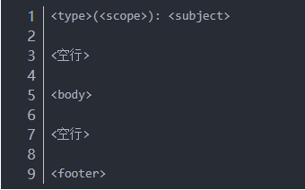
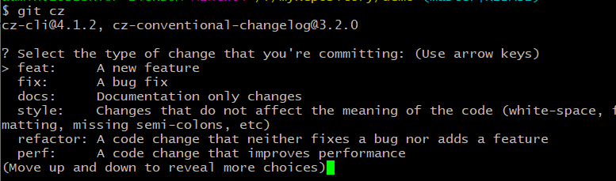

# Git提交信息规范
## 一、为什么需要制定提交规范？

在团队协作开发时，每个人提交代码时都会写 commit message。

每个人都有自己的书写风格，可以说是五花八门，十分不利于阅读和维护。

一般来说，大厂都有一套的自己的提交规范，尤其是在一些大型开源项目中，commit message 都是十分一致的。

因此，我们需要制定统一标准，促使团队形成一致的代码提交风格，更好的提高工作效率，成为一名有追求的工程师。

## 二、采用哪种规范？

采用Angular的git commit 规范，基本项目都在采用这套规范。

## 三、规范具体介绍

Commit Message 格式:每次提交，Commit message 都包括三个部分：Header，Body 和 Footer。

其中，Header 是必需的，Body 和 Footer 可以省略。

Header :

Header部分只有一行，包括三个字段：type（必需）、scope（可选）和subject（必需）。

1. type

2. scope

用于说明 commit 影响的范围，比如数据层、控制层、视图层、包名、文件名等等。

3. subject

是 commit 目的的简短描述，不超过50个字符，结尾不加句号。

Body :

Body 部分是对本次 commit 的详细描述,应该说明代码变动的动机，以及与以前行为的对比。

Footer :

Footer有两种情况

1. 是否有重大的改变(是否有突破性的变化)

框架式改变，或者跟上一版本不兼容，则 Footer 部分以BREAKING CHANGE开头，后面是对变动的描述、以及变动理由和迁移方法。

2. 这一变化是否影响到任何尚未解决的问题(关闭issue)

可以填写fix #1 等于关闭问题1 或者 使用Closes #1,关闭多个issue使用fix #1,#2,#3 逗号分割，关闭了三个issue。

## 四、Commitizen工具

Commitizen是一个撰写合格Commit message 的工具。
安装命令如下：
**$ npm install -g commitizen**

进入工程项目仓库，使用 **npm init --yes**

然后使用命令 **commitizen init cz-conventional-changelog --save --save-exact**，接着就可以用 **git cz** 命令来代替 **git commit** 了。

此后会出现一个选项，用于生成commit message  
  
它提示我们使用上下箭头键，选择type，然后根据提示逐条填写信息，从而生成一个合格的commit message。

***更多信息请阅读阮一峰老师的：[Commit message 和 Change log 编写指南](http://www.ruanyifeng.com/blog/2016/01/commit_message_change_log.html)***