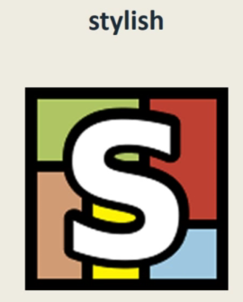
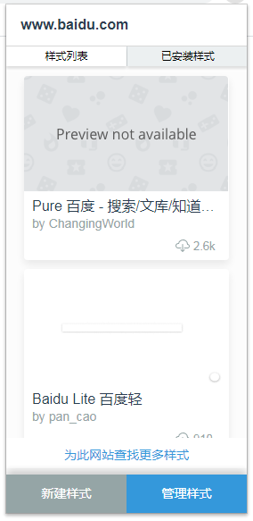
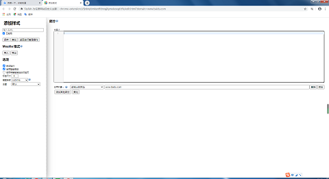
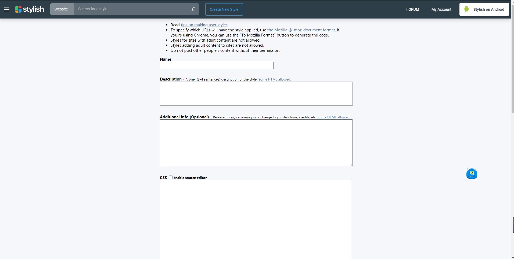
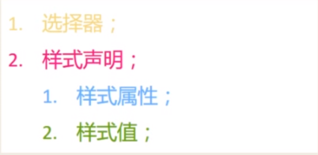
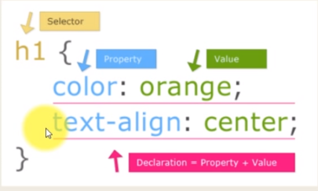
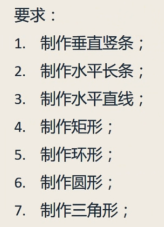

# stylish 网站换肤
Github是一个非常好的学习网站，上面不仅有最新、最时髦的技术资料，有大牛收集整理的学习笔记和资料，还可以参与实际项目的开发。这些都非常有助于我们技术的提高和沉淀。

在Github开源之旅的学习过程中，前四季主要是学习了Git的基础，由浅入深的讲解了Git的使用，并且第二季讲解了用Markdown在编写自然语言文档的语法规则。从第五季开始就进行实战的训练，Github上的仓库分为“文档型项目仓库”和“代码型项目仓库”。
文档型项目仓库主要使用Markdown编写的自然语言文档，内容大多是自己的学习笔记或技术文档，除了第二季外在第六季（how-to-markdown）、第七季（Gitbook）、第八季（Jekyll静态站）都是文档型项目在Github上的极限玩儿法。

本季我们介绍基于CSS的**_stylish网站换肤技术_**，王顶老师在自己创建的[simple-clear-style](https://github.com/wangding/simple-clear-style)仓库里就有很好的样式范例，我也参与提交了 www.processon.com 网站的样式 [clean-processon](https://userstyles.org/styles/browse/processon)。

---

## 一、stylish简介
stylish [ˈstaɪlɪʃ] 英文单词的意思是：时髦的、流行的、漂亮的。  
  
这个log表示的是一款名为 stylish 的浏览器插件。Chorme、Firefox、Safari都有这款插件。  
Github是一个非常好的学习网站，上面不仅与最新、最时髦的技术资料，有大牛收集整理的学习笔记和资料，还可以参与实际项目的开发。这些都非常有助于我们技术的提高和沉淀。

在Github开源之旅的学习过程中，前四季主要是学习了Git的基础，由浅入深的讲解了Git的使用，并且第二季讲解了用Markdown在编写自然语言文档的语法规则。从第五季开始就进行实战的训练，Github上的仓库分为“文档型项目仓库”和“代码型项目仓库”。
文档型项目仓库主要使用Markdown编写的自然语言文档，内容大多是自己的学习笔记或技术文档，除了第二季外在第六季（how-to-markdown）、第七季（Gitbook）、第八季（Jekyll静态站）都是文档型项目在Github上的极限玩儿法。
代码型项目仓库就是基于不同编程语言的软件项目文档。  

本季我们介绍基于CSS的**_stylish网站换肤技术_**，王顶老师在自己创建的[simple-clear-style](https://github.com/wangding/simple-clear-style)仓库就是很好的学习资料。

---

## stylish简介
stylish [ˈstaɪlɪʃ] 英文单词的意思是：时髦的、流行的、漂亮的。  
  
这个log表示的是stylish的一款浏览器插件。Chorme、Firefox、Safari都有这款插件。
使用这款插件可是实现网页的改版（一键换肤），改变网页的布局和显示风格，我们可以在自己常用的网站上定制自己的页面布局和显示风格。

**要使用的工具**  
  - stylish 插进
  - usestyles.arg 网站（我们可以将自己制作的样式或皮肤发布的该网站上，也可以使用别人制作的皮肤）
  - 浏览器的开发者工具
  
---
  
## 二、安装并使用stylish插件
首先在插件市场搜索“stylish”，然后安装该插件，我是在Chorme上安装的。安装完成后会在浏览器右上角出现一个小图标:  
## 安装并使用stylish插件
首先在插件市场搜索“stylish”，然后安装该插件，我是在Chorme上安装的。安装完成后会在浏览器左上角出现一个小图标:  
  
表示插件安装好了。

然后点击小图标，就会出现一个小窗口：  
  
里面会列出当前网页的“样式列表”和“已安装样式”，我们也可以点击[为此网站查找更多样式](https://userstyles.org)的超链接，去到styles官网去查找当前网页的更多样式。

如果我们想创建自己的样式，可以点击“新建样式”，就会出现一个新的窗口。  
  
然后在要修改样式的网页上打开浏览器的“开发者工具”，修改或添加该网页的CSS样式代码，再把修改或添加的代码写入到上述窗口的编辑框中然后保存，并为我们制作的样式输入一个名称。这样我们就可以保存自己创建的样式了。

创建了自己的样式后如果想要发布到userstyles官网上让需要的人下载使用，则先要登录网站如果没有注册的要先注册，注意注册时要翻墙才可以成功。  
登录成功后点击 “Create new styles”按钮进入到发布信息窗口，  
  
在窗口上填写发布的具体信息，包括网站样式的名称、具体描述、截图，还要将stylish代码导出来复制到对应位置，完成全部操作后就可以点击“Save”按钮发布出去了。
如果信息填写错误是发布不出去的，并且网页会有错误提示，根据提示修改即可。

---

## 三、CSS基础
1. **CSS简介**
  - CSS(Cascading Style Sheets)指*层叠*样式表
  - 样式定义如何显示HTML元素
  - 样式有三种存储方式：嵌入、内联和外链（外部的样式文件）
    - 嵌入是指直接写到HTML标签的style属性上的样式；
	- 内联是指在HTML的head标签里写入 style{ } 的样式代码，嵌入和内联统称为内部样式；
	- 外链就是直接写在一个外部的CSS文件里的，因此又称为外部样式。
  - CSS解决了内容与表现分离的问题
  - 外部样式表可以极大提高工作效率
  - 外部样式表通常存储在CSS文件中
  - 多个样式定义可层叠为一  
    嵌入、内联和外链三种方式可以多次重叠定义，它们的优先级由低到高为：浏览器的默认样式 --> 外链 --> 内联 --> 嵌入，就是说浏览器的缺省样式优先级最低，然后是外部样式，然后是内部样式，内部样式里嵌入方式优先级最高。
	
2. **CSS基本语法**  

	CSS的语法其实很简单，主要的组成部分：  
	  
	例如：  
	  

	- **选择器**：表示要规范的是哪个标签的样式，有多个标签时用逗号隔开，上例中表示要对h1进行样式规范。  
	- **样式声明**，包含在一对花括号里，每条样式声明以分号结束。一条样式声明中包含“样式属性”、“样式值”两部分，并以冒号隔开。上例中，包含了两条样式声明，蓝色部分就是样式属性，绿色部分就是样式值。分别规范了h1标签的两种样式：1，颜色为绿色；2，文本对齐方式为居中。

3. **练习**

	我们可以点击王顶老师提供的 [one div game](http://sample.wangding.in/web/one-div.html) 小游戏，练习CSS语法并完成如下要求：  
	

	如果想深入学习CSS知识可以点击[w3school CSS教程](https://www.w3school.com.cn/css/index.asp) 或者[W3C HTML 网页标准教程](http://www.w3chtml.com/)，也可以直接查阅[w3school CSS参考手册](https://www.w3school.com.cn/cssref/index.asp)，里面有系统的介绍和实例。

---

## 四、CSS学习路线
CSS的语法虽然简单，但是包含的内容非常多，如果不加梳理一股脑的乱学，反而效果不佳。我们总结了CSS学习的四个步骤，具体如下：
- Lvl1： 入门级别
  - 基本选择器
  - 基本样式，由*样式属性:样式值*形式组成
- Lvl2： 进阶级别
  - 高级选择器
  - 盒模型
  - 布局和定位
- Lvl3： 高级级别
  - CSS动画特效
- Lvl4： 最高级别
  - SASS （使用CSS编程，可使用变量和循环等...）
  - bootstrap (CSS框架)

通常，我们达到第二个层次就可以满足stylish网站换肤的所有需求了。

关于CSS的学习我们提供了两个网站，分别是[CSS Diner](http://flukeout.github.io/) 和 [学习CSS布局](http://learnlayout.com/)，第一个是以游戏通关的形式进行CSS选择器的练习，具有很好的实践效果；第二个网站是用来学习CSS布局的。

---

## 五、总结
学完stylish网站换肤后，我们就可以对常用的网站进行私人订制，比如屏蔽广告、隐藏多余的内容、改变网站风格等。我们也可以参与到被人的项目中，比如我们在Github上搜索stylish，然后选择CSS语言就会出现很多别人创建的关于stylish的仓库，我们可以进入仓库查看、使用别人写好的stylish样式，也可以为其贡献代码（pull request），或提出错误（issues），来参与到这些项目当中增加项目经验。
  

