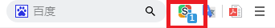
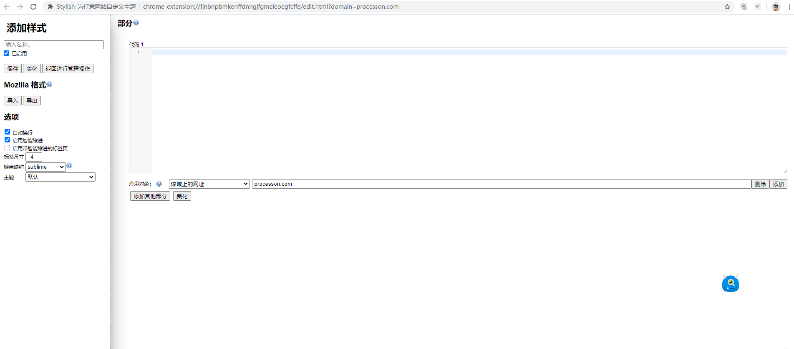

# stylish 网站换肤
Github是一个非常好的学习网站，上面不仅与最新、最时髦的技术资料，有大牛收集整理的学习笔记和资料，还可以参与实际项目的开发。这些都非常有助于我们技术的提高和沉淀。

在Github开源之旅的学习过程中，前四季主要是学习了Git的基础，由浅入深的讲解了Git的使用，并且第二季讲解了用Markdown在编写自然语言文档的语法规则。从第五季开始就进行实战的训练，Github上的仓库分为“文档型项目仓库”和“代码型项目仓库”。
文档型项目仓库主要使用Markdown编写的自然语言文档，内容大多是自己的学习笔记或技术文档，除了第二季外在第六季（how-to-markdown）、第七季（Gitbook）、第八季（Jekyll静态站）都是文档型项目在Github上的极限玩儿法。
代码型项目仓库就是基于不同编程语言的软件项目文档。  

本季我们介绍基于CSS的**_stylish网站换肤技术_**，王顶老师在自己创建的[simple-clear-style](https://github.com/wangding/simple-clear-style)仓库就是很好的学习资料。

---

## stylish简介
stylish [ˈstaɪlɪʃ] 英文单词的意思是：时髦的、流行的、漂亮的。  
  
这个log表示的是stylish的一款浏览器插件。Chorme、Firefox、Safari都有这款插件。
使用这款插件可是实现网页的改版（一键换肤），改变网页的布局和显示风格，我们可以在自己常用的网站上定制自己的页面布局和显示风格。

**要使用的工具**  
  - stylish 插进
  - usestyles.arg 网站（我们可以将自己制作的样式或皮肤发布的该网站上，也可以使用别人制作的皮肤）
  - 浏览器的开发者工具
  
## 安装并使用stylish插件
首先在插件市场搜索“stylish”，然后安装该插件，我是在Chorme上安装的。安装完成后会在浏览器左上角出现一个小图标:  
  
表示插件安装好了。

然后点击小图标，就会出现一个小窗口：  
  
里面会列出当前网页的“样式列表”和“已安装样式”，我们也可以点击[为此网站查找更多样式](https://userstyles.org)的超链接，去到styles官网去查找当前网页的更多样式。

如果我们想创建自己的样式，可以点击“新建样式”，就会出现一个新的窗口。  
  
然后在要修改样式的网页上打开浏览器的“开发者工具”，修改或添加该网页的CSS样式代码，再把修改或添加的代码写入到上述窗口的编辑框中然后保存，并为我们制作的样式输入一个名称。这样我们就可以保存自己创建的样式了。