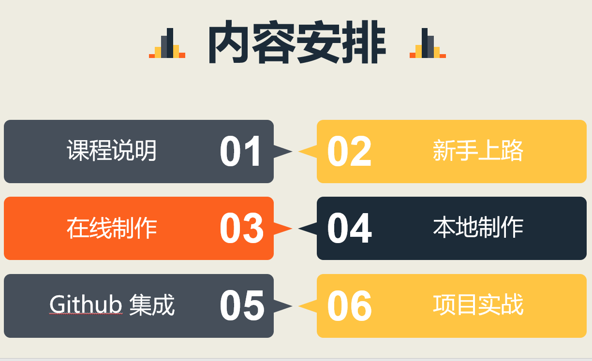

# GitBook 是什么？
  **GitBook 是以 Git 作为版本控制系统，以团队协作的方式，用来编写电子书。**
  
  GitBook 写书用的就是 Markdown 这种轻量的、纯文本的标记语言。所以我们一定要熟悉 Git 和 Markdown 的使用。

# GitBook 的用途
一提起 GitGook 是用来编写电子书的，有人也许会说：“我用不到它，那是大牛用来写书写教程的”。其实，当我们在编写软件时，
其中的文档就是电子书，如果我们编写的是软件包，其中的 API 接口文档也是电子书，这样看来，电子书其实是一个泛化的东西，
可以后广泛的用途。

# GitBook 网站
登录 GitBook 的[官方网站](https://www.gitbook.com/)，里面有大量高质量的电子书籍，可以在线看，也可以下载为 PDF 格式文档学习。

如何学习编写电子书呢？这就是本课程要解决的问题。

## 要求
1. 阅读百度百科的 GitBook 词条
2. 浏览 GitBook 网站
3. 浏览课程资料页面