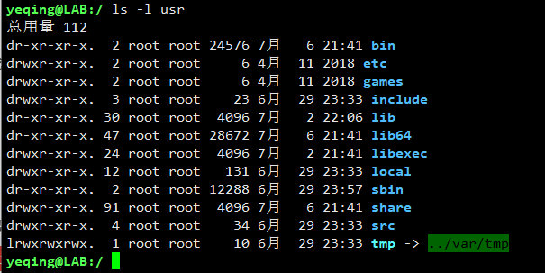
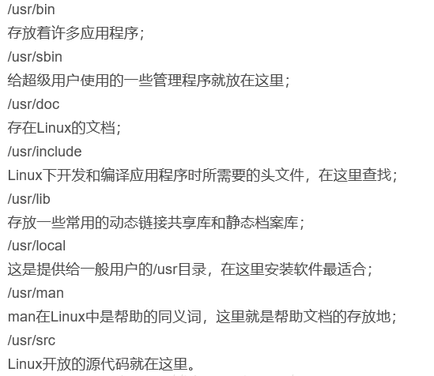

# 三、一见钟情之 -- 初识 Linux
## 目录
- [探索Linux操作系统](section-3.md#探索Linux操作系统)
- [三个常用的命令](section-3.md#三个常用的命令)
- [Linux根目录下各个子目录介绍](section-3.md#Linux根目录下各个子目录介绍)
- [操作文件和目录](section-3.md#操作文件和目录)
- [使用命令](section-3.md#使用命令)

## 探索 Linux 操作系统
Linux 操作系统中，命令行语法：**_command -options arguments_**  
例如：ls -l /lib

一个命令行由三部分组成：  
- command 表示命令本身，如："ls" "cd" 等
- -options 表示命令选项，指定命令的具体行为(例如 -l 表示按长格式显示)，一个命令可以有一个或多个选项
- arguments 表示命令的参数，指定命令的操纵对象（例如一个文件夹名称或一个路径），一个命令可以有一个或多个参数

注意：options（选项）有长短之分：
- short options(短选项)：一个横杠后面跟一个字母，通常是单词的首字母，例如：-a 或 -l
- long options(长选项)：两个横杠后面跟一个单词，通常表示选项的具体含义，例如：--all 或 --long  
  (长选项与短选项输出的内容是一样的)

两个或多个短选项可以合并，如：-a -l 可合并为 -al 或 -la，但是长选项不能合并。

## 三个常用的命令： 
1. ls 命令：列出目录内容
- "-d" 或 "--directory"，表示只看当前目录本身的信息，而不显示它里面的内容
- "-F" 或 "--classify"，给文件或目录名字后加一个分类的字符标识，"/" 表示一个文件夹，"@" 表示一个软链接，什么也不加表示一个文件
- "-h" 或 "--human-readable"，可读格式
- "-l" 长（long）格式输出
- "-r" 或 "--reverse"，按默认顺序的反序输出
- "-t" 或 "--time"，按修改日期排序

下来介绍 ls 的长格式(ls long format)输出的具体含义，  
我们以 **_drwxr-xr-x.  13 root root  155 6月  29 23:33 usr_**，为例进行说明：  
- ***drwxr-xr-x.***
  - first character(第一个字母)：字母 "d" 表示文件夹，横杠 "-" 表示文件，字母 "l" 表示软链接；  
    drwxr-xr-x 中的首字母是 d，表示 usr 是一个文件夹
  - **rwxr-xr-x** 表示三组权限：
    - 1 group owner user：第一组是当前目录的所有者权限
    - 2 group owner group：第二组是所有者所在的组的权限
    - 3 group all user：第三组是所有人的权限  
	
    每组权限都由 rwx 三个字母，按固定顺序表示：
    - "r" 即 "read"，表示读权限
    - "w" 即 "write"，表示写权限
	- "x" 即 "excute"，表示可执行权限  
    （如果是一个横杠 "-"，表示无对应的权限）
	
	因此，**rwxr-xr-x**表示，当前目录的所有者有“读、写、执行” 的权限，所有者所在的组和其他所有人有“读、执行” 权限，但没有“写”的权限。

- ***13*** 表示硬链接（hard link），后面会讲到
- ***root*** 表示：当前目录的所有者名称
- ***root*** 表示：所有者所在的组名称
- ***155*** 表示文件夹大小，单位是字节（byte）
- ***6月  29 23:33*** 表示文件夹创建或最后修改的日期和时间
- ***user*** 当前文件夹名称

2. file 命令：确定文件类型
在 Windows 上所有的文件都有扩展名，我们通过扩展名可以知道文件的类型。而 Linux 上没有文件扩展名，因此我们如何确定文件的类型呢？这就需要 file 命令。  
格式：***file filename***，filename 可以是相对路径，也可以是绝对路径。

3. less 命令：浏览文件内容
less 命令是一个用来查看文本文件的程序，格式：***less filename***。  
该命令如同用 vim 程序打开一个文本文件一样，操作方法也相同：
- 按 j 表示文本向上滚动一行
- 按 k 表示文本向下滚动一行
- 按 G 跳转到文本的末尾
- 按 g 或 gg 跳转到文本开头
- 按空格表示文本向上滚动一屏
- 按 q 退出

我们也可以按 "/" 后面跟一个字符串，表示在文本中查找该字符串。然后按 n 表示向下查找，按 N 表示向上查找。

## Linux根目录下各个子目录介绍：
***PS: 图片截取自 Linux 的 CentOS7 最小系统，文字说明来源于[这里](https://blog.csdn.net/weixin_40921797/article/details/81664453)***

首先用 cd / 命令来到系统根目录下，Linux 只有这一个根目录，可谓万物之源！
然后运行 ls 命令，可以看到有如下子目录：  

下来我们一一介绍一下它们：  
### bin  
bin 是 binary 的缩写，是 UNIX 类操作系统中根目录的标准子目录，包含可执行的程序（即准备运行的程序），以便达到启动（即启动）和修复系统的最小功能。  
  
打开 bin目录我们发现。这里面的内容非常多，一屏都显示不完，其中有我们常用的很多命令：cat、mv、cp、su、等。所以这里面存放着使用者最经常使用的命令。  
/bin是系统默认的路径，它是系统发出命令时搜索相应程序的目录列表。这意味着，只要在命令行中输入文件名，然后按下 Enter 键，
就可以运行 /bin 中的对应的可执行文件（即，可运行程序）从而达到我们执行命令完成对应功能的操作。

### boot  
这里面存放的是启动 Linux 时使用的一些核心文件（包括 Linux 系统内核）。Linux 的引导过程是 Linux 上的开源操作系统在计算机上的初始化。
它涵盖了从初始引导到启动初始用户空间应用程序的许多步骤。让我们打开 boot 看看里面的内容：
  

### dev  
dev 是 device（设备）的缩写。是Linux内核的设备管理器。  
  
我们可以看见其中包括：disk 磁盘、cdrom 光盘驱动器等，很多我们熟悉的硬件设备。  
/dev是特殊文件或设备文件的位置。这是一个非常有趣的目录，它突出显示了Linux文件系统的一个重要
方面——一切皆文件/目录。

### etc  
etc目录用来存放系统管理所需要的配置文件和子目录。  
  
这是我们 Linux 系统的神经中枢，它包含所有与系统相关的配置文件。一个“配置文件”要被定义为用来控制程序操作的本地文件；它必须是静态的，不能是可执行二进制文件。
因此，定期备份这个目录是个好主意。如果您重新安装或丢失当前的安装，它肯定会为您节省大量的重新配置时间。通常，不能存放二进制文件。

### home  
使用用户的主目录，比如说我的用户叫 yeqing，那么我的主目录就是 /home/yeqing，我们通常用 “~” 来表示家目录。

### lib
这个目录里存放着内核模块和系统最基本的动态链接共享库（库文件），其作用类似于 Windows 里的 .dll 文件。几乎所有的应用程序都须要用到这些共享库，是二进制文件。
它们对于基本系统功能是必不可少的。  

### media  
包含系统的可移除设备，比如,媒体播放器（DVD）等

### opt  
这个目录是为所有不属于默认安装的软件和附加包保留的。因为要遵守 FSSTND，所有第三方应用程序(比如，商业软件)都应该安装在这个目录中。在这里安装的任何包都必须
找到它的静态文件（如：额外的字体、剪贴板、数据库文件）必须将其静态文件定位在单独的 opt 的目录树中。

### proc  
这个目录是一个虚拟的目录，它是系统内存的映射，我们可以通过直接访问这个目录来获取系统信息。也就是说，这个目录的内容不在硬盘上而是在内存里。
通常，它是由系统自动安装的，而且大多数文件是只读的。  
  
在 Linux下，/proc 包含每个运行的进程的目录，包括内核进程。

### root  
root 包含一个先进的GNU/Linux操作系统。它的目标是稳定、灵活和快速。root 是一个通用系统，包括服务器和工作站使用的软件。root 包括现代和强大的桌面环境。
它是系统管理员的主目录。作为系统的拥有者，它的特权就是单独拥有一个目录。

### sbin  
和一开始我们讲的 bin 类似，s 就是 super 的意思，/sbin 是 Linux 和其他 UNIX 类操作系统中 root 目录的标准子目录，包含可执行程序（即准备运行）程序，
也就是说这里存放的是系统管理员使用的管理程序。  
  

### srv  
一般是空的，srv 包含由该系统服务的站点特定数据。指定这一点的主要目的是使得用户可以找到针对特定服务的数据文件的位置，从而可以合理地放置需要单个树用于只读数据、
可写数据和脚本（例如 CGI 脚本）的服务。只对特定用户感兴趣的数据应该进入用户的主目录。

### tmp  
在 UNIX 和 Linux 中，tmp 目录是存放临时文件的地方。Web 浏览器在页面浏览和下载期间定期向 TMP 目录写入数据。  

### usr  
usr 不是 user 的缩写，全拼是 Unix System Resources。这是最庞大的目录，我们要用到的应用程序和文件几乎都存放在这个目录下，是用于系统范围的配置文件。  
  
通常会有这些内容，重点的展示如下。（来源网络）

### var  
/var是Linux和其他UNIX类操作系统中根目录的标准子目录，它包含系统在其运行过程中写入数据的文件。  
  
/var 中包含可变数据，如系统日志文件、邮件和打印机假脱机目录，以及临时文件和临时文件。VAR 的某些部分在不同系统之间是不可共享的。
/var 包含变量数据，即系统在运行期间必须能够写入的文件和目录，由于网络拓扑或安全问题，有些目录可以放在单独的分区或系统上，更容易备份。

## 操作文件和目录
下来我们学习几个常用的文件操作命令：  
- cp 复制文件和目录
- mv 移动/重命名文件和目录
- mkdir 创建目录
- rm 删除文件和目录
- ln 创建硬连接和符号链接

对于初学者来说，使用图形界面操作文件要比使用命令行更直观、方便。那么我们为什么还要学习命令行呢？  
这是因为命令行功能强大而且使用灵活。图像界面只能让简单的任务更简单，但对于复杂的操作任务，则不一定能完成，而使用命令行程序则可以轻松搞定。
随着学习的深入，以及今后学习和工作中使用 Linux 的增多，你会逐渐体会到 Linux 的强大，并真正爱上 Linux！

在学习文件和目录操作命令之前，我们先简单介绍几个常用的 Linux 通配符：  
- "*"     匹配0到任意字符
- "?"     匹配单个字符
- [0-9] 匹配0到9之间的任意一个数字
- [a-z] 匹配a到z之间的任意小写字母
- [character]  匹配集合中的任意一个字符
- [!character] 不匹配集合中的字符
- [[:class:]] 匹配符合指定类的任意字符，具体如下：
  - [[:digit:]] 匹配数字
  - [[:lower:]] 匹配小写字母
  - [[:upper:]] 匹配大写字母
  - [[:alnum:]] 匹配数字和字母
  - [[:alpha:]] 匹配所有的字母，包含大小写

### cp 命令
英文单词 cope 的缩写，用于拷贝一个文件/目录，它有两种用法
1. cp item1 item2， 将文件 item1 中的内容拷贝到文件 item2 中
2. cp item... directory， 将一个或多个文件拷贝到指定目录中
  
cp 命令常用的选项有：
- -a 或 --archive，将文件的属性一并复制，如，权限、所有权等...
- -i 或 --interactive，复制时有交互式提示，如，发生文件覆盖时会有提示
- -r 或 --recursive，递归式拷贝，复制文件夹时会把其中所有的子文件全部复制
- -u 或 --update，只会复制已经更新的文件，没有更新的不复制
- -v 或 --verbose，复制时会提示操作信息

### mv 命令
英文单词 move 的缩写，用于移动和重命名文件：
1. mv item1 item2，将文件 itme1 重命名为 item2
2. mv item... directory，将一个或多个文件移动到指定文件夹中

常用选项有：-i，-u，-v，含义与上述 cp 命令的常用选项类似

### mkdir 命令
英文单词 make directory 的缩写，表示创建文件夹。  
该命令后面可以跟多个名称，表示可同时创建多个文件夹，如：mkdir dir1 dir2，意为一次创建 dir1 和 dir2 两个文件夹。

### rm 命令
英文单词 remove 的缩写，用于删除文件和目录：
1. rm item...， 删除当前目录下指定的一个或多个文件
2. rm -f directory， 以递归方式删除指定文件夹，及其包含的所有子文件

常用选项除了前面介绍的 -i，-r，-v 外还有一个 -f（--force），表示强制删除

***注意***：因为 Linux 系统一旦删除了文件是无法恢复的，所以在 rm 命令中使用通配符 "*" 时，如果使用不当会造成灾难性的后果。比如：
当我们使用 命令，本意是删除当前目录中所有 .html 格式的文件，但是如果我们不小心在
"*" 和 ".html" 之间误敲了一个空格，那么系统就会将当前目录下的所有文件删除，并且提示找不到 .html 文件！

### ln 命令
英文单词 link 缩写，用于创建硬连接和软连接（又叫：符号链接）。  
硬链接：ln file link  
软连接：ln -s item link

硬链接就要好像是创建了一份原文件的拷贝，删除其中任意一个另一个都不受影响，但是两份文件共用了一个内容（数据块），
修改其中任何一个的内容，另一个也会随之改变。  
当硬链接的两个文件在同一个文件夹下时，我们可以使用 ls -il 命令，会在长格式信息前多一个节点编号，我们发现硬链接的两个文件的节点编号是一样的，
说明它们共有了同一个节点。
硬链接要更早一些，它是最早由 UNIX 系统所创建的，但是因为硬链接有很多的局限性，所以就出现了软链接。  
每个文件在创建是都有一个默认的硬链接。  

硬链接的局限性有：
- 无法链接到目录，硬链接只能链接到文件
- 硬链接的两个文件无能位于不同的设备
- 硬链接关系在 ls 命令里看不出来，只能看见链接数量

正是因为硬链接有上述限制，所以人们发明的软链接（符号链接）。软链接，是一个特殊的文件，它相当于原文件的指针。
如果删除链接文件，就等于删除了指针，但原文件不受影响。如果删除了原文件，链接文件就会指向空，变成野指针（坏链接）了，
Linux 系统会将其标记为红色。

软链接的用途：软链接经常被用来链接到一个应用程序，如果没有软链接用户要启动该程序，就要输入其全称（包括版本号）。有了软链接的应用程序，
用户只需要输入简化的链接符号即可，也就不会因为程序升级或版本号改变，而受到影响了。

## 使用命令
重点讲解一下几个命令：  

在 Linux 系统中所有的命令可分为如下几类：
- 可执行程序，通常是放在 /bin 或 /usr/bin 目录下
- 内嵌在 shell 中的命令
- shell 的一个函数，可能是一个小规模的 shell 脚本
- alias 别名，即其他命令的一个别名

Linux 提供了如下几种方法可以查看命令的类型及其详细信息：
1. type 命令：是 shell 的一个内嵌命令，会显示所查询命令的类型
2. which 命令：帮助我们查看可执行程序的位置
3. help 命令：提供 shell 内部命令的帮助文档
4. man 命令：是单词 manual 的简写，可以打印被查询命令的完整的用户手册
5. whatis 命令：“是什么？”，顾名思义，就是告诉你被查询命令是干什么的（相比 man 显示的冗长内容，该命令更简单直接）
6. info 命令：单词 information 的简写，同样是提供某个命令的详细信息
  info显示的信息节点以树状结构组合，前面带有 “*” 的一行相当于一个超链接，将光标移到该行，按“回车”会跳转到对应的节点。
  - 按 n (next node)，跳转到下一个节点
  - 按 p (preview node)，跳转到上一个节点
  - 按上下键，可上下滚动
  - 按 pageup 和 pagedown，可向上和向下翻页
  - 按 q 退出
7. apropos 命令：后面跟一个关键词，系统可帮助我们查找与该关键词相关的命令及其含义，方便我们在用户手册中进一步查阅（man -k keyword 也有同样的功能）
8. alias 命令：来给已有的命令起一个别名，语法格式：alias byname='command string...'  
  单引号里面可以是多个命令的组合，用分号隔开。例如：  alias foo='cd /bin; ls -l; cd'  
  就是给 cd /bin，ls -l，cd 三个命令设置了一个别名 "foo"
 
  如果 alias 后面什么也不跟，就会显示当前所有的别名信息

  取消已设置的别名用：unalias byname 

  使用 alias 设置的别名只在当前 shell 回话中有效，如果重启系统或关闭 shell 回话，别名会失效。后面会讲到，如何将别名保存到配置文件中，使其永久有效。
  
## （完）