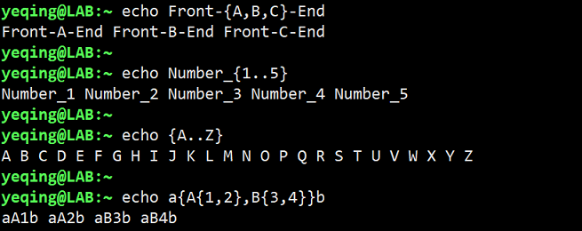

# 五、花前月下之 -- Shell 眼中看世界
 
## ehco 命令----展开（expansion）
1. 字符展开（character expansion）  
常用格式：echo string 或 echo，例如：$echo This is test 命令会打印出“This is test”这个字符串

2. 路径展开(pathname expansion)  
例如：$echo * 命令会打印出当前目录下的所有文件名，我们还可以结合通配符的使用和正则表达式来显示我们想要的内容。

3. 波浪线展开（tilde expansion）  
波浪线“~”就是指的家目录，我们使用$echo ~ 命令会打印出家目录路径，与pwd命令相同。

4. 算术展开（arithmetic expansion）  
语法：echo $(())，例如：echo $((2 + 2)) 命令会打印出结果4。  
echo 命令支持的运算符有：加（+），减（-），乘（\*），除（/），幂运算（\*\*），模运算（%）  
注意：echo运算不支持小数运算，只支持整数运算，使用小数会报错。

5. 花括号展开（brace expansion）  
花括号展开有着很神奇的效果，它可以使用一个命令帮我们做很多重复的事情。我们来看看下面的例子：  
  

平时我们在保存照片的时候，如果有大量的照片要按照日期来保存到文件夹里，如果使用图形界面就会非常的不方便，
而是用命令行可以用一条命令搞定。例如，我们要按照月份创建从2015年到2019年的文件夹，可以使用命令：  
mkdir {2017..2019}-{01..12}，一键搞定。  
  

6. 参数展开（parameter expansion）  
参数展开，主要是在echo 后面跟一个参数名称，可以看到相应的参数内容，例如：  
echo $USER 可以显示当前的用户名，printenv | less 命令可以显示当前所有的环境变量名称，echo $LANG 命令可以显示当前使用的语言，等等...  
关于参数展开后面还会详细讲解！

7. 命令替换（command subtitution）  
命令替换（又称：命令组合），可以将一个命令的输出作为另外一个的参数，格式为：echo $(command)，例如：echo $(date)表示将 date 命令的输出作为 echo 命令的参数进行展开。又例如：ls -s $(which cp)，表示我们使用命令 which cp 可以得到 cp 文件的绝对路径，然后利用该输出作为 ls 命令的参数，可以打印出 cp 的详细信息。

8. 忽略  
忽略指的是在使用命令时可以使用引号或转义符 \ 在改变shell的默认行为。例如：如果在 echo 命令后的字符串中使用了多个空格，shell默认会只保留一个空格，忽略多余的空格，但如果使用引号（双引号或单引号）则会改变默认行为，输出所有的空格。又例如：echo This total is $1.00，shell默认会将$1变为一个空格，如果使用单引号则会忽略该默认行为直接输出$1.00。*通常，单引号比双引号的禁用效果更强。*，如果要直接输出“! $” 等特殊字符，可以使用转义符\，因此echo This total is \$1.00，也是同样的效果。

## （完）