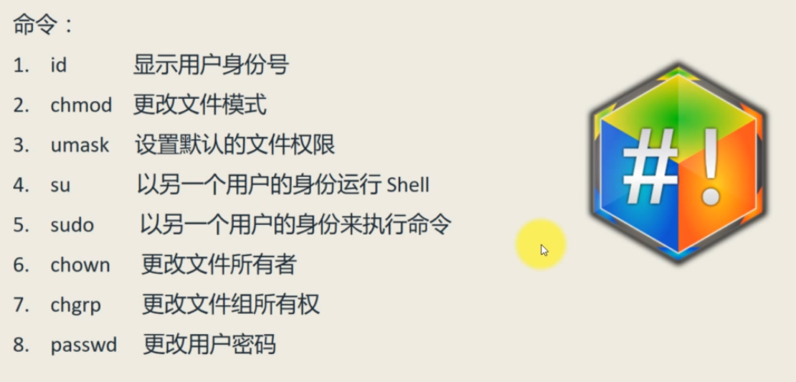
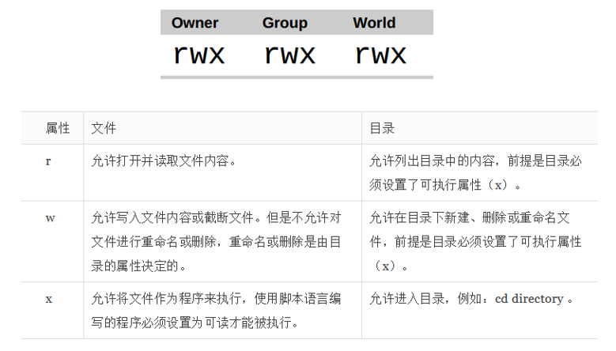
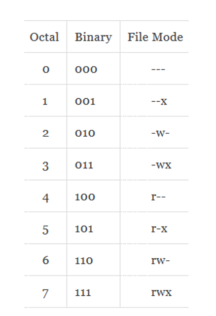

# 七、难舍难分之 -- 权限管理

Linux 操作系统支持多个用户同一时间使用用一台计算机，Linux的多任务特性在最初设计系统内核时就已经考虑进去了。它有三种权限：owner(user)、group、other，分别对应的是：所有者、用户组和其他用户。  
涉及到的命令如下：  
  

1. id 命令  
当我们执行id命令时会显示当前用户的身份号，它包含uid(user id)、gid(group id)两种。  
相关的系统文件有：  
/etc/passwd 保存用户权限  
/etc/group 保存用户组信息  
/etc/shadow 保存账户密码

2. chmod 命令  
Linux的用户权限有三种：r w x  
分别对应着对于文件和目录的read write excute三种权限。  
  
chmod命令就是用户修改权限的，它是change mode的缩写。  
权限有两种表示法：一个是数字表示法，一个是符号表示法。
  - 数字表示法：有八进制和二进制两种，具体如下图：  
    
  我们可以对应上图，用数字表示权限，三类用户的权限就可以用三个数字表示。  
  例如我们有文件foo.txt的权限是：-rw-rw-r-- 对应的数字是664，如果我们要改变其他用户的权限为r-x，就是增加执行权限，可使用命令：chmod 665 foo.txt
  - 符号表示法：u、g、o、a(可省略不写)  
  u表示user(owner)，g表示group，o表示other，a表示all = user + group + other  
  如果要增加权限就用+，反之减少权限用-，直接设定权限用=  
  例如：o+x表示给其他用户增加执行权限；-w表示给所有用户减少些权限；ug=rw表示将所有者和用户组权限直接设定为可读和可写。因此，chmod ug+x foo.txt 就表示给foo.txt文件的所有者和用户组增加执行权限。

3. umask 命令  
该命令用来设置默认权限的，当我们创建一个文件的时候，umask命令负责控制该文件的默认权限。  
我们通常用4个八进制数字表示默认权限（从左往右，第一个数是特殊权限，后三位数普通权限），例如0000 表示为：--- rw- rw- rw- ，对应的是八位掩码为：000 000 000 000  
当我们要取消对应的全新是只需要把对应的二进制数从零改为1，然后用umask命令设置对应的八进制数即可。  
例如，我们要将上述 --- rw- rw- rw- 权限变成 --- rw- r-- r-- ，对应的掩码就是 000 000 010 010，对应的八进制数就是0022，因此我们使用命令 umask 0022 即可一个将文件的默认权限变成 rw- r-- r--

特殊权限，通常有三个值：  
- setuid 用字母s表示  
  一般用于文件，而且是可执行文件。当我们把一个可执行程序设置成了setuid权限后，它就会把实际运行的id，变成程序所有者的id。例如，有些程序只有root（超级管理员）才有权限运行，一般用户要想运行，就要把它设置成setuid，即将权限提升为超级管理员的权限。例如，chmod u+s foo.txt 就表示将foo.txt文件从使用者id提升为了所有者id。我们还可以设置setuid的个数，来设定其影响范围。
- setgid 用字母s表示  
  可以更改一个文件的权限为用户组id，它主要是给目录来设置的。当一个目录被设置了setgid后，它就不再是该目录使用者的id，而是用户组的id了。例如，chmod g+s playground/ 就是将playground目录变成了用户组id。
- sticky 用字母t表示  
  它继承自UNIX，可以把一个可执行程序标记为不可交换的，也就是可以阻止删除和重命名操作。除非用户是文件的所有者、创建者或者是超级管理员。例如，chmod o+t playground/ 就是将playground目录的其他用户的权限变成了不可删除和重命名。
- su  
  su 是 supper user 的简写，用于改变当前用户角色的，语法格式：su [-[l]] [user]，例如 su -l root 命令就是将用户角色变成root。su 还有一种用法就是 su -c 'command' 表示直接以对应的角色执行某一个命令，例如，su -c 'ls -l /root/' 就是以root角色执行 ls -l /root/ 命令，就相当于是：su -l root 与 ls -l /root/ 两个命令的组合。
- sudo  
  sudo是supper user do 的缩写，表示以超级管理员的身份来做某事。通常sudo后面紧跟一条命令，语法：sudo command。例如：sudo ls -l /root/，就表示以root角色执行ls -l /root/ 操作，因此它与上面的 su -c 'ls -l /root/' 执行效果是一样的。
- chown  
  是 change owner 的缩写。语法格式：chown [owner][:group] file... 它表示更改文件的所有者和用户组。  
  例如：chown root:root foo.txt 就表示改变文件foo.txt的所有者和用户组为root。如果只有一个root参数，就是只改变所有者为root，如果是 :root 就表示只改变用户组为root
- chgrp  
  chgrp 是 change group 的缩写，用于改变文件的用户组。例如：chgrp root foo.txt 就表示改变foo.txt文件的用户组为root，效果相当于执行 chown :root foo.txt。chgrp 最早出现在UNIX上，现在用的较少，多用chown来代替。
- passwd  
  语法格式：passwd [user] 用于修改某个用户的密码。如果 passwd 后面不跟参数，就表示修改当前用户的密码。一般不建议使用passwd来练习修改密码，因为系统会提示你设置一个长格式密码，这样不便于记忆，使用也不方便。
  
  ## （完）