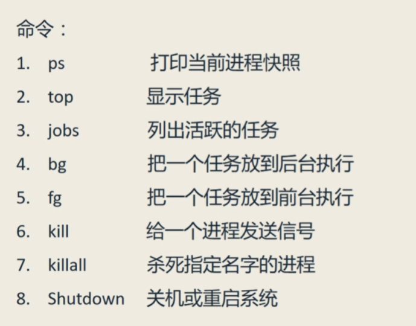
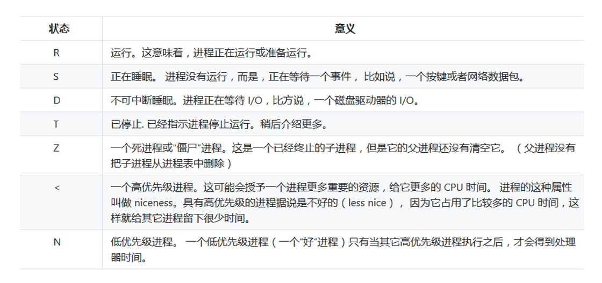
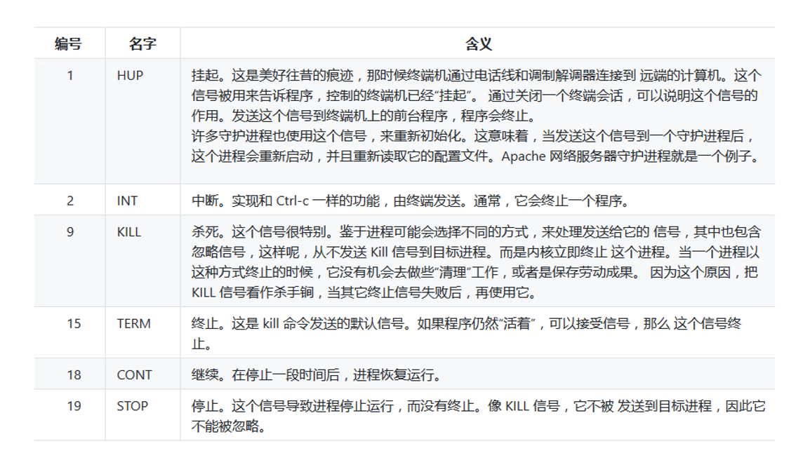

# 八、难舍难分之 -- 进程管理
  
## 进程
关于进程管理常用的命令：  
  
1. ps  
  ps 是单词 process 的简写，用于打印当前进程的信息。它包含：PID--process id，TIY--teletype，TIME--时间，CMD--command。  
  常用方法：  
  - ps x 会比ps多一个STAT(state)信息，具体含义有：  
    
  - ps aux 会列出所有用户的进程，其中主要包含：%CPU--cpu耗时，%MEM--消耗的内存（memory），VSZ--虚拟内存(vitual memory)，RSS--物理内存(phiscal memory)  

2. top 打印所有进程的摘要和详细信息（按q退出）
3. jobs 列出活跃的任务
4. bg 把一个任务放在后台运行（语法：bg %num），也可以在启动进程时直接用command&，将其放于后台运行。
5. fg 把一个任务放在前台运行（语法：fb %num）
6. kill 给一个进程发送信号，语法：kill [-signal] PID 其中常用信号如下：  
    
  *信号只需要写编号即可，如kill -9 1459 表示将id号为1459的进程杀死。*

7. killall 杀死指定名称的进行（该命令需要单独按照，一般使用较少）
8. shutdown 关机或重启系统，shutdown -h now 关机， shutdown -r now 重启

## （完）
 