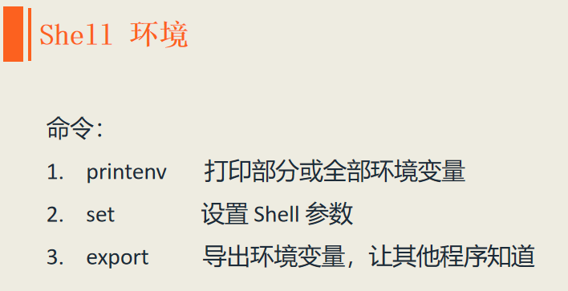
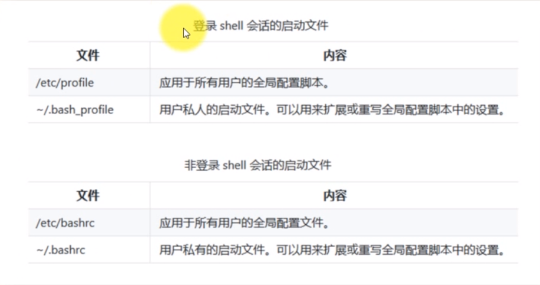

# 一、共筑爱巢之 -- Shell环境

Shell在 shell 会话中维护着大量的信息，这些信息被称为**环境**。被存储在 shell 环境中的数据，程序用来确定它的配置参数。
虽然大多数程序用自己的配置文件来确定它的相关设置，但有些程序也用 shell 环境中的数值来调整它们的行为。
因此，我们可以利用 shell 环境来定制我们 shell 的体验，本小节会介绍以下三个命令：  
  
我们存储在 Shell 中的数据有两种：一种是shell 变量（shell var），一种是环境变量（environment var）。  
首先介绍 printenv 命令，它用来打印环境变量。可以利用管道后面跟 grep varName 来逐个查找，或者直接用 printenv varName 打印某个具体的环境变量。  
set 命令可以打印所有的环境变量和 shell 变量，因此 printenv 打印的内容一定是 set 内容的一个子集。我们也可以用 echo $varName 来查看某个具体
的 Shell 变量或环境变量。  
还有一部分变量是 printenv 和 set 都无法打印的，那就是我们设置的别名变量，我们用 alias 命令来打印。  

下面列出了一些有趣的变量：  

**那么我们如何定义自己的 Shell 环境呢？**  

当登录系统时，首先会启动 Bash 程序，Bash 程序会读取一系列的成为启动文件的配置脚本，这些文件定义了默认的共享的 Shell 的环境变量。
然后是读取我们自己的家目录中的启动文件，这些文件定义了用户个人的 Shell 环境。准确的启动顺序，要依赖于我们的 Shell 会话类型。  
这里介绍两种 Shell 会话类型：一个是需要登录的 Shell 会话类型（login shell session），另一个是不需要登录的 Shell 会话类型（non-login shell session）。
它们读取的文件是不一样的，具体如下图所示：  
  

因此，如果我们想定制自己的 Shell 环境，就需要修改相关的配置文件。我们通常是修改用户家目录下的配置文件，它只对该用户生效，如果修改了 /etc 下的配置文件就会对所有的用户生效。
例如，如果我们定义了一个别名，要想在下次登录后这个别名还可以使用，就需要将它保存在配置文件中。
我们一般用 vi 或 vim 编辑器进行操作。下面来定义命令 ls -al 的别名 la ，具体步骤如下：  
1. 使用 vi .bashrc 在 vi 编辑器中打开 ~/.bashrc 文件
2. 在 ~/.bashrc 文件的末尾添加语句：alias la='ls -al'
3. 执行 source .bashrc 让刚才的配置生效

完成上述三步操作后，定义的别名就生效了，即便是退出登录也不是失效。

## （完）