# 十、七年之痒之 -- 文本处理

Linux 系统非常严重的依赖于文本文件这种数据存储类型，因此 Linux 中有很多用于处理文本文件的工具。

文本文件除了可以用作配置文件外，还有什么用处呢？

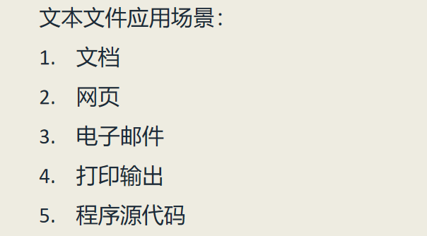

本次课程我们将讲解一大批用于处理文本文件的工具和命令。对于这些命令有些是我们原来介绍过的，
我们将做深入的介绍，有些是新的命令。
我们一共要介绍 12 条命令，它们可以分为四个大类，具体如下：  

**第一类：跟文本排序相关的命令**
1. **cat 命令**，连接文件并且打印到标准输出
2. **sort 命令**，给文本行排序
3. **uniq 命令**，报告或者省略重复行

**第二类：跟文本切片（或切块）相关的命令**  
1. **cut 命令**，从每行中删除文本区域
2. **paste 命令**，合并文件文本行
3. **join 命令**，基于某个共享字段来联合两个文件的文本行

**第三类：跟文本比较相关的命令** 
1. **comm 命令**，逐行比较两个有序的文件
2. **diff 命令**，逐行比较文件
3. **patch 命令**，给原始文件打补丁

**第四类：跟运行时的文本编辑相关的命令**  
1. **tr 命令**，翻译或删除字符
2. **sed 命令**，用于筛选和转换文本的流编辑器
3. **aspell 命令**，交互式拼写检查器

下面我们就逐个对除 aspell 命令以外的 11 条命令进行讲解。aspell 是交互式拼写检查器，因为平时使用较少，
所以不做讲解。

---

## 第一类：跟文本排序相关的命令（cat sort uniq）

### cat 命令
我们知道 cat 命令可以打印一个文本文档的内容，例如：  
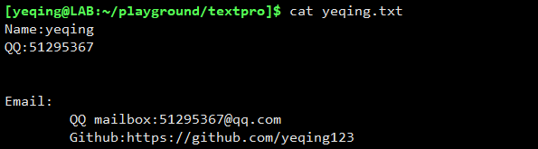  
cat 程序打印出了 yeqing.txt 文档中的内容。

其实 cat 命令还有很多有趣的选项，比如 -A 选项，可以打印出文本文档中的非打印字符。
这样我们就可以知道文本文件的格式了。非打印字符有：回车、制表符、空格。还是以 yeqing.txt 文档为例：  
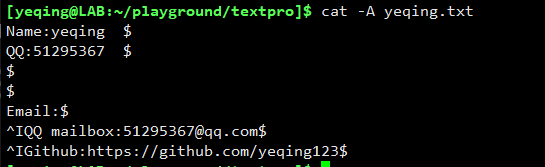  
可以看到，$ 代表回车 表示一行的行尾、**^I** 代表制表符。因此，我们可以根据 $ 的位置，知道一行输入的空格数。

还有一个有趣的选项 -n， n 代表 number，它会显示文本的行号：  
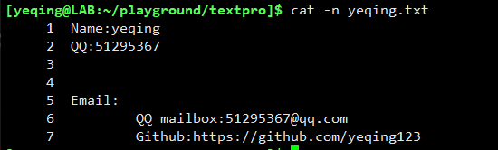

-s 选项可以消除文档中多余的空行，而只保留一个空行：  
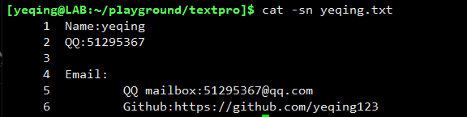

### sort 命令
sort 顾名思义就是排序的意思，如果 sort 后面什么也不跟就会等待用户输入内容，当按 Ctr-d 结束后。
sort 程序就会以行为单位，对输入的文本按默认的升序进行排序，然后打印到标准输出，例如：  
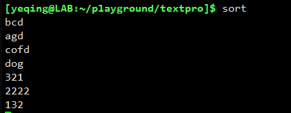  

我们输入了上面七行文本，然后按 Ctrl-d 结束，sort 程序就会对它们进行排序，然后显示出来： 
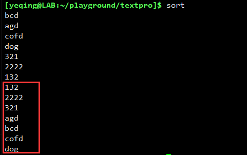  
可以看到，红框框起来的就是排序后的结果。我们还可以使用重定向，把排序结果保存到一个文件里。

sort 命令常用的语法格式是：**sort fileName**，就是将指定文件中的文本进行排序，
然后打印出排序结果。例如，我们有一个文件 unordered_file.txt：  
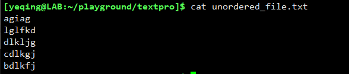  
可以看到，它里面的文本行是无序排列的。

我们可以通过运行 **sort unordered_file.txt** 命令对其进行排序：  
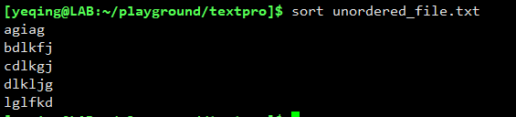  
输出的结果是按字母升序排列的。

如果 sort 后面跟多个文件，则会将它们的内容全部排序，然后合并打印出来。

**sort 命令有很多选项方便我们进行不同的操作，常见的选项有：**  
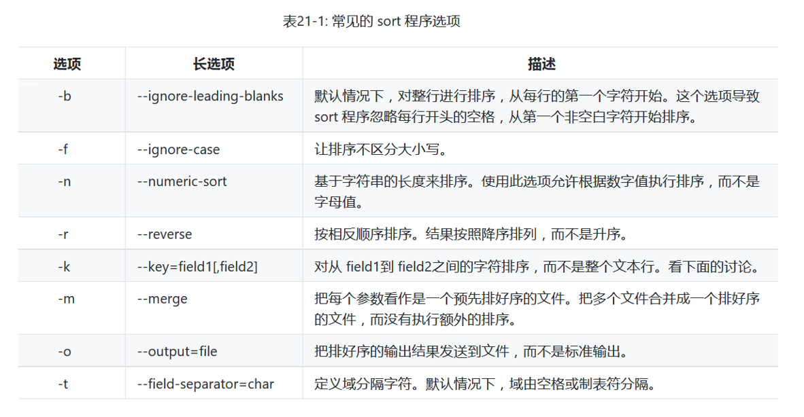  

我们还是通过几个例子来进行说明：

我们首先使用 **du** 来查看一下 /usr/share/ 目录下的所有子目录所占的磁盘大小：  
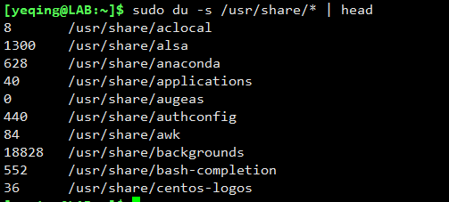  
我们只列出了前十条信息，第一列是所占磁盘大小，第二列是子目录的名称。

以上输出的信息是没有经过排序的，我们现在对所有的信息按磁盘大小进行降序排序，然后再输出前十条信息.
我们可以使用 sort 命令的 -n 选项和 -r 选项。-n （长选项：--numeric-sort）是按数字大小排序，-r 
（长选项：--reverse）是按默认排序（升序）的反序排序。
具体如下：  
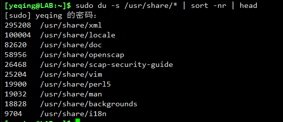  
可以看到，我们从大到小以降序排序方式，输出了占磁盘空间最大的前十个（top len）子目录。

下来我们再来看下面的输出信息：  
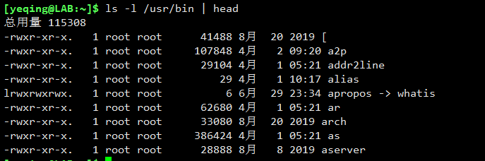  
可以看到，我们按长格式输出了 /usr/bin 目录下的所有文件的前十条信息。这些信息默认是按照文件名进行排序的。
这些信息一共有九列（或九个字段）。我们现在要让它们按照文件大小进行降序排序，该怎么做呢？  
除了要使用 -n 和 -r 选项外，我们还需要使用 -k 选项（长选项：--key），该选项后面需要跟指定字段的序号，
表示按指定字段进行排序。在上面列出的长格式信息中，文件的大小是第 5 个字段，因此，就是 -k 5。
于是有了下面的运行效果：  
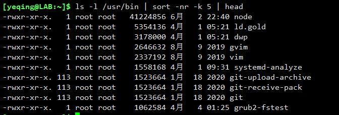  
可以看到，sort 程序列出了从大到小的前十个文件。

有时候按指定字段排序时，会涉及到按多字段排序，比如说我们有下面一个文件：  
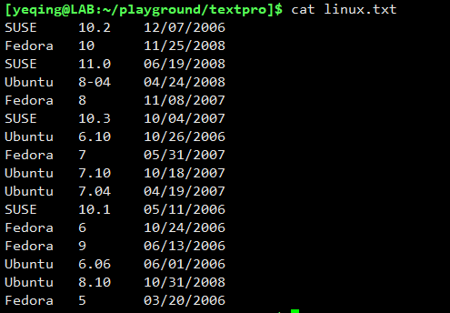  
在 linux.txt 文件中保存了 Linux 操作系统不同发行版的 **名称、版本号、发行日期**。

如果我们对该文件使用 sort 命令进行排序会是什么结果呢？  

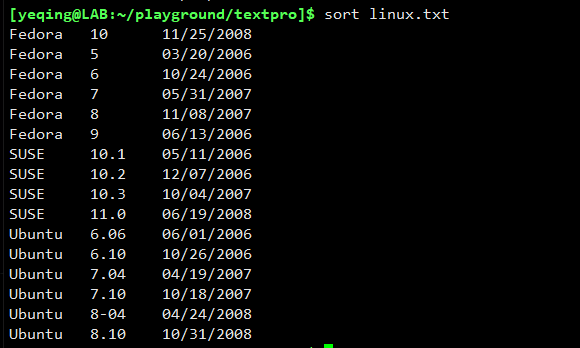  
可以看到，sort 程序会默认按照名称的首字母顺序进行排序，并且相同名称的信息之间又是按版本号排序的。
不过细心的读者会发现， Fedora 信息中，版本号为 10 的信息本应列在所有 Fedora 信息的后面，但是却排在了第一位？！
这是因为，sort 程序默认是按字符排序的，所以 10 号就只是 1 和 0 两个字符，而不是数字 10，所以 1 就自然会排在第一位。

如何让 sort 即按字符排序，又按照数值进行排序呢？

这就涉及多字段排序问题。我们的目的是既要按第一字段的名称排序，又要按照第二字段的数值排序。  
我们要用到两个 -k 选项，所运行的命令是：**sort -k 1,1 -k 2n linux.txt**  
第一个 -k 表示默认排序规则的影响区间，后面的 1,1 表示从第一个字段开始到第一个字段结束，即按名称排序。  
第二个 -k 表示指定的字段，后面的 2n 表示按数值对第二个字段（版本号）进行排序。

运行效果如下：   
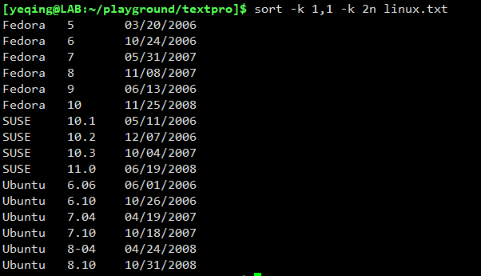  
我们看到，结果是既按照名称排序又按照版本号排序，这就是按多字段排序。

如果我们想按发行时间来排序，就是按第三个字段来排序，但是它里面又有十个字符。我们该如何做呢？  
通常我们用 **_“-k 大字段序号 . 字符偏量”_** 的格式来表示，例如: -k 3.3 就表示第三个字段中的第三个字符。
因此，上面的月、日、年，分别可以表示为：-k 3.1（从第三个字段中的第一个字符开始）、 -k 3.4（从第三个字段中的第四个字符开始）、
 -k 3.7（从第三个字段的第七个字符开始）。另外，还要使用 -n -b -r 三个选项，
表示 **_按数值排序、忽略每行开头的空格、反序_**。  

于是我们可以运行命令：**sort -k 3.7nbr -k 3.1nbr -k 3.4nbr linux.txt**  
注意：三个 -k 的顺序不能改变，因为我们是按照 **年** --> **月** --> **日** 的顺序进行排序的。  
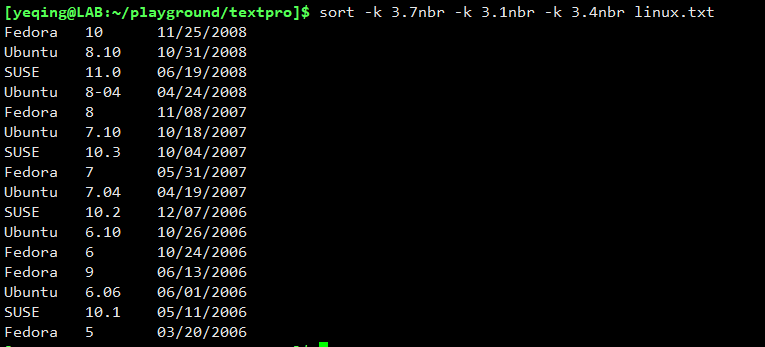  
可以看到，最近的发行时间排在了最前面，最早的时间排在最后面。

正常情况下，sort 程序是按照空格或 tab键 来分割字段的，如果我们要自己指定分割符，就要用到 -t 选项，例如：  
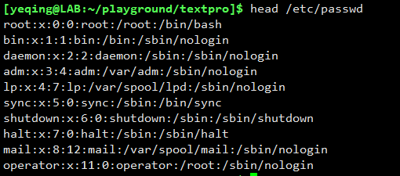   
上面的文本都是以冒号 : 来作为分割符的，所以我们就要用 **-t ':'** 的形式指定分隔符。
然后我们使用 -k 7 来指定要排序的字段是最后的文件名，完整的命令行即运行效果如下：  
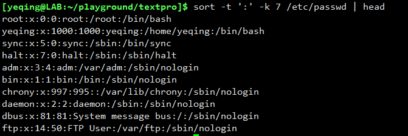  
可以看到，我们以冒号文分割符，并以第七个字段进行排序。

### uniq 命令
uniq 命令是和 sort 命令配合使用的，它是用来在排好序的基础上消除重复行。之所以要先排好序，
是因为它要比对相邻的两行。

比如我们有一个 foo.txt 文件，它的内容如下：  
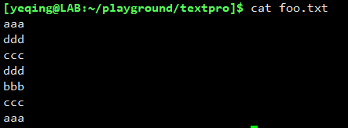  
我们看到，它里面有重复的行。但是如果没有排序的话，是无法用 uniq 命令消除重复行的。  

如果我们先使用 sort 命令排序，然后再使用 uniq 命令，就可消除重复行：  
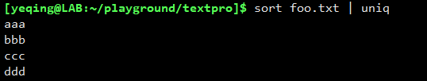  
可以看到，在排序之后重复行被消除了，因为排序后重复行会处在相邻位置。

uniq 命令的常用选项如下：  
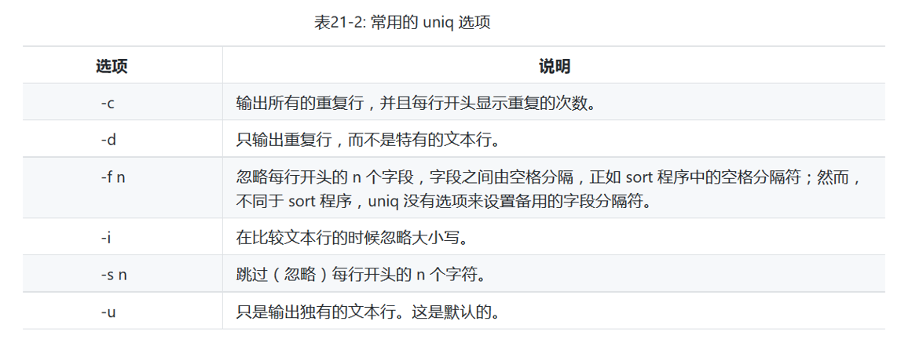  

例如，我们运行命令：**sort foo.txt | uniq -c**  
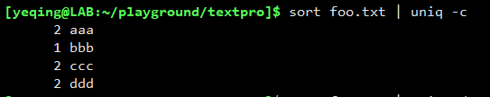  
可以看到，使用 -c 选项后，uniq 在消除重复行的同时，还在每行的开头显示了重复的次数。

## 第二类：跟文本切片（或切块）相关的命令（cut paste join）

下面我们讲的三个命令是跟文本的切片和切块有关的，就是从文本中截取一段出来。我们来逐一介绍：  

### cut 命令
cut 命令，顾名思义就是从一段文本中切割出我们需要的一部分，可以直接打印到控制台，也可以保存在某个文件里。

cut 命令的常用选项如下：  
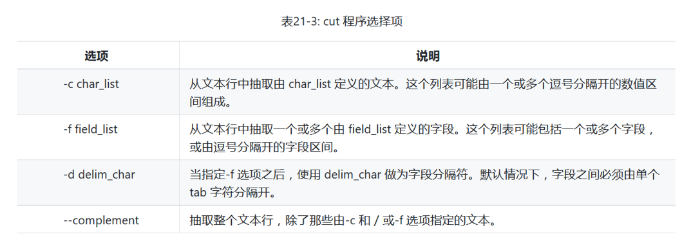

注意：默认情况下 cut 命令是按 **tab键** 作为字段分割符进行剪裁的。

我们先来看一下前面讲过的 linux.txt 文件：  
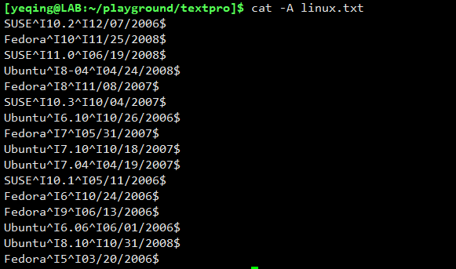  
可以看到，linux.txt 文件中字段之间是以 **tab键** 分割的。

因此，我们可以使用 cut 命令的 **-f** 选项将指定的字段截取出来。于是我们运行
**cut -f 3 linux.txt** 命令：  
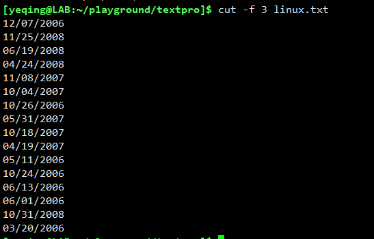  
可以看到，cut 命令将 linux.txt 文件中第三个字段截取出来，打印到了控制台上。

我们还可以使用 -c 选项，截取文本行中的一个或多个字符区间（如果是多个区间，则用逗号隔开），例如：  
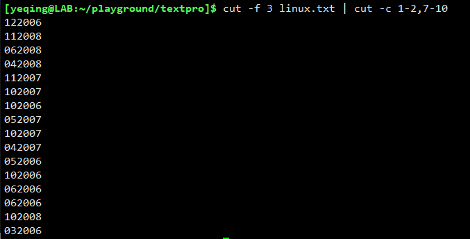  
可以看到，我们先截取了 linux.txt 文件中的第三个字段，然后通过管道，又截取了第三个字段中 1-2 和 7-10 两个字符区间中的所有字符，
其实就是 **月** 和 **年** 被截取出来。

如果一个文本文件中的分割符不是 **tab键** 则我们需要用 -d 选项指定分割符。例如，在 /etc/passwd 文件中，
所有的分割符都是冒号：  
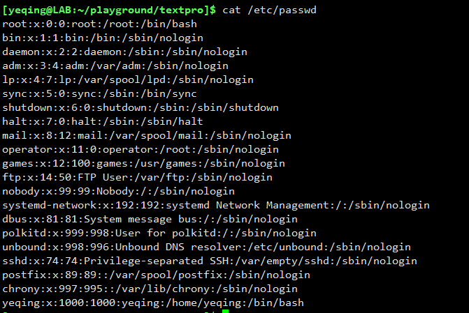  

如果我们要截取其中的第一个字段，该怎么办呢？很显然，我们首先要用 -d 选项指定分割符，然后再使用 -f 选项指定要截取的字段序号，
具体如下：  
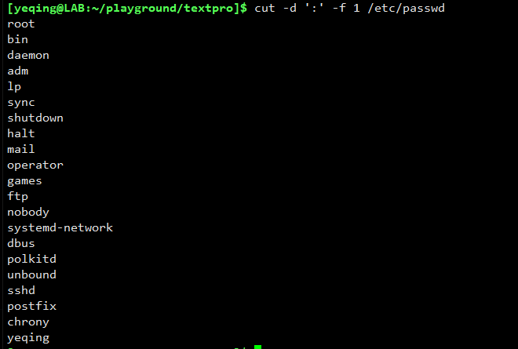  
可以看到，我们首先指定了冒号为分割符，然后截取出了第一个字段。

### paste 命令
paste 顾名思义，就是粘贴、合并之意。一般它用作将不同的文本内容合并成一个。

例如，我们有两个文件，一个是 linux-versions.txt  
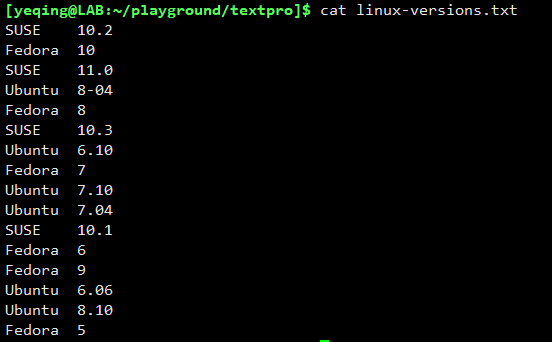  
它只保存了 Linux 操作系统的 **版本名称** 和 **版本号**。

另一个文件是 linux-dates.txt  
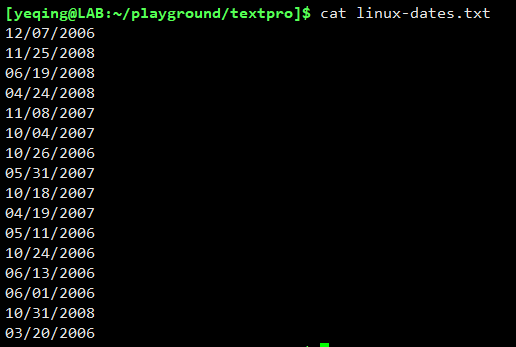  
它只保存了所有的 **发行日期**。

现在我们使用 paste 命令将两个文件合并，让发行日期在前，版本名称和版本号在后：  
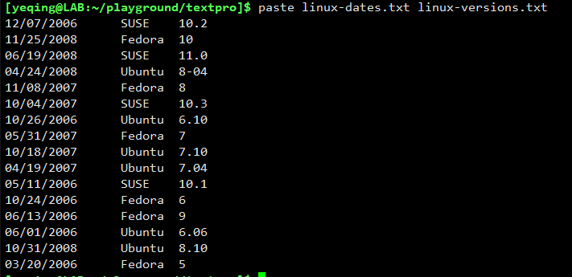  
可以看到，两个文件的内容进行了合并，我们还可以将合并后的内容保存在一个文件中。

通过上面的例子，我们知道 paste 命令的主要作用和使用方法就是这样的。

### join 命令
join 命令在某些方面和 paste 命令很像，都是对文本进行合并。尤其是处理类似字段的时候，很像是对数据库中的表格进行的合并操作。
join 命令也确实很适合对数据库进行操作。因为 join 在执行合并操作的时候，必须要求两个文本中要有两个相同的字段，并且字段序号也相同。

我们还是举例说明：  

我们还是以 linux.txt 文件为基础，从中截取字段形成两个文件，一个是：linux-versions.txt  
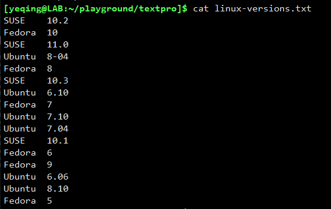  

另一个是 linux-dates.txt  
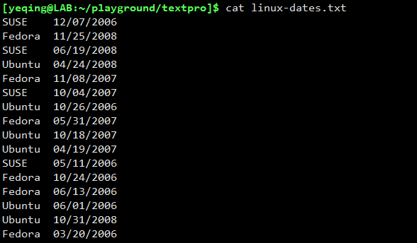  

可以看到，两个文件的第一个字段是完全相同的。于是，我们就可以使用 join 命令将它们合并：  
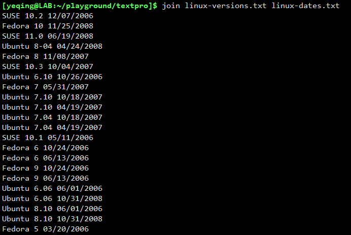  
我们看到，两个文件合并在了一起，并且相同的字段没有重复。

因此，在数据库中如果两张表格都有一个相同的外键，就可以使用 join 命令进行合并操作。

## 第三类：跟文本比较相关的命令（comm diff patch）

比较文本在平时的工作中用的还是比较频繁的。尤其是在书写文档和软件开发过程中，我们经常需要查看一份文档或代码，它们在修改后和修改前的差异，
这时就需要用到文本的比较。Linux Bash 中主要使用 **comm、 diff、 patch** 三个命令做文本比较。comm 相比 diff 功能较弱一点。
下面我们逐一来进行讲解。

### comm 命令
comm 是单词 compare （比较）的缩写。该命令最常使用的形式是：**comm file1 file2**，即比较两个文件的内容。

举例说明：
  
我们有两个文件 file1.txt 和 file2.txt ，它们的内容分别是：  
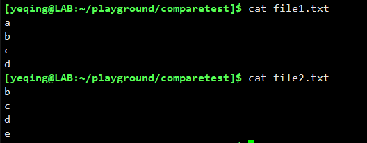  

我们现在使用 comm 命令来对它们进行比较：  
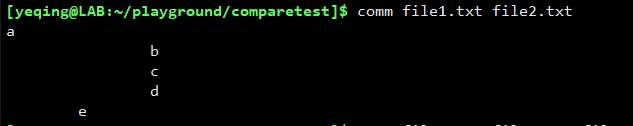  
从结果来看，第一列是第一个文件 file1.txt 特有的内容，第二列是第二个文件 file2.txt 特有的内容，第三列是两个文件共有的内容。
这样看起来是不是很直观？:-)

如果只想隐藏某一列，就在 comm 命令后跟 **横杠加列的序号**。比如，我们要隐藏第一、二列，只显示第三列共有部分，
则运行 **comm -12 file1.txt file2.txt**   
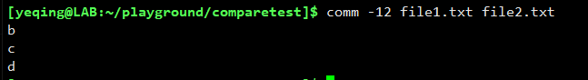  
如果想显示差异部分，隐藏共有部分，就在 comm 后面跟 -3 即可。
 

### diff 命令
diff 是单词 different 的缩写。它比 comm 命令功能更强大，使用方法也更复杂。早先 Linux 内核的开发人员，都是用的 diff 命令进行文本比较的。
它除了可以比较文件，还可以比较目录（文件夹）中的所有文件。

我们还是拿上面的 file1.txt 和 file2.txt 来演示。

运行 **diff file1.txt file2.txt** 命令：  
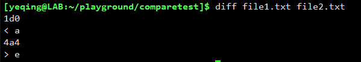  
它的显示结果是什么意思呢？

其实 diff 共有三种显示模式：一个是 **普通显示模式**，一个是 **上下文显示模式**、一个是 **统一显示模式**

不加任何参数就是 **_普通显示模式_**，它有如下的显示规则：  
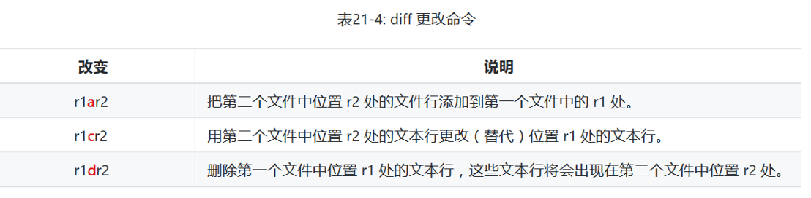

因此上面的显示结果中，**1d0** 表示 **_删除第一个文件中的第一行文本，0表示删除的文本行不会出现在第二个文件中_**，
**< a** 表示 **_删除的文本行是单个字符 a_**， 
**4a4** 表示 **_把第二个文件中第四行的内容添加到第一个文件的第四行_**，**> e** 表示 **_添加的文本行是单个字符 e_**  

参照上面的提示，我们就可以把 file1.txt 变成 file2.txt 了。

如果是 **_上下文显示模式_**，就要使用参数 **-c** 了：  
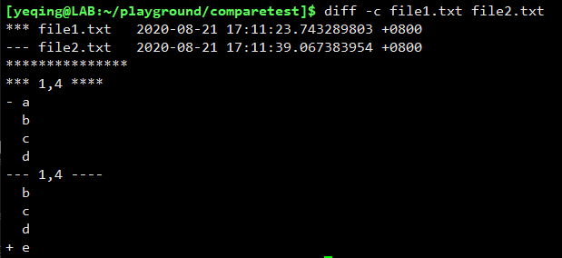  
可以看到，起始的两行是文件名后面跟着时间戳，行首的字符 \* 星号 对应的是第一个文件，\- 横杠 对应的是第二个文件。
后面的内容表示 **_删除第一个文件中的第一行，将第二个文件中的第四行添加到第一个文件的第四行_**，就可以把 file1.txt 变成 file2.txt 了。

关于上下文显示模式中符号的含义，见下表：  
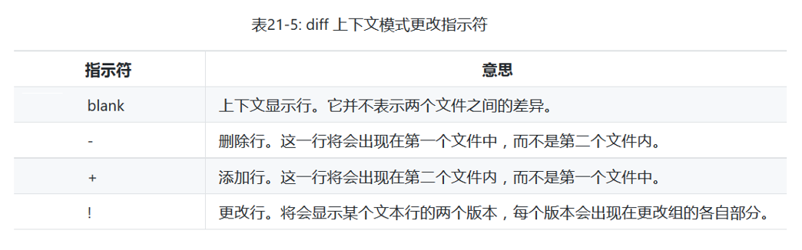

我们看的出，**_上下文显示模式_** 会打印出文件的所有内容，看起来很直观。但是当文件内容较多时，就显得比较冗余。  
因此，还有第三种模式 **统一显示模式**，它需要使用参数 -u  
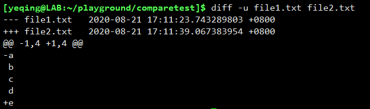  
可以看出，它显示的内容精简了很多，表示的意思和上面的两种模式是一样的。
  
关于统一显示模式指示符号的含义，见下表：  
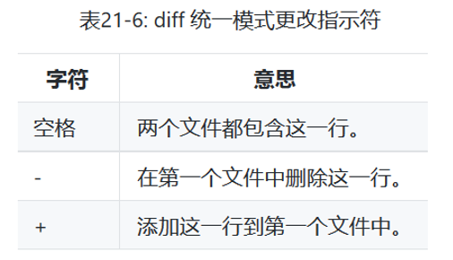

通过上面的实例我们知道，diff 命令其实就是两个参数 **-c、 -u** 和三种输出模式，记住它们的显示规则，能看得懂就 OK 了！
它们输出的含义都是想告诉你如何将文件一变成文件二，你能变过去，也就知道两个文件的差异在哪了。

### patch 命令
patch 命令可以把我们对一个文件的修改内容应用到原始文件中去。比如说，我们在开发软件时，我们需要将一份已经写好的代码文件做一些修改，
通常我们不会直接去修改原始文件，而是修改它的副本。当我们确定要应用副本中的修改时，就需要替换整个原始文件，而且修改部分和原始部分也不容易区别。

如果使用 diff 命令就可以避免复制整个文本，同时可以清楚的知道我们做了哪些修改。我们只需两步即可做到：  
1. 先使用 diff 命令生成一个专门的文件（我们可以叫它“补丁文件”）用来保存原始文件与修改文件之间的差异信息；
2. 用 patch 命令把补丁文件中的差异，像打补丁一样应用到原始文件中。

这样做的好处是，1.我们可以通过补丁文件，一目了然的了解都有哪些部分做了修改；2.如果修改的只有一点点内容，就避免了对整个文本的替换。

因此，patch 命令通常是和 diff 命令一起使用的。

具体做法是：我们可以先用 **diff -Naur old\_file new\_file > patchfile.txt** 命令打印出两个文件的差异信息，并且重定向到一个单独的文件中。
其中 -Naur 参数表示递归式的寻找文件的差异，后面的 old\_file 和 new\_file 就表示两个文件，注意也可以是目录（文件夹）。
这样 patchfile.txt 文件（补丁文件）中就会保存两个文件或目录的差异信息。然后，我们再运行 **patch < patchfile.txt** 命令，
就会把 old_file 变成 new_file 了。

我们用实例来演示一下，还是上面的 file1.txt 和 file2.txt 两个文件为例：  

我们知道两个文件的内容是不一样的，现在需要将 file2.txt 中的差异部分应用的 file1.txt 中，让 file1 变成 file2。

1. 首先需要生成一个补丁文件：  
 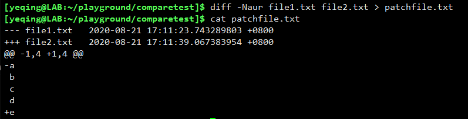  
 patchfile.txt 文件中保存了两个文件的差异信息。

2. 然后使用 patch 命令，将 patchfile.txt 文件中的差异信息应用到 file1.txt 中：  
  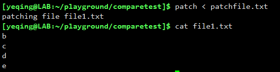  
  可以看到，系统提示：“修补文件file1.txt” ，文件 file1.txt 的内容变成了 file2.txt 的内容了。 

**_需要注意的是：使用 diff 命令生成补丁文件时，普通显示模式输出的内容是无法被 patch 命令使用的，其他两种模式都可以！_**

其实 patch 命令还有很多有选项，可以帮助我们进一步编辑和处理补丁文件，有兴趣的读者可以自行研究和学习！

## 第四类：跟运行时的文本编辑相关的命令（tr sed aspell）
前面所讲的文本编辑形式都是交互式的，例如我们打开 vi/vim 编辑器然后在其中移动光标，输入文本、删除或更改内容。
现在我们要讲的文本编辑方式是非交互式的，也就是通过运行命令行来对文本进行修改。涉及到三个命令：**tr sed 和 aspell**，
最后的 aspell 是关于拼写检查的，因为在 Linux 命令行中用的不多，所以我们就忽略不讲了。

### tr 命令
tr 命令主要用于对文件的内容或字符进行修改，它很像“查找/替换”机制。

tr 命令的用法其实很简单，格式为：**tr char\_set1 char\_set2** 它会把第一个字符集中的内容在文本里查找，然后替换成第二个字符集。

字符集 char_set 有三种表示方法：  
1. 可以是一个枚举列表；
2. 可以是一个域，例如：a-z 或 A-Z 
3. 可以是 POSIX 例如：[:lower:]表示小写 或 [:upper:]表示大写

下面通过实例来一一演示：  

首先是枚举列表：  
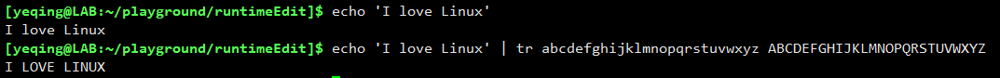  
可以看到，tr 后面的字符集采用的枚举方式，列出了所有的26个大小写字母。

我们再来看一些，以域来表示：  
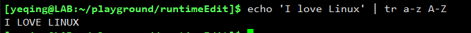  
可以看到，用域的方式，字符集会变得简洁。但是域只适用于一个连续的字符区间，如果是不连续的就只能用枚举了。

再来看 POSIX 表示方法，我们使用了 POSIX 中的 [:lower:] 和 [:upper:] 分别表示了“小写字母”和“大写字母”两个字符集。  
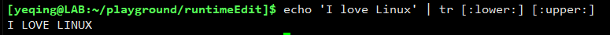  

这里要提示一点，通常两个字符集表示的范围是相同的，这没有问题。但如果 char_set2 表示的范围要小于 char_set1，
那会出现什么情况呢？  
  
文本中所有的小写字母，都只被替换成了大写字母A。

如果使用 -d 选项，就表示删除文本中指定的内容，例如：  
  
删除了文本中所有的大写字母。

tr 命令还可以对文本执行压缩操作，要用 -s 选项，例如：  
  
可以看到，tr 程序对文本中的 abc 三个字符进行了压缩。  

注意：被压缩的文本必须是连续出现，否则无法被压缩，例如：  
  
因为a b c 三个字符不连续，所以无法被压缩。

### sed 命令
sed 是单词 stream editor（流编辑器）的缩写。sed 命令用于对文本流进行编辑，并且可以指定要操作的文件。
它有一堆的相关命令来完成不同的操作，它的功能是比较强大的，用法也较为复杂。如果要把 sed 命令讲完全、讲清楚，
可以专门开一个专辑，或写一本专门的书。本次课程只进行入门性的简单介绍。

sed 命令最简单的用法就是进行“查找和替换”。例如：  
  
可以看到，sed 命令将文本 'lowercase' 替换成了 'capital'， 命令行中的 's/lowercase/capital/'
就是用来执行查找/替换功能的。其中 s 表示查找（即单词 search），后面斜杠里的内容是要查找的字符串和要替换的内容。

我们还可以在 s 前指定行数，比如 1s 就表示在第一行执行查找和替换，2s 表示在第二行执行查找和替换。
另外，斜杠也可以改成 **_下划线_** 和 **_横杠_**。

关于 sed 命令行中地址的表示法，见下表所示：  

上述表格中列出了我们如何指定操作的位置及范围。

指定了地址，又该如何指定具体操作呢？
例如，打印、删除、插入、查找/替换...等，这些操作该如何在 sed 命令行中表示呢？

下面通过一张表来进行说明：  

举例说明：  

首先我们来一个简单的，即打印出 linux.txt 文件中指定的文本行：  
  
可以看出，我们使用了选项 -n 表示我们要列出具体的行号，然后在后面跟了一个行号的范围（从第一行到第五行），
字符 p 表示执行打印操作。这样，sed 程序就打印出了文件中的前五行内容。

下面我们再举一个复杂的例子，我们将 linux.txt 文件中的日期格式从原来的“月/日/年”，通过 sed 命令替换成
“年-月-日”的格式。我们先看看最终效果：  
  

可以看出，因为我们要执行“查找/替换”，所以要使用 **s/regexp/replacement/** 这种操作命令，
其中 regexp 是一个正则表达式，replacement 是替换后的内容。按照 linux.txt 文件中日期的表示格式，
我们列出它的正则表达式为：**([0-9]{2})/([0-9]{2})/([0-9]{4})**，并且要对 “()”、 “{}” 还有斜杠 “/” 进行转义，
因此前面要加上转义符 “\”，正则表达式就成了：**\\([0-9]\\{2\\}\\)\\/\\([0-9]\\{2\\}\\)\\/\\([0-9]\\{4\\}\\)**，
我们将它放在 regexp 的位置。  
replacement 的位置在放替换后的日期内容：**\3-\1-\2**。表示日期格式是：**年-月-日**，其中的数字指的是正则表达式中组的序号，
3 表示第三组 **年**，1 表示第一组 **月**，2 表示第二组 **日**，并且要对数值进行转义，否则，将被视为一个普通的数字。
这样就可以将日期格式从原来的 **月/日/年** 形式，变成 **年-月-日** 形式。

其实我们还可以将 sed 的操作命令保存在一个 **.sed** 文件中，例如我们有如下一个文件：  
  
可以看到，我们将两种操作命令保存在了 linux.sed 文件中，第一行是改变日期的显示格式，第二行是将所有的小写字母转换成大写字母。

然后我们可以使用 -f 选项，将 linux.sed 文件中保存的操作命令施加到 linux.txt 文件上，效果如下：  
  
可以看到，linux.txt 文件的第一列中所有的小写字母都变成了大写字母，第三列的日期格式也改变了。

以上我们介绍了与文本处理有关的四大类共计 11 个命令，我们只是抛砖引玉第进行了入门性的简单介绍，有兴趣的读者可以进行更深入的研究。

## （完）

