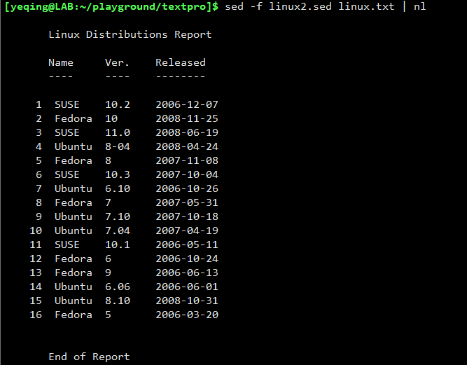
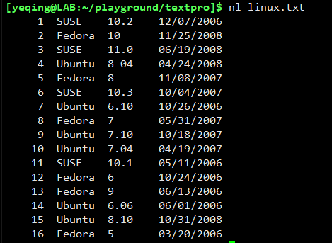
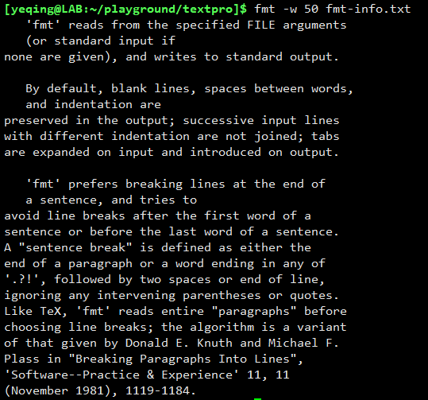
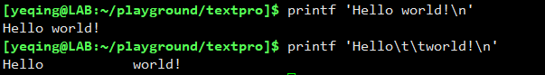

# 十一、白头到老之 -- 格式化输出

本次课程我们继续介绍与文本操作相关的内容--格式化文本输出。格式化输出只提供文本格式上的变化，并不会改变文本的内容。

我们将讲解如下五个工具：  

下面我们逐一进行介绍。

---

## ln 命令
ln 是单词 number line 的缩写，它的作用是在文本前面增加行号。因此它的作用等同于前面介绍过的 cat -n 命令。  
例如：  
  
可以看到，它们都给 linux.txt 文件的内容增加了行号。

我们再来看一个例子，有一个保存着 sed 操作命令的文件 linux2.sed ，其内容如下：  
  
上述内容表示，从文本的第一行插入**页眉** 和 **表头** ，然后将日期的显示格式转换为 **_“年-月-日”_**；
最后在末尾插入页脚：**End of Report**。

下来我们将 linux2.sed 中的内容施加到 linux.txt 文件上，并用 nl 命令增加行号：  
  
我们看到，按预期的效果，在原来的文本上加入的页眉、表头、页脚，并且添加了行号。

如果我们只希望显示文本主内容的行号，而后加入的页眉、表头、页脚，则不显示行号，该怎么做呢？  

我们可以利用 ln 命令的标记来完成，具体如下：  
  

因此，我们可以将 linux2.sed 文件修改为：  
  
可以看到，其中 "\\\\:\\\\:\\\\:" 就表示页眉开始处，"\\\\:\\\\:" 就表示主题内容开始处，"\\\\:" 表示页脚开始处。  
**_注意：因为字 "\\" 是转移字符，所以在标记中需要用 "\\\\" 进行转义。_**

现在将修改后的 linux2.sed 文件施加到 linux.txt 上，并显示行号：  
  
可以看到，因为增加了标记，所以只给文本的主题内容增加行号。

ln 命令还有一些常用的选项用于格式化行号，具体如下：  
  
利用上面的选项我们就可以根据需要来格式化文本行号。

通常 nl 显示的行号宽度，默认为 6 个字符：  

我们可以利用 -w 选项，指定其宽度：  
  
可以看到，行号的宽度变成了 3。

我们还可以用 -n format 选项，设置行号的输出格式，例如：  
  
我们使用了 **-n rz** 选项，指定行号数偏右显示，且空白部分用零补全。

## fold 命令
顾名思义，fold 命令就是用来折叠文本的。常用的语法格式：**fold -w width file_name**，即按指定的文本行宽度折叠文件中的内容。
也可以利用管道，折叠管道左侧命令输出的文本，例如：  
  
可以看到，fold 程序按每行 12 个字符的宽度，折叠了 echo 命令输出的文本。

但是发现没有，在执行折叠的同时它把单词也打断了！如果不希望打断单词，可以使用 -s 选项：  
  
可以看到，在按要求折叠的同时，也保证了单词的完整性。

## fmt命令
fmt 是单词 format 的简写。其实它也是用来设定文本行宽度的，作用跟 fold 比较接近。  
它的常用语法格式为：**fmt -w with [-c] file_name**

我们还是以两个文件为例，一个是 fmt-info.txt 一个是 fmt-info2.txt，进行演示说明：
  
两个文件的内容相同，只是在 fmt-info2.txt 中最后一段每行的前面都添加了 '#' 标识。如果是代码文件，则以 '#' 为前导的文本行是注释。

我们可以首先以 fmt-info.txt 为例，来指定文本行的宽度：  
  
可以看到，fmt 程序将文件内容按照指定的宽度重新打印了出来。

我们发现在第一段中，括号里的内容并没有超过我们指定的宽度，但是却被拆成两行显示，这样看起来很不爽！
如果不希望括号里的内容被打断，可以增加 -c 选项：  
  
可以看到，括号里的内容被放在一行中显示了。但是如果括号里的内容很多，已经超过了我们指定的宽度时，
即便使用了 -c 选项，也是无法在一行中显示的。

fmt 命令还有一个选项是 -p ，我们可以在它后面跟指定的字符，比如 '#'，表示我们只格式化以 '#' 为前导的文本行：  
  
可以看到，fmt 程序只对以 '#' 开始的文本行进行了格式化输出。

## pr 命令
pr 是单词 print 的简写。它的作用是以分页形式打印文件内容。

语法格式：**pr -l linage file_name**

我们可以在 -l 选项后面指定每页的行数。我们以 linux.txt 为例：  
  
可以看到，我们指定了每页20行，因此就会分两页显示。指定的行数越小，分的页数就越多。
如果不使用 -l ，直接在 pr 后面跟文件名，就会在一页中显示。

**_注意：默认每页最小行数是11行，因此指定的行数不能小于或等于10行。否则，pr 命令就会失效：_**  

我们还可以在 pr 命令行中使用 -w 选项来指定行的宽度。
 
更多关于 pr 命令用法，可以运行 **pr --help** 命令来查看帮助文档。

## printf 命令
printf 命令其实和 C 语言中的 printf 命令的用法是一样的。也是按指定格式输出文本内容。例如：  

我们还可以使用格式字符指定输出格式，例如：  
  
可以看到，我们可以使用了 %s 和 %d 格式字符，表示将后面的两个变量分别以 **_字符串类型_** 和 **_整型类型_** 打印输出。
这和 C 语言的用法是完全一样的。

## （完）

