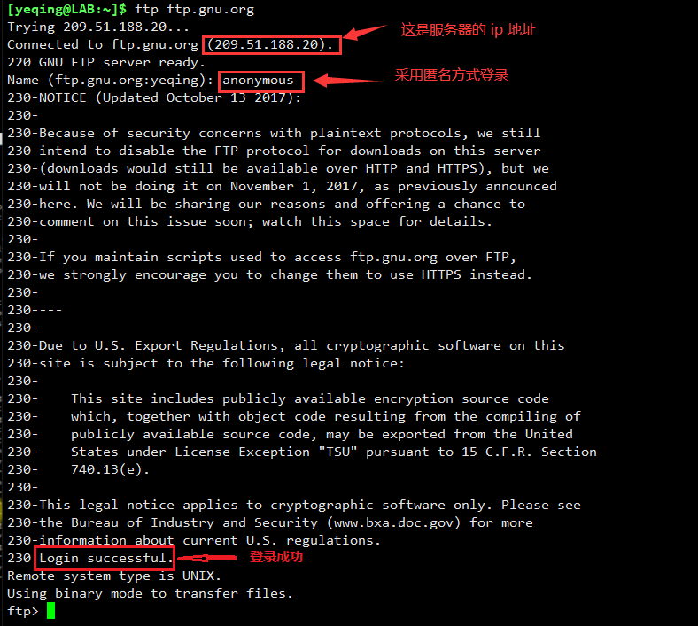

# 十二、白头到老之 -- 编译程序
本次课程我们将介绍如何通过编译源代码来创建程序。小伙伴们都知道 Linux 是开源系统，不仅仅操作系统的内核是开源的，
而且其周边的许多程序也都是开源的。因此，我们就可以在 Linux 系统上接触到大量的源代码，作为我们学习和研究的对象。

我们为什么要编译源代码呢？这里至少有两个原因：第一，**_可用性_**；尽管系统发行版的仓库里面包含了大量的预编译程序，
但是它不可能包含所有的程序。因此，我们要得到程序的唯一方法就是编译源代码。第二，**_及时性_**；
虽然大多系统发行版包含的应用程序都是较新版的，但是还有很多不是最新版的，而都是很老旧的版本。因此，
如果我们要得到最新版本，就需要编译源代码。

提起编译源代码，很多人都会望而生畏，认为这是一个很复杂和具有技术难度的事情。其实很多编译任务是很简单的，
只涉及到几个编译步骤。这次课程我们会通过一个具体案例，来让大家有一个整体的认识。
为将来大家在 Linux 系统上做开发打下基础。

在具体的操作中会涉及到一个 **make** 命令，和下面几个步骤：  

下来我们按照上面的六个步骤，通过编译 diction 程序进行学习。

----
1. 安装编译器

  我们的编译器用的是 **gcc**，如果没有安装可以运行 **sudo yum -y install gcc** 命令进行安装。
2. 获取源代码

  获取源代码是通过 **ftp** 程序获取的，如果你的系统里 **ftp** 不存在，也可通过运行 **yum** 命令进行安装。
  编译源代码并且最后的安装都是通过 **make** 程序实现的。

  一切就绪后，首先运行 **ftp ftp.gnu.org** 命令登录远程服务器。其中 **ftp.gnu.org** 是服务器的域名，
  登录过程中，它会提示你输入用户名，我们可以输入 anonymous 表示以匿名方式登录。如果登录成功，它会出现一段描述文字，
  并在最后提示：**Login successful.**（登录成功）具体如下：  
  
  
  登录成功后，我们 cd 到服务器的 gnu/diction 目录下，里面有几个不同版本的 diction 压缩包：  
  
  
  我们使用 get 命令获取最新的 1.11 版本：  
    
  获取成功后，我们输入 bye 退出登录。这时我们的 /home/yeqing 目录下就会多一个 diction 程序的 tar 包：  
    
  
  将其解压缩：  
    
  解压成功后，就会多一个 diction-1.11 目录，这就是我们获取的源代码。
  
3. 查看源代码

  我们来查看一下 diction-1.11 目录里面都有什么：  
    
  其中绿色的是可执行脚本程序，名称是大写字母的都是常规的文档。因为 diction 是 C 语言程序，所以它有很多的 *.c 和 *.h 文件：
  
  它们都是用 C 语言编写的程序源代码，我们可以任意的打开进行学习、研究和修改。
  
4. 编译预处理

  编译预处理就是在正式编译前所做的一些准备工作。我们先使用 diction-1.11/ 目录下的 configure 脚本，
  来做好准备工作。  
    
  每行后面的 yes 就表示检查结果正常。最后它会创建一些文件，其中的 Makefile 文件最重要，它是一个脚本文件。  
  
  Makefile 关系到了整个工程的编译规则。一个工程中的源文件不计数，其按类型、功能、模块分别放在若干个目录中，
  Makefile 定义了一系 列的规则来指定，哪些文件需要先编译，哪些文件需要后编译，哪些文件需要重新编译，甚至于进行更复杂的功能操作，
  因为 Makefile 就像一个Shell 脚本一样，其中也可以执行操作系统的命令。
  
  比如：Makefile 中定义了变量 CC = gcc 就表示使用 gcc 编译器，所以后面只要出现变量名 CC 的地方，都代指 gcc 编译器。
  
  Makefile 带来的好处就是——“自动化编译”，一旦写好，只需要一个 make 命令，整个工程完全自动编译，极大的提高了软件开发的效率。
  
5. 编译程序

  完成编译预处理后，我们只需运行 make 命令，它会去找刚才创建的 Mackfile 脚本文件，
  然后按照 Makefile 中指定的规则进行 “自动化编译”：
    
  这样就算是编译好了！编译好之后它会创建很多 *.o 的中间文件。  
  
  
6. 安装程序

  编译完成就可以安装程序了，我们运行 **sudo make install diction** 命令：  
    
  这样就算安装成功了！
  
  我们可以进行验证：  
    
  可以看到，diction 程序已经安装到了我们的本地的 /usr/local/bin 目录下了。
  
下来我们执行一下 diction 程序：  
  
这是 diction 程序的运行效果，说明我们通过自己编译、安装的这个程序是可用的。

## （完）

  