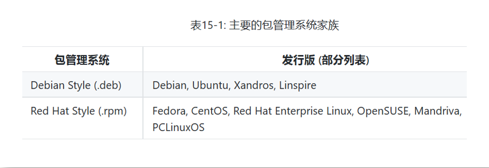
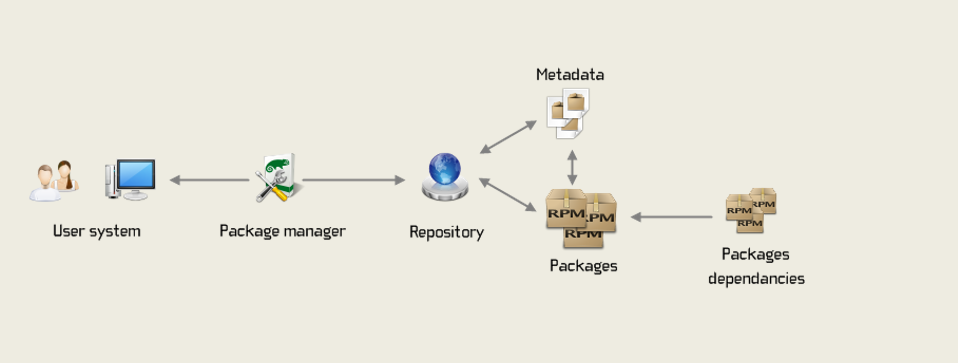
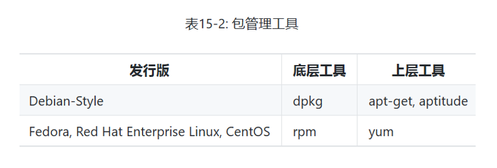

# 四、携手同行之 -- 软件包管理

Linux上常用的软件包管理工具有如下两个：  
  
因为CentOS系统用的是第二个，因此我们只介绍.rpm  

Linux的软件包到来自于网络，它的使用方式和组成如下图：  
  
各种软件包保存在网络的仓库里，每个软件包都有元数据的相关文档组成。一般软件包都包含其他的依赖包，用户通常通过软件包管理工具从仓库上下载软件包和依赖包。这些软件包通常都是编译好的。  
使用Linux的好处在于我们可以直接下载软件包源代码，从而自己定制修改软件包。

**常用的包管理工具有：**  
  
包管理工具分为上层工具和底层工具，我使用的系统是CentOS，所以只介绍第二种，yum 的常用方法有：  
- yum list --------------------- 列出仓库中所有的软件包
- yum list installed ----------- 列出所有已安装的软件包
- yum list packageName --------- 查看某个软件包是否已安装
- yum search packageName ------- 从仓库里搜索某个软件包
- sudo yum install packageName - 安装某个软件包，因为要安装在根目录的bin目录下，所以前面要加上sudo
- sudo yum erase packageName --- 卸载某个软件包
- yum list updates ------------- 查看所有可以更新的软件包
- sudo yum update packageName -- 更新某个软件包
- yum info packageName --------- 显示某个软件包的详细信息  

**_提示：_**  
*1.所有使用 list 的命令后面都可以使用 | grep keyword 进行筛选，例如：yum list | grep git ，其中 | 为管道；*  
*2.安装或卸载时可以加 -y 参数，表示不用中断询问 'yes/no?'，而继续操作。*

## （完）