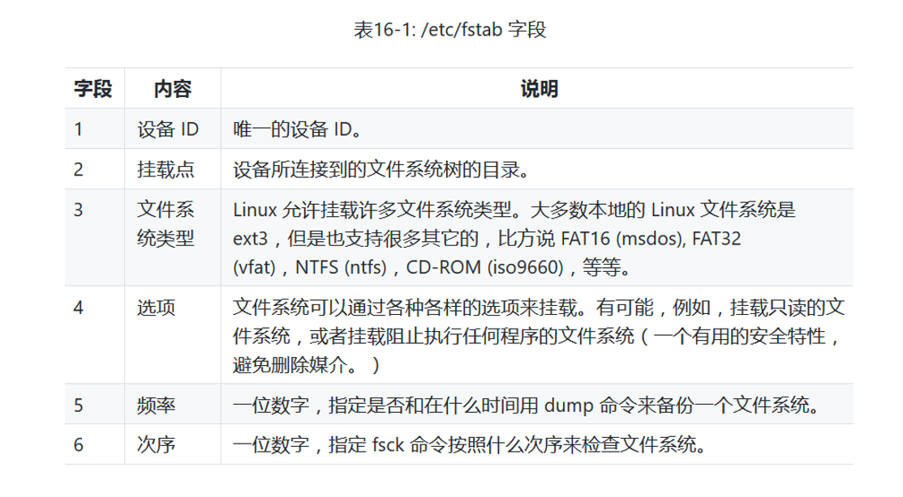

# 五、柴米油盐之 -- 存储媒介

前面的内容我们已经掌握了文件级别的数据操作，本次课程将介绍设备级别的数据操作。Linux 有非常强大的设备管理能力，
不管这个设备是物理设备还是虚拟设备。本次课程我们会介绍存储管理方面的基本概念，以及存储设备管理方面的重要命令。  
我们会介绍如下两个重要命令：  
  

Linux 的桌面系统跟 Windows 的桌面系统类似，可以非常容易的管理存储设备，就是 **_即插即用_**。但是这是在桌面系统，
对于命令行系统我们需要手工的完成设备的挂载。管理存储设备的第一步就是把设备连接到文件系统的树中，这个操作称为**_挂载_**。
挂载就是允许存储设备参与到系统的文件系统中。

Windows 会为每个存储设备，比如：U盘和 cdrom 分配不同的盘符，而 Linux 只有一个根，
因此我们就需要将设备挂载到根目录下的某个文件夹上边才能使用，通过这种方式来维护整个Linux 目录树的统一性和一致性。  

当 Linux 系统启动的时候，它会默认的挂载一些设备，这些设备在 /etc/fstab 文件内，fstab 是 file system table
（文件系统列表）的缩写。通过 cat /etc/fstab 命令可以展示已经挂载的设备。  
  

上图中除了带 # 的注释外，就展示了已经挂载的设备。第一列是：**设备ID**，第二列是：**挂载点**，第三列是：**文件系统类型**，
第四列是：**选项**，第五、六列分别是：**频率** 和 **次序**。每一项的内容详见如下表格：  

mount 命令可以用来挂载一个文件系统，如果后面不跟任何参数，可以显示系统当前挂载了哪些文件系统。

**我们如何挂载一个设备？**

我们以挂载一个光盘设备（cdrom）为例，我们要挂载的设备位于系统 /dev/cdrom 文件夹下，现在需要将它挂载到 /mnt/cdrom 目录下面，
/mnt/cdrom 就是设备的挂载点。步骤如下：  
1. cd 到 /mnt 目录下
2. 执行 sudo mkdir cdrom 命令，创建设备的挂载点
3. 执行 sudo mount /dev/cdrom /mnt/cdrom 命令，将光盘挂载到 /mnt/cdrom 下  
    
  这样我们就挂载成功，并且可以使用该设备了。  

**那么如何卸载一个设备呢？**  

执行 sudo umount /mnt/cdrom 命令，可以卸载刚才挂载的设备

*挂载安装光盘是一件很有意思的事情。通常我们下载安装软件包，是从网络寻找软件包的仓库，从仓库里下载并安装的。
但如果我们无法链接网络，就无法从网上下载安装软件包。这种情况下，我们可以用我们的安装光盘作为我们的 yum 源，
从光盘上去找软件包，而不是网上去找。*

**下面讲一下本地 yum 源（local yum repos）**  

yum 在安装软件包的时候，它找网上的仓库或是本地的仓库，在 /ect/yum.repos.d/ 文件夹下定义了很多 yum 源的配置信息。  
  
我们可以看到里面有很多的 \*.repo 文件，其中 CentOS-Base.repo 和  CentOS-Media.repo 两个文件最重要，
前一个定义的是互联网上的 yum 源，后一个定义的是本地的（光盘上的）yum 源。  

CentOS-Media.repo 中包含如下内容：  
  
它有一个本地的 yum 源叫 "c7-media"，我们可以创建 /media/cdrom 挂载点，然后执行 **mount /dev/cdrom /media/cdrom** 命令，
将本地安装光盘挂载到 /media/cdrom/ 目录下。  

**那么如何从本地 yum 源安装软件包呢？**  

我们以安装 git 为例，我们看到 CentOS-Media.repo 文件中有一条提示语句：  
  
它表示先禁用其他所有的 yum 源，然后启用 c7-meida 源，后面跟具体的安装语句，因此使用该格式命令就可以从本地 yum 源安装软件包。  
于是我们执行 **sudo yum --disablerepo=\\* --enablerepo=c7-media install git** 即可从本地 yum 源（之前挂载的光盘中）安装 git 软件包。 

  
从安装信息中可以看出，yum 源是 c7-meida

## （完）

