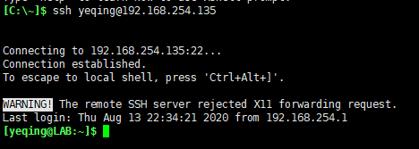

# 六、柴米油盐之 -- 网络系统

说到网络功能，好像没有什么是 Linux 不能做到的。Linux 被用来创建各式各样的网络系统或网络设备，包括：防火墙、
路由器、域名服务器、网络存储等等。当然很多网络公司用 Linux 做网站服务器或数据库服务器，都很常见。

Linux 有丰富的有关网络操作的命令，本次课程我们仅介绍一些最常使用的命令：  

下来我们一一介绍这几个命令：  
## （一）ping 命令
它用来帮助我们确定网络上的各个组件是否正常工作，ping 命令发出一个特殊的数据包，叫 ICMP ECHO_REQUEST，
这个数据包会发到某一个特定的主机上。语法格式：**ping IP Address or Domain Name**，ping 后面跟一个 IP 地址，
或者一个域名。我们可以通过这个 IP 地址或域名对应的网络设备发给我们的消息，来判断自己的主机与被访问的服务器之间的
网络通信状态是否正常。

比如，我们执行 **ping www.baidu.com** 命令，这个域名首先会被解析成 IP 地址，然后在由这个 IP 地址的主机，
会每隔约一秒给我们回复一条消息，我们可以按 Ctr-C 结束该进程，然后它会给我们发送一条简单的报告，具体如下图所示：  
  
从图中可以看到，远程主机一共给我们发送了9条信息。最后的报告表明，一共给我们传送了9个数据包，接收了9个数据包，
丢包率是0%，总耗时8015毫秒。丢包率是0%说明我们的网络连接时畅通的，如果丢包率过高，说明与被访问主机之间网络连接不正常。
如果丢包率是100%，则说明网络连接不通。

**当我们与被访问的主机网络不通时，我们如何知道是哪里出了问题呢？也就是如何来排错呢？**  

1. 用 **ping 127.0.0.1** 查一下自己本机的 IP 地址，看是否连接正常
2. ping 一下自己的网关，Window 系统可以在 CMD 中运行 ipconfig/all 得到自己的网关。  
  如果 Linux 系统可用命令 **netstat -rn**，它会打印一个路由表，其中 Gateway 就对应的列就是网关。  
  
3. 用 **ping 8.8.8.8**，看一下自己的路由器是否正常

如果上述三个设备都正常工作，就说明我们要访问的主机有问题，或者被访问的 IP 地址根本就不存在。因此，当我们的网络出问题时，
最常用的方法就是用 ping 命令来进行测试。

## （二）netstat 命令
netstat 是单词 network statistics（网络统计）的缩写。它用来检查各种网络设置和统计数据，比如说现在某个网络端口和某个协议发了多少数据包，
哪些端口在连接状态或监听状态等等，都可以通过该命令统计出来。

它的常用方法有：  
1. **netstat -ie**，它等价于 **ifconfig** 命令，用来打印网卡接口信息的  
    
  可以看出，两个命令打印的信息是一样的。里面的信息有两大块儿：  
  
  第一块儿中，ens32 是**以太网**，后面的尖括号中：UP 表示 **设备正常工作**，如果是 DOWN 表示该设备**已禁用**；
  BROADCAST 表示 **该以太网是广播式的**；RUNNING 是 **运行状态**；MULTICAST 也表示是 **广播类型**的。  
  inet 192.168.254.135 是本机的 IP 地址， netmask 255.255.255.0 是 **子网掩码**，broadcast 192.168.254.255 **广播地址**，
  inet6 fe80::af90:c7c9:2a86:d3c1 是 IPV6 的地址，其余部分是相关的统计数据了。
  
  第二块儿中，lo 是**虚拟网卡** 只要我们有物理网卡一般都会配一个虚拟网卡，它主要是做网络故障诊断时用的，inet 127.0.0.1
  表示本机的地址，其他的都不用多说了。
  
2. **netstat -rn**，它打印的是一个路由表，其中通常有两条路由信息  
    
  netstat 常用的介绍了两个，更多用法大家可以自行查阅相关的手册。
  
## (三) ssh 命令
ssh 是单词 Secure Shell（安全的 Shell）的缩写。ssh 解决了本地主机与远程主机之间，如何安全的交流的问题。
在 ssh 程序出现之前，所有的数据传输协议都是采用 ***明文*** 的，包括用户的账户和密码，这显然是很不安全的。
SSH 在进行数据传输前，先要对传输对象进行确认，确认成功后对传输的数据要进行加密。通常发起 ssh 连接请求的就是客户端，
另外一个就是服务器，它走的端口号是 22 号端口。

发起一个 ssh 连接请求的命令行格式为：**ssh user\_name@host\_name**，比方说我们使用命令：
ssh yeqing\@192.168.254.135 就可以用 XShell 连接并登录到我的 Linux 虚拟机。  
  

我们还可以在后面跟一个命令，在连接成功后在远程主机上直接执行该命令，而不用进行登录。最后将执行结果打印出来。  
  

或者是再在后面跟一个输入重定向，将打印结果输入到本地主机的一个文件里：  

## （四）scp 命令
scp 是单词 secure copy（安全的拷贝）的缩写。它可以用作从远程的 Linux 主机上拷贝文件到本地的 Linux 主机。
它之所以安全是因为它也是用的 ssh 协议来完成的远程拷贝。  

语法格式：**scp user\_name@host\_name:file\_list destination**，    

比如：执行命令 **scp yeqing\@192.168.254.135:~/playground/catin.txt .**  
表示用 SSH 协议通过网络从自己的 Linux 主机上拷贝一个文件到当前目录下，. 表示当前目录。  

  
如果真的有两台 Linux 主机，传输效果也是一样的。

## (完)

