# 七，柴米油盐之 -- 查找文件

之前的课程咱们已经浏览了 Linux 文件系统，一个典型 Linux 文件系统中包含了很多的文件，这就带来一个问题：

**_我们怎么才能快速的找到自己所需要的文件？_** 

虽然 Linux 文件系统有良好的目录结构，但是因为文件数量的庞大，
所以即使有良好的目录结构，也使得查找文件变得非常可怕。  

本次课程我们将介绍，如何使用命令行在系统中查找文件，主要涉及如下命令：  
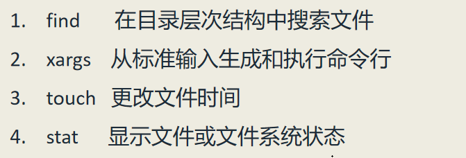

### 下面我们逐一进行介绍：

---

# （一）find 命令
find 命令可以基于文件的各种属性，在给定的目录中查找所有符合条件的文件。  

如果 find 后面跟一个目录或多个目录，运行后它会把给定目录中所有的子目录和所有的文件
（包括隐藏文件和隐藏目录中的文件）都打印出来。

如果直接来一个 find 后面不跟任何目录，它会把当前目录中所有的子目录和文件都打印出来。
因此其等价于 find . 命令，也使用相当于 ls -aR 命令。

find 命令最核心的用法就是，**find dir... condition** ，即按照给定的条件进行搜索。  

**搜索的条件可以分为以下几种：**  
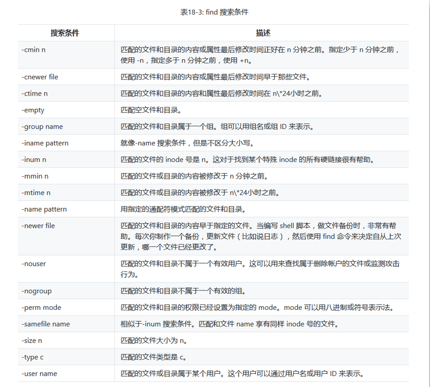

- ### 如果是按文件类型（-type）来查找，则文件类型又分如下几种：  
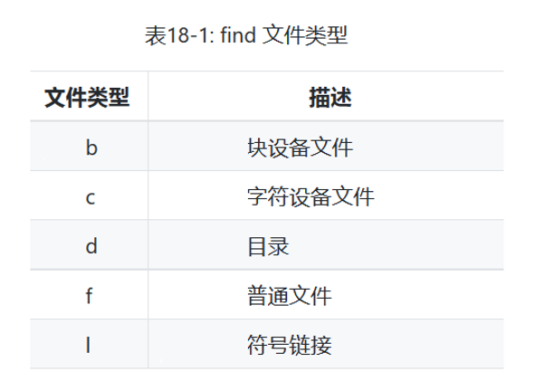  
例如 **find dir -type d** 表示在目录 dir 中搜索所有的目录

- ### 如果是按文件大小（-size）来查找，则文件大小单位有如下几种：  
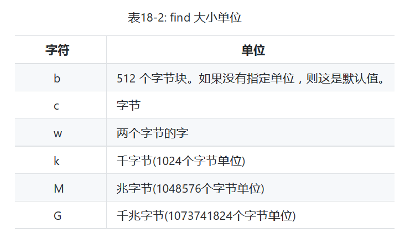  
例如 **find playground -size 12k** 表示在目录 playground 中搜索大小等于 12k 的文件和子目录。

  ***需要提醒的是：如果在数字前加 + 符号，表示大于给定数值；加 - 符号，表示小于给定数值。***

  例如：**find playground -size +15c** 表示在目录 playground 中搜索所有大于 15字节 的文件及子目录。  
  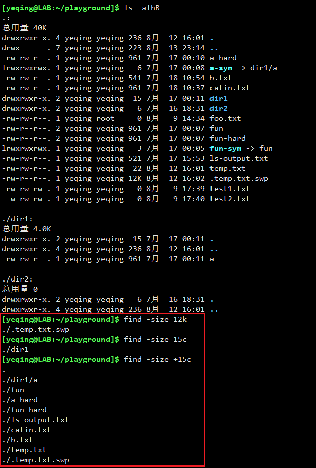  

- ### 最常用的是按照文件名称（-name）来查找：
例如：**find playground -name "*.txt"**，表示搜索所有 TXT 格式的文件：  
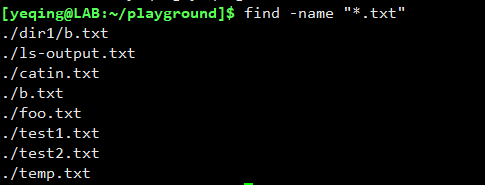  

  如果搜索的结果很多，我们可以利用管道后面跟命令进行统计。  
  如： **find /media/cdrom/Packages -name "*.rpm" | wc -l**  
  就是查找 /media/cdrom/Packages 文件夹下所有 .rpm 格式的文件，然后统计有多少行结果。  
  
  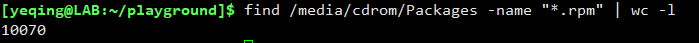

  我们还可以按其他条件进行搜索，比如按文件的权限，或按文件的修改时间等等，这里就不再一一讲解，都不难，读者可以自己研究一下。

- ### 我们还可以对搜索条件进行组合，组合的逻辑操作符如下：  
  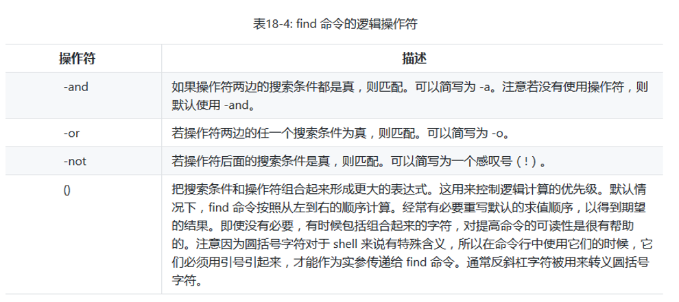  
  默认情况下是 -and ，就是说 -and 可以省略。比如：**find -name "*.txt" -size +10k** 就是查找当前目录下，所有大于 10k 并且格式为TXT的文件。
  如果是 -or 就是“或”的关系，得到的结果就会更多。

  **_注意： 加上 ( ) 就表示更高的优先级，但是在命令行中括号前要加上转义符号\，比如：_**  
  **_find \\( -name "\*.txt" -or -size +10c \\) -and -type d ，括号中的组合条件具有更高的优先级，与不加括号的搜索结果是不一样的。_**

- ### 我们还可以在 find 命令行后增加一些额外的操作：
这些操作有 **预定义的操作**（predefine operation） 和 **自定义的操作** (customized operation) 两种。

  - #### 预定义操作：
  
      
	比如：**find -name "\*.txt" -delete** 表示搜索当前目录中所有的 TXT 文件，然后删除掉。

  - #### 自定义操作：
    语法格式是在 find 命令行的后面跟：**-exec command '{}' ';'**   
    花括号代表 command 命令所要操作的路径，分号代表一个限定符，表示 command 命令已经执行完毕。 

    比如：**find -name "*.txt" -exec ls -l '{}' ';'** 表示将搜索结果按长格式打印：  
    

    这其实是在搜索到的每个文件上运行了一遍 ls -l 命令，等于调用4次 ls -l 命令。  
    我们知道其实 ls 命令是可以一次处理多个文件的，只要将 **';'** (分号连同单引号）换成 + （加号），
    就可以只调用一次 ls 命令。  
    

# （二）xargs 命令

大多数 Linux 命令都不接受标准输入作为参数，只能直接在命令行输入参数，这导致无法用管道命令传递参数。  
举例来说，echo 命令就不接受管道传参。**echo "hello world" | echo** 命令不会有任何输出，因为管道右侧的echo不接受管道传来的标准输入作为参数。

xargs 命令的作用，是将标准输入转为命令行参数。它最常见的用法就是： **command1 | xargs command2**，
xargs 命令会将管道右侧的 command1 命令产生的结果，转为命令行参数，传给 command2 命令。  

因此 **echo "hello world" | echo** 可以改成：**echo "hello world" | xargs echo**  
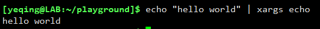  
上面的代码将管道左侧的标准输入，转为命令行参数hello world，传给第二个echo命令。
  
于是上面讲过的自定义操作 **find -name "*.txt" -exec ls -l '{}' ';'** 还可以写成：  
**find -name "*.txt" | xargs ls -l** 它们的效果是一样的。  
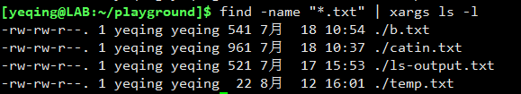

还有一个原因，使得 xargs 特别适合 find 命令。有些命令（比如rm）一旦参数过多会报错"参数列表过长"，而无法执行，
改用 xargs 就没有这个问题，因为它对每个参数执行一次命令。

**find . -name "*.txt" | xargs grep "abc"**

上面命令找出所有 TXT 文件以后，对每个文件搜索一次是否包含字符串abc

#### xargs 命令还可以有不同的选项，有关的详细介绍，可以参阅阮一峰老师的 [xargs 命令教程](http://www.ruanyifeng.com/blog/2019/08/xargs-tutorial.html)

# （三）touch 命令
Linux 的 touch 命令不常用，一般用来创建文件和修改文件或者目录的时间戳

### 1. 命令格式：

touch 【选项】 【文件名或者目录名】

### 2. 命令参数：

- -a 只修改文件的access(访问)时间.

- -c 或 --no-create 　不建立任何文档。

- -d 使用指定的日期时间，而非现在的时间。

- -m 只修改 Modify (修改)时间，而不修改 access (访问)时间

- -r file1 file2　使用指定的 file1 文件的时间戳（access，modify），更新 file2 文件的时间戳（access，modify）

- -t 使用指定的日期时间，而非现在的时间。

***注：access 表示最后一次访问（仅仅是访问，没有改动）文件的时间***

***modify 表示最后一次修改文件的时间***

***change 表示最后一次对文件属性改变的时间，包括权限，大小，属性等等***

### 3. 使用范例：

- **实例一：创建不存在的文件**

  命令：***touch b.txt c.txt***

  输出：

  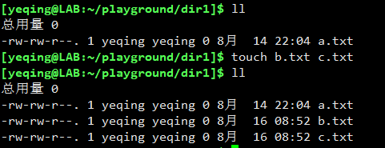

  **如果 d.txt 不存在，则不创建文件：**

  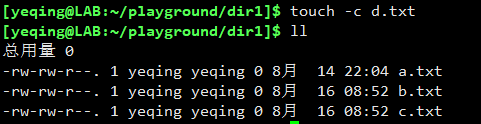

- **实例二：更新 b.txt 的时间和 a.txt 时间戳相同**

  命令：***touch -r a.txt b.txt***

  输出：

  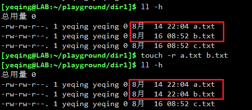

- **实例三：设定文件的时间戳**

  命令：***touch -t 201306130830.50 b.txt***

  输出：

  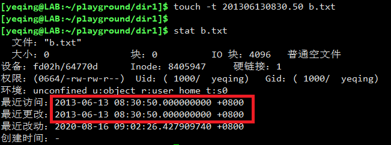

  **说明：**

  **t  time 使用指定的时间值 time 作为指定文件相应时间戳记的新值。此处的 time规定为如下形式的十进制数:**     

  **[[CC]YY]MMDDhhmm[.SS]**     

  **这里，CC 为年数中的前两位，即”世纪数”；YY 为年数的后两位，即某世纪中的年数。
  如果不给出 CC 的值，则 touch 将把年数 CCYY 限定在 1969--2068 之内。
  MM 为月数，DD 为天数，hh 为小时数(几点)，mm 为分钟数，SS 为秒数。此处秒的设定范围是 0--61，这样可以处理闰秒。
  这些数字组成的时间是环境变量 TZ 指定的时区中的一个时间。由于系统的限制，早于1970年1月1日的时间是错误的。**

- **实例四：只设定 modify (修改) 事件，而不改变 access (访问)事件**

  命令：***touch -m -t 201306130830.50 c.txt***

  输出：

  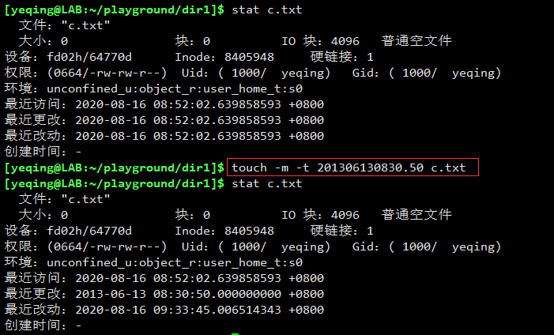

# (四) stat 命令
stat 命令可以把一个文件的详细信息全部展示出来，尤其是时间信息。例如下图所示：  

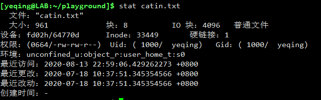  

## （完）

