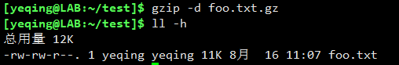
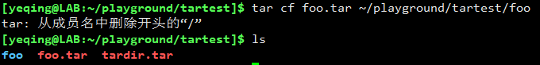

# 八、七年之痒之 -- 归档和备份
系统管理员的主要任务之一，就是保护数据的安全。保护数据的主要方法就是 **备份**。
即使是一般的用户，我们也经常需要在不同的设备或同一台设备的不同文件夹之间，拷贝大量的文件。

本次课程我们将介绍几个常用的文件归档和备份的命令：  

下面我们将逐一对它们进行介绍。

---

## （一）gzip 命令
gzip 是单词 GNU zip 的简写。gzip 程序用来压缩一个或多个文件。当我们执行 gzip 命令时，原始文件的压缩版就替代了原始文件。
相对的，解压缩的命令是 gunzip

例如：在我们的 test目录下有一个 foo.txt 文件，大小为 11k  

我们使用 azip 命令，将它进行压缩：  
  

可以看到，.gz 格式的压缩文件替代了原来的文件，并且大小只有原始文件的约五分之一。

如果想把它进行解压缩，就用 gunzip 命令：  
  
可以看到，压缩版的文件被解压后的文件所替代了。

我们还可以利用管道，将 ls 命令的标准输出传递给 gzip 生成一个压缩文件。比如像这样：  
  
它将管道右侧 ls -lh /etc 命令的标准输出传递给 gzip 命令进行压缩，然后重定向生成一个压缩文件。

其实当我们向 github 网站推送和拉去数据的时候，就是用的 gzip 程序对数据进行压缩，然后进行网络传输的。 

#### gzip 命令还有很多的选项：  

举几个例子：

我们用选项 -t -v 来显示压缩文件 foo.txt.gz 的信息。  
  
可以看到，显示 OK 信息，表示该压缩文件可以被解压缩。

我们还可以使用 -d 选项来进行解压缩，效果同 gunzip 命令一样  

我们使用 -c 选项，可以打印出压缩文件的内容：  
  
通过 **gunzip -c foo.txt.gz** 命令我们可以得到 foo.txt.gz 解压后的内容，并且保留了压缩文件。  
使用 **zcat** 命令可以得到同样的效果，而且不用加入任何选项：  

## （二）tar 命令
tar 是用于文件 ***归档（archive）*** 的命令。它是单词 tape archive（磁带归档）的简写，它最初是一款用于 ***磁带备份*** 的工具，
现在已经能支持各种新的存储设备。在类 UNIX 的世界里，tar 命令是用于文件归档、备份的经典命令。

tar 命令能可以将多个文件或目录合并成一个大的文件，这样便于文件的备份和管理，它通常和文件的压缩一起使用。
生成的归档文件以 .tar 或 .tgz 扩展名结尾。

tar 命令的语法格式：***tar mode pathname...***

mode 表示模式，是运行 tar 的必备选项，一般有如下几种：  
  
***注意：Linux命令选项一般都会在前面都加横杠，而 tar 模式不需要加横杠！***

下面我们通过实例来对 tar 命令进行详细说明： 

#### 实例一：合并多个文件和目录：
我们先创建一些目录和文件：  
  

  
我们先创建了100个目录（从dir-001/ 到 dir-100/），然后在每个目录中各创建了26个文件(从file-A 到 file-Z)。

统计一下文件数量：  
  
一共创建了2600个文件。

运行命令：**tar cf tardir.tar dir-{00{1..9},0{10..99},100}** 将这100个目录进行归档，
命令行中字母 c 表示“为文件和目录列表创建归档文件”，f 是 force 表示强制执行，以后都要用的：  
  
可以看到，运行后生成了一个 tardir.tar 文件，该文件就是由上述100个目录合并后生成的。

归档之后我们可以删除原始文件，只留一个归档文件，方便保存和管理：  

#### 实例二：提取归档文件
我们如何从归档文件中提取和展开原始文件呢？
  
可以使用命令行：**tar xf tardir.tar** 来实现，字母 x 表示“抽取归档文件”
  
可以看到，我们从 tardir.tar 中抽取了所有的归档文件，放入了 foo 文件夹中。

我们可以只提取某个指定的文件：  
  
我们只提取其中的 dir-001/file-A 文件

#### 实例三：查看归档文件
如果我们只是想查看一下归档文件中的内容，而并不需要将它们提取出来，该如何操作呢？  
我们可以用 t 模式，列出归档文件的内容：  
  
该命令行会列出所有的归档目录及文件，我们使用 head 命令只让它显示了前10行信息。

这里值得一提的是，在执行归档操作时如果使用文件的绝对路径，则会产生不一样的效果。
例如，我们对 foo 文件夹执行归档时，使用 foo 的绝对路径：  
  
从执行效果看，系统提示：删除了绝对路径开头的 “/”，意思是删除了根目录。

我们对生成的 foo.tar 文件进行提取和查看，看看有何不同：  
  
可以看到，执行 **tar xf foo.tar** 后提取出来的是一个名为 home 的文件夹。这是因为归档时使用了绝对路径，
而系统又将根目录 “/” 删除了，所以才会提取出一个 home 文件夹。  
再运行 **tar tf foo.tar | head** 命令查看归档文件，从列出的信息也可以看到，所有文件都是按绝对路径归档的，只是缺少了根目录“/”。

**_那么系统删除根目录“/”有什么作用呢？_**  

这样做的好处是，因为没有了根目录，所以我们在提取归档文件时就可以不受根目录的限制，
把文件提取到任何地方了。

#### 实例四：归档并压缩
如果我们想在归档的同时进行压缩操作，则可以使用模式 z （表示压缩所有的归档文件），合并后的文件扩展名是 .tgz
  
通过运行 **tar czf tardir2.tgz foo** 命令，将包含了100个目录和2600个文件的 foo 文件夹进行了归档并压缩。
可以看到所以生成的 tardir2.tgz 文件尺寸只有 20k，而没有经过压缩的 tardir.tar 则有1.4M。
  
运行命令：**tar xzf tardir2.tgz** 则可以把 tardir2.tgz 文件再次展开：  
  
同样使用 t 模式，则可以列出归档文件。

## （三）rsync 命令
rsync 是单词 remote sync（远程同步）的缩写。rsync 是 Linux 系统下的数据镜像备份工具。它可以进行本地与本地的同步，或本地与远程的同步，
但不可以是远程与远程之间的同步。Rsync使用所谓的“Rsync算法”来使本地和远程两个主机之间的文件达到同步，这个算法只传送两个文件的不同部分，
而不是每次都整份传送，因此速度相当快。

**特点**  
1、可以镜像保存整个目录树和文件系统；  
2、可以很容易做到保持原来文件的权限、时间、软硬链接等；  
3、无须特殊权限即可安装；  
4、优化的流程，文件传输效率高；  
5、可以使用rsh、ssh等方式来传输文件，当然也可以通过直接的socket连接；  
6、支持匿名传输

**rsync 命令常用选项说明：**  

-v：显示rsync过程中详细信息。可以使用"-vvvv"获取更详细信息。  
-P：显示文件传输的进度信息。(实际上"-P"="--partial --progress"，其中的"--progress"才是显示进度信息的)。  
-n --dry-run  ：仅测试传输，而不实际传输。常和"-vvvv"配合使用来查看rsync是如何工作的。  
-a --archive  ：归档模式，表示递归传输并保持文件属性。等同于"-rtopgDl"。  
-r --recursive：递归到目录中去。  
-t --times：保持mtime属性。强烈建议任何时候都加上"-t"，否则目标文件mtime会设置为系统时间，导致下次更新检查出 mtime 不同从而导致增量传输无效。  
-o --owner：保持owner属性(属主)。  
-g --group：保持group属性(属组)。  
-p --perms：保持perms属性(权限，不包括特殊权限)。  
-D        ：是"--device --specials"选项的组合，即也拷贝设备文件和特殊文件。  
-l --links：如果文件是软链接文件，则拷贝软链接本身而非软链接所指向的对象。  
-z        ：传输时进行压缩提高效率。  
-R --relative：使用相对路径。意味着将命令行中指定的全路径而非路径最尾部的文件名发送给服务端，包括它们的属性。用法见下文示例。  
--size-only ：默认算法是检查文件大小和mtime不同的文件，使用此选项将只检查文件大小。  
-u --update ：仅在源mtime比目标已存在文件的mtime新时才拷贝。注意，该选项是接收端判断的，不会影响删除行为。  
-d --dirs   ：以不递归的方式拷贝目录本身。默认递归时，如果源为"dir1/file1"，则不会拷贝dir1目录，使用该选项将拷贝dir1但不拷贝file1。  
--max-size  ：限制rsync传输的最大文件大小。可以使用单位后缀，还可以是一个小数值(例如："--max-size=1.5m")  
--min-size  ：限制rsync传输的最小文件大小。这可以用于禁止传输小文件或那些垃圾文件。  
--exclude   ：指定排除规则来排除不需要传输的文件。  
--delete    ：以SRC为主，对DEST进行同步。多则删之，少则补之。注意"--delete"是在接收端执行的，所以它是在 exclude/include 规则生效之后才执行的。  
-b --backup ：对目标上已存在的文件做一个备份，备份的文件名后默认使用"~"做后缀。  
--backup-dir：指定备份文件的保存路径。不指定时默认和待备份文件保存在同一目录下。  
-e          ：指定所要使用的远程shell程序，默认为ssh。  
--port      ：连接daemon时使用的端口号，默认为873端口。  
--password-file：daemon模式时的密码文件，可以从中读取密码实现非交互式。注意，这不是远程shell认证的密码，而是rsync模块认证的密码。  
-W --whole-file：rsync将不再使用增量传输，而是全量传输。在网络带宽高于磁盘带宽时，该选项比增量传输更高效。  
--existing  ：要求只更新目标端已存在的文件，目标端还不存在的文件不传输。注意，使用相对路径时如果上层目录不存在也不会传输。  
--ignore-existing：要求只更新目标端不存在的文件。和"--existing"结合使用有特殊功能，见下文示例。  
--remove-source-files：要求删除源端已经成功传输的文件。

**_rsync的选项非常多，能够实现非常具有弹性的功能，关于更完整更详细的选项说明，请移步 [这里](https://www.cnblogs.com/f-ck-need-u/p/7221713.html)。_**

### 举例说明：

#### 1. 本地到本地的同步（local to local）：  
**语法格式：rsync options source destination**  

我们将 foo.txt 文件进行本地到本地之间的同步：  
  
可以看到，我们将 rsynctest 目录下的 foo.txt 文件，同步到了用户根目录下。  
在命令行中使用选项 -v ，会打印出同步过程的详细信息。

如果同步的是一个文件夹，则使用 -a 选项将所有的子目录和文件进行递归同步：  
  
可以看到，dir 文件夹下的所有目录和文件，被以递归的方式同步到了用户根目录下，
并列出了详细信息。  

如果我们再次将 dir 目录同步到用户根目录下，会怎样呢？  
  
从提示信息可知，没有任何数据被同步。这证明了，rsync 只传送两个文件的不同部分（只做 **_增量同步_**），
而不是每次都整份传送。

我们在文件 dir/dir-001/file-A 中输入 “Hello world!”，然后再执行同步：  
  
可以看出，rsync 只对修改过的 file-A 文件做了同步。  
打印 ~/dir/dir-001/file-A 文件内容：  
  
可以看到，增加的 “Hello world!” 语句已经同步过去了。

#### 2. 本地到远程的同步（local to remote）：
本地到远程的同步，一般多用 SSH 协议进行。

常用的语法格式：**rsync -av --rsh=ssh localSource user_name@remoteIP:destination**

localSource 是本地的源文件，user_name 是远程主机的用户名，remoteIP 是远程主机的 IP 地址，destination 是远程同步的目标位置

例如，我们将刚才的 dir 文件夹，在两台 Linux 虚拟机之间进行远程同步：  
**_注意：如果是第一次连接，则会询问是否继续连接，我们只要输入 yes 继续，第一次连接成功以后就不会再出现提示了。_**  
  
  
结果显示，我们完成了从一台Linux 主机向另一个台 Linux 主机进行远程同步的操作。

在远程主机上查看同步效果：  
  
可以看到在远程主机上的 ~/playground 目录中多了一个 dir 目录，其内容与本地主机上的 dir 目录完全一致。

远程同步同样也传送两个文件的不同部分（只做 **_增量同步_**），而不是每次都整份传送。  

