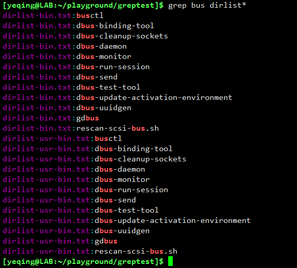
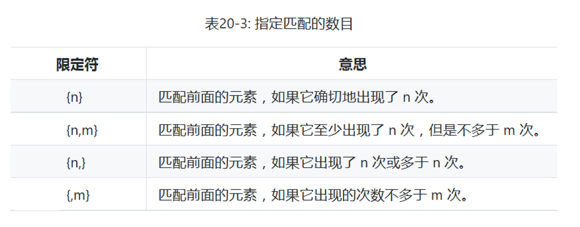
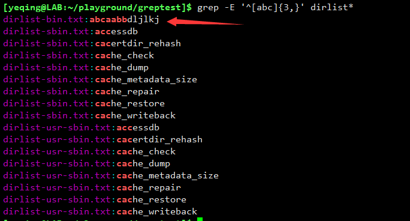

# 九、七年之痒之 -- 正则表达式
在 Linux 系统中文本操作占有举足轻重的作用。它主要有三类操作：正则表达式、文本处理、格式化输出。  
其中正则表达式又是非常重要且神奇的技术。本节课程我们就来讲解正则表达式在 Linux Bash 中的使用。

---

什么是正则表达式？  
正则表达式，又称规则表达式。（英语：Regular Expression，在代码中常简写为 regex、regexp 或 RE），计算机科学的一个概念。
正则表达式通常被用来检索、替换那些符合某个模式(规则)的文本。

许多程序设计语言都支持利用正则表达式进行字符串操作。例如，在Perl中就内建了一个功能强大的正则表达式引擎。
正则表达式这个概念最初是由Unix中的工具软件（例如sed和grep）普及开的。
正则表达式通常缩写成“regex”，单数有regexp、regex，复数有regexps、regexes、regexen。

### 概念  
正则表达式是对字符串操作的一种逻辑公式，就是用事先定义好的一些特定字符、及这些特定字符的组合，组成一个“规则字符串”，
这个“规则字符串”用来表达对字符串的一种过滤逻辑。

### 特点  
正则表达式的特点是：

1. 灵活性、逻辑性和功能性非常强；
2. 可以迅速地用极简单的方式达到字符串的复杂控制。
3. 对于刚接触的人来说，比较晦涩难懂。

由于正则表达式主要应用对象是文本，因此它在各种文本编辑器场合都有应用，小到著名编辑器EditPlus、vi/vim，
大到Microsoft Word、Visual Studio等大型编辑器，都可以使用正则表达式来处理文本内容。

注意一点，并不是所有系统的正则表达式规则都是完全一样的。这里我们主要介绍正则表达式在 Linux Bash 中的使用，
主要分为两类：一类是 **_基本的正则表达式_** ；一类是 **_扩展的正则表达式_** 。

涉及到的命令：grep 基于正则表达式的文本搜索

grep 是英文 global regular expression print 的缩写。

常用的命令选项有：  

**举例说明**

我们首先在 greptest/ 目录中创建好实验环境：  
  
我们创建了四个 TXT 文件，每个文件中都包含着不同的内容。

#### 基本的正则表达式语法
基本的正则表达式(Basic regular expression)，英文缩写 BRE

语法格式：**grep [options] regex [file...]**   其中 regex 就是正则表达式

1. 运行 grep bus dirlist* 命令，在四个文件中查找匹配字符串 "bus" 的内容：  
    
  可以看出，系统列出了所有的匹配项，冒号左边是文件名，冒号右边是匹配的内容。  
  如果使用 -v 选项（或--invert-match）则是搜索 **_不匹配_** 内容。

  如果只想看文件不想显示匹配内容，可以使用 -l 选项：  
    
  我们看到只找到了两个文件。
  
  如果只想显示不匹配的文件列表（就是反选），则可以使用 -L 选项：
    
  我们看到，它列出了所有不匹配的文件名。
  
  如果只想看匹配内容不想显示文件列表，则可以使用 -h 选项：  
    
   

2. 第一个实例中，我们用的是 **bus** 进行搜索，它也算是一个正则表达式，只是没有使用任何元字符进行逻辑判断，
这种直接以普通字符串进行匹配的方式，称作 **_精确匹配_**。还有一个更高级的匹配方式是 **_模糊匹配_**，它需要使用 **_元字符_** 进行逻辑判断。
  
  常用的元字符有：  
     
  在命令行中使用带有元字符的正则表达式时，
  需要在正则表达式两边加上单引号，否则系统会将它们视为命令来处理，比如元字符 | 如果不加单引号，系统会将它视为管道！
  
  它们的含义分别如下：  
  
  - **^** ---- 匹配输入字行首；
  - **$** ---- 匹配输入行尾；
  - **.点** ---- 匹配处"\n"和"\r"之外的任何单个字符；
  - **[]** ---- 字符集合。匹配所包含的任意一个字符；
  - **{}** ---- 匹配的个数
  - **\-横杠** ---- 表示字符的范围，比如 a-z 表示小写的 26 个英文字母，0-9 表示数字0到9；
  - **?** ---- 匹配前面的子表达式零次或一次
  - **\*** ---- 匹配前面的子表达式零次或多次
  - **\+** ---- 匹配前面的子表达式一次或多次
  - **()** ---- () 表示将( 和 ) 之间的表达式定义为“组”（group），即一个正则表达式组；
  - **|** ---- 将两个匹配条件进行逻辑“或”(or)运算，如 x|y 表示匹配 x 或 y
  - **\** ---- 相当于编程语言中的“转义字符”，比如 "\\\\" 匹配 \\ 

  基本的正则表达式用到的元字符有：**.点 ^ $ [] \-**  
  
  下来我们逐一举例说明：
  
  例如，我们匹配上述四个文件中，所有行首以字符串 "bu" 开始的内容：  
  
  
  匹配行尾以字符串 "ser" 结尾的内容：  
  
  
  匹配行尾是 "er."的内容，其中 .（点）表示任何单个字符，就是以 er 后面跟任意一个字符作为行尾的内容：  
  
  
  匹配字符串 "us" 前面是字符集合 [abcd] 中的任意一个字符：  
  
  
  匹配字符串 "use" 前面是任意小写字母的内容：  
  
  
#### 扩展的正则表达式语法
扩展的正则表达式（Extended regular expression），英文缩写 ERE

语法格式：**egrep [options] regex [file...]** 或者  **grep -E [options] regex [file...]**

扩展的正则表达式用到的元字符有：**() {} ? * + |**

下来举例说明：
  
我们先看一个 * 的例子：  
  
正则表达式 "[abc].*use" 中 * 表示前面的 . 点可以是零个或多个任意字符。如果不加 * 就表示只有一个任意字符。

现在给 **'[abc].\*use'** 看加上 () 变成 **'([abc].)\*use'**，使 () 内部的表达式成为一组，看看效果：  
  
显然匹配的数量比不加括号要多很多，因为 "([abc].)*use" 表示括号中的 "[abc]." 是按一组正则表达式处理的，
因此 * 星号就影响的是前面的一组而不是 . 点，表示 "[abc]." 匹配的内容可以出现任意次。

{} 是表示匹配的数量，主要有下面几种：  

下面逐一进行演示：  

1. {n} n是一个非负整数。匹配确定的n次，例如：  
    
  表示行首以[abc]集合中任意一个字母开始，并且匹配3次。
  
2. {n,} n是一个非负整数。至少匹配n次，也就是可以匹配 n 以上且包含 n 次，例如：  
    
  可以看到，搜索效果是行首出现 [abc] 集合中任意一个字符3次以上且包含3次。
  
3. {n,m} m和n均为非负整数，其中n<=m。表示最少匹配n次且最多匹配m次，例如：  
    
  可以看到，所有行首出现 [abc]集合中任意字母最少3次且最多6次的内容，均被显示出来。
  
4. {,m} m 为非负整数。表示最多匹配 m 次，例如：  
    
  可以看到，如果是行首一个小写字母加横杠，则没有匹配项。如果行首最多三个小写字母加横杠，则有194条匹配项。

？匹配前面的子表达式零次或一次，例如：  
  
行首是字母 b 后面跟a b c d 四个字母中任意一个字母的，匹配内容有 12 条。如果集合 [a-d]后面使用 ? ，
表示可以匹配 [a-d] 零次或一次，那么结果就是 56 条。

\* 表示匹配前面的子表达式零次或多次，+ 表示匹配前面的子表达式一次或多次。使用方式与 ? 类似，这里就不再一一举例说明了。
  
| 表示将两个匹配条件进行逻辑“或”(or)运算，例如：  
  
 "^[a-d]?|er$" 表示将 "^[a-d]?" 和 "er$" 两个匹配条件进行逻辑“或”运算，
 因此结果是 "^[a-d]?" 和 "er$" 两个匹配集合数量相加，即 56 + 64 = 120 条匹配项。

#### 我们再举一个有关电话号码的实例
我们首先通过一串命令行来创建一个保存电话号码的文件 phone.txt

命令行：**for i in {1..10}; do echo "(${RANDOM:0:3}) ${RANDOM:0:3}-${RANDOM:0:4}" >> phone.txt; done**

其中 for i in {1..10} 表示执行 10 遍 for 循环，do echo ... 表示每次循环的具体操作内容，
其中 ${RANDOM:n:m} （通常 n < m） 表示随机生成 n 到 m 位整数。每生成一个随机号码都将其追加到 phone.txt 文件中，
done 表示循环结束。

运行命令后，在 phone.txt 文件中会保存 10 条电话号码，执行 cat 命令查看文件内容：  
  
可以看到，我们有了十行数据，是十个随机生成的电话号码。每个号码都有三位国家号、三位区号和四位号码。

我们对其中几个号码做一下修改，把它们改成错误号码：  
  
可以看到，其中一些号码是错误的。这就是我们下面要用到的实验文件。

首先我们利用正则表达式来匹配出正确的电话号码。  

命令行：**grep -E '\\([0-9]{3}\\) [0-9]{3}-[0-9]{4}' phone.txt**

注意：因为要在表达式中使用圆括号，为了不使系统将圆括号() 识别为正则表达式的元字符，我们在前面加上转义符 \ 让它变成普通字符

运行效果如下：  
  
可以看到，我们匹配出了所有正确的电话号码。

我们可以使用选项 -v (或长选项：--invert-match)，列出所有错误的电话号码：  
  

我们知道 less 命令用于显示文件内容，我们可输入 / 后面跟字符串进行查找操作。其实它也可以使用正则表达式，
例如我们输入：**/\\([0-9]{3}\\) [0-9]{3}-[0-9]{4}** 同样可以匹配出所有的正确号码：  
  
可以看到，匹配出的正确号码均已高亮显示。

文本编辑器 vi 及 vim 都支持正则表达式搜索，只是它们要对花括号 {} 进行转义，因此匹配电话号码的正则表达式为：  
**([0-9]\\{3\\}) [0-9]\\{3\\}-[0-9]\\{4\\}**

最后提示一点，find 命令在查找文件时，也可使用正则表达式，它的语法格式为：**find dir... -regex 'expression'**

例如，我们利用正则表达式找出用户根目录下，文件名以"dirlist"开始的所有 TXT 文件:
  
因为 . 点是元字符，所以 .txt 中的点前面要使用转义符将它变成普通字符。

**关于正则表达式元字符还有很多，这里只介绍了一些常用的，更多的详细介绍，请查阅[百度百科之--正则表达式](https://baike.baidu.com/item/%E6%AD%A3%E5%88%99%E8%A1%A8%E8%BE%BE%E5%BC%8F/1700215?fr=aladdin)，**

---

**_如何在 Linux Bash 中使用正则表达式，就简单的介绍到这里，其实有关的内容还有很多，限于篇幅原因，无法做到面面俱到。
这里只是做了一点简单的探讨和演示，有兴趣的读者可以自行深入研究。学习 Linux 命令行的好处在于，前面学过的知识和技能，
在后面的学习或工作中都可以直接拿来使用，也就是所有知识都具有连贯性和一致性。因此随着不断的积累会越学越轻松，越学越容易上手。_**

## （完）
