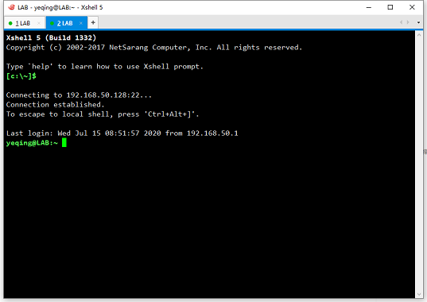

# 一、实验环境搭建
## 1. 所需的软件有：  

- VMWare 虚拟机
- Linux 的 CentOS7 操作系统
- XShell5.0 远程链接

## 2. 安装步骤

1. 安装空白虚拟机  

2. 在虚拟机中安装 CenOS7 最小系统，注意参数的配置。

3. 安装 XShell，并与虚拟机建立连接  

***PS: 详细安装过程，请学习王顶老师的教学视频：[Linux Bash 入门（上）](https://ke.qq.com/course/230588)***