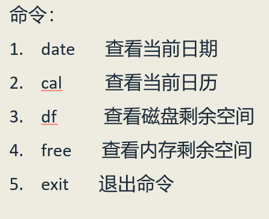

# 二、懵懵懂懂之--什么是 shell？
在计算机科学中，Shell俗称壳（用来区别于核），是指“为使用者提供操作界面”的软件（命令解析器）。
它类似于DOS下的command.com和后来的cmd.exe。它接收用户命令，然后调用相应的应用程序。

同时它又是一种程序设计语言。作为命令语言，它交互式解释和执行用户输入的命令或者自动地解释和执行预先设定好的一连串的命令；
作为程序设计语言，它定义了各种变量和参数，并提供了许多在高级语言中才具有的控制结构，包括循环和分支。

在 Linux 系统中 shell 有很多种，我们今天介绍的是 “Bourne Again shell” 简称 HASH。  

Bash，Unix shell的一种，在1987年由布莱恩·福克斯为了GNU计划而编写。1989年发布第一个正式版本，原先是计划用在GNU操作系统上，但能运行于大多数类Unix系统的操作系统之上，包括Linux与Mac OS X v10.4都将它作为默认shell。
Bash是Bourne shell的后继兼容版本与开放源代码版本，它的名称来自Bourne shell（sh）的一个双关语（Bourne again / born again）：Bourne-Again SHell。

其常用的命令有：  
- "~"，是系统中“/home/用户名”的别名
- "/"，表示系统根目录，与 Windows 操作系统不同，Linux 只有一个根目录
- "pwd"，pring working directory 的缩写，表示打印当前工作目录
- "ls"，list 的缩写，后面通常跟一个路径，表示查看该路径下的所有“目录、子目录和文件”（如果 "ls" 后面什么也不跟，表示查看当前目录下的所有文件）
  - ls 后面跟 "-l"，列出更多信息（"l" 代表单词 long ，指长格式显示信息）
  - ls 后面跟 "-a"，列出所有文件（"a" 代表单词 all ，指所有文件，包括隐藏文件）
  - "ls -la"，是 "-l" 和 "-a" 两个选项的合并，表示以长格式列出所有文件
- "cd"，change directory 的缩写，表示改变当前路径
  - cd 后面什么都不加，是回到家目录
  - "cd -" 是和上一个目录切换
  - "cd ~用户名"，切换到指定用户的“/home/用户名”路径下
- "su"，切换到 root 身份，但 Shell 环境仍然是普通用户的 Shell
- "su -" 连用户和Shell环境一起切换成 root 身份了。  
  （只有切换了Shell环境才不会出现PATH环境变量错误，报command not found的错误。  
  使用 pwd 和 echo $PATH 命令会看出二者的区别）

其他常用的还有：  

**_Bash 的命令有很多，这里不再一一列举，可以自己查阅相关资料。_**
