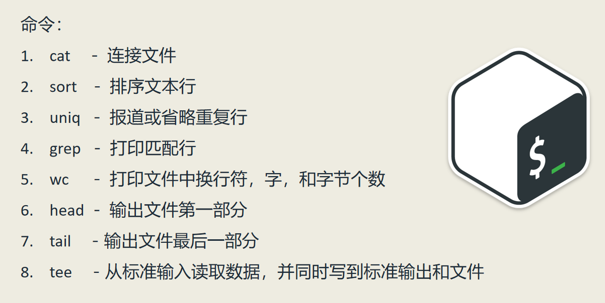
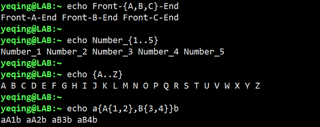
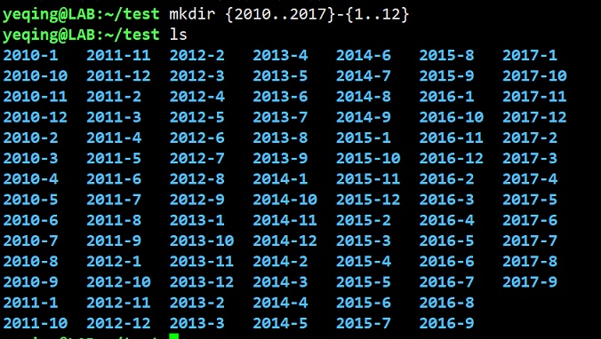

# 四、花前月下

## 目录
- [I/O 重定向](section-4.md#I/O-重定向-redirection)
  - [标准输出](section-4.md#标准输出-stdout)
  - [标准错误](section-4.md#标准错误-stderr)
  - [标准输入](section-4.md#标准输入-stdin)
  - [管道线](section-4.md#pipe-line-管道线)
  - [过滤器](section-4.md#filter-过滤器)
- [Shell眼中看世界](section-4.md#Shell-眼中看世界)
## I/O重定向（redirection）  
常用命令：  

重定向有三种：
1. stdin 标准输入（standard int device）
2. stdout 标准输出（standard out device）
2. stderr 标准错误（standard int device）

### 标准输出 stdout
我们可以将一个命令的标准输出重定向到一个文件里，语法格式：command > filename  
例如：ls -l . > ls-output.txt  表示将 "ls -l . " 命令的标准输出重定向到文件 ls-output.txt 里。

如果要将标准输出内容追加到一个文件里，语法格式：command >> filename  

### 标准错误 stderr
三种输出格式可以由三个数字表示：
0 表示标准输入  
1 表示标准输出（如果不加数字默认是1）  
2 表示标准错误

因此，要将一个命令产生的错误提示，重定向到文件里，语法格式：command 2> filename  
例如：ls /bin/usr 2> ls-err.txt 因为系统里没有 /bin/usr 目录，因此会产生一个错误提示，所以用 "2>" 就表示将错误提示重定向到文件 ls-err.txt 中。

**如何将一个标准输出和一个错误输出，都重定向到同一个文件里呢？**  
第一种方法：command > filename 2> &1  
例如：ls -l . /bin/usr > ls-output.txt 2>&1  就是同时将正确的标准输出和错误输出，都重定向到了 ls-output.txt 文件里。

第二种方法：command &> ls-output.txt  
例如：ls -l . /bin/usr &> ls-output.txt 该语法更简练，并且与上一个例子输出的效果是一样的。

在 Linux 中还有一个被称为“垃圾桶”的目录，位于 /dev/null 对于一些无用的信息，可以重定向到垃圾桶里：  
 ls -l /bin/usr 2> /dev/null  
这样产生的错误信息，就会直接被扔进垃圾桶里！

### 标准输入 stdin
cat [filename] 命令是将指定文件的内容打印到屏幕上（类似于 less 命令），后面的文件名是可选的。如果不指定文件，系统会从标准输入（键盘）读取内容，
然后打印到标准输出（屏幕）。因此系统会等待用户输入内容，按回车后将输入的内容在打印出来，然后继续等待输入，按 Ctrl + D 退出。  
我们还可以在 cat 后跟一个重定向符号，将要打印的内容进行重定向，例如：cat > cat-in.txt，表示将从键盘读取数据然后重定向，最后打印到文件 cat-in.txt 文件中；
又如：cat a.txt >> cat-in.txt，表示从 a.txt 文件中读取数据后重定向，再追加到 cat-in.txt 文件中。  

在 Linux 中标准输入的语法是：command < filename  
cat < filename 等价于 cat filename

### pipe line (管道线)
管道线 “|” 是将一个命令的传递给下一个命令，语法格式：command | command  
管道将竖线两边的命令连接起来，竖线左边命令的输出是竖线后边命令的输入。  
例如：ls -l /usr/bin | less，会将 ls 输出的内容传递给 less 命令，由 less 命令按分页形式显示出来。  

### filter (过滤器)
能够接受数据，过滤（处理或筛选）后再输出的工具，称为过滤器。常用的过滤器有：  
- sort----将文件中的各行按字母或数进行排序。sort命令既可以从特定的文件，也可以从stdin获取输入。
- grep----是一个强大的文本搜索工具，可以使用正则表达式，并返回匹配的行，语法为：grep pattern file(s)
- uniq----显示并删除文件中重复的行，通常与 sort 命令一起使用，排序后删除重复的行
- wc----打印总行数、单词数或者字节数，选项: -l 或 --line 打印行数， -c 或 --bytes 打印字节数，-w 或 --word 打印单词数
- tee----从标准输出中读入内容并写入标准输出和文件，例如：ls -l . | tee a.txt，将ls -l . 输出的内容写入标准输出和文件 a.txt 中
- head----用于读取文件的开头（默认10行），若没有指定文件，则从标准输入读取，可以自己指定行数：-n 行数 或 -行数
- tail----用于读取文件的末尾（默认10行），若没有指定文件，则从标准输入读取，指定行数：n 行数 或 -行数

## Shell 眼中看世界
### ehco 命令----展开（expansion）
1. 字符展开（character expansion）  
常用格式：echo string 或 echo，例如：$echo This is test 命令会打印出“This is test”这个字符串
2. 路径展开(pathname expansion)  
例如：$echo * 命令会打印出当前目录下的所有文件名，我们还可以结合通配符的使用和正则表达式来显示我们想要的内容。
3. 波浪线展开（tilde expansion）  
波浪线“~”就是指的家目录，我们使用$echo ~ 命令会打印出家目录路径，与pwd命令相同。
4. 算术展开（arithmetic expansion）  
语法：echo $(())，例如：echo $((2 + 2)) 命令会打印出结果4。  
echo 命令支持的运算符有：加（+），减（-），乘（\*），除（/），幂运算（\*\*），模运算（%）  
注意：echo运算不支持小数运算，只支持整数运算，使用小数会报错。
5. 花括号展开（brace expansion）  
花括号展开有着很神奇的效果，它可以使用一个命令帮我们做很多重复的事情。我们来看看下面的例子：  
  

平时我们在保存照片的时候，如果有大量的照片要按照日期来保存到文件夹里，如果使用图形界面就会非常的不方便，
而是用命令行可以用一条命令搞定。例如，我们要按照月份创建从2015年到2019年的文件夹，可以使用命令：  
mkdir {2017..2019}-{01..12}，一键搞定。  
  

6. 参数展开（parameter expansion）  
参数展开，主要是在echo 后面跟一个参数名称，可以看到相应的参数内容，例如：  
echo $USER 可以显示当前的用户名，printenv | less 命令可以显示当前所有的环境变量名称，echo $LANG 命令可以显示当前使用的语言，等等...  
关于参数展开后面还会详细讲解！

7. 命令替换（command subtitution）  
命令替换（又称：命令组合），可以将一个命令的输出作为另外一个的参数，格式为：echo $(command)，例如：echo $(date)表示将 date 命令的输出作为 echo 命令的参数进行展开。又例如：ls -s $(which cp)，表示我们使用命令 which cp 可以得到 cp 文件的绝对路径，然后利用该输出作为 ls 命令的参数，可以打印出 cp 的详细信息。

8. 忽略  
忽略指的是在使用命令时可以使用引号或转义符 \ 在改变shell的默认行为。例如：如果在 echo 命令后的字符串中使用了多个空格，shell默认会只保留一个空格，忽略多余的空格，但如果使用引号（双引号或单引号）则会改变默认行为，输出所有的空格。又例如：echo This total is $1.00，shell默认会将$1变为一个空格，如果使用单引号则会忽略该默认行为直接输出$1.00。*通常，单引号比双引号的禁用效果更强。*，如果要直接输出“! $” 等特殊字符，可以使用转义符\，因此echo This total is \$1.00，也是同样的效果。
